---
lang: ru-RU
title: Дисциплина Сетевые технологии
subtitle: Формирование и спектральный анализ сигналов
author: 
  - Комягин Андрей Николаевич
institute: 
  - РУДН
babel-lang: russian
babel-otherlangs: english
toc: false
toc-title: Содержание
slidelevel: 2
aspectratio: 169
section-titles: true
theme: metropolis
header-includes:
  - '\usepackage{xcolor}'
  - '\setbeamercolor{structure}{fg=blue}'
---

# Введение

## Цель работы

- Изучение среды Octave

- Построение и визуализация сигналов

- Спектральный анализ сигналов

- Исследование линейного кодирования

# Основы Octave

## Среда Octave

- Свободная среда для численных расчетов

- Матричная алгебра и операции над массивами

- Встроенные функции для анализа сигналов

- Графический интерфейс и командная строка

# Суммарные гармонические сигналы

## Скрипт sinplot.m

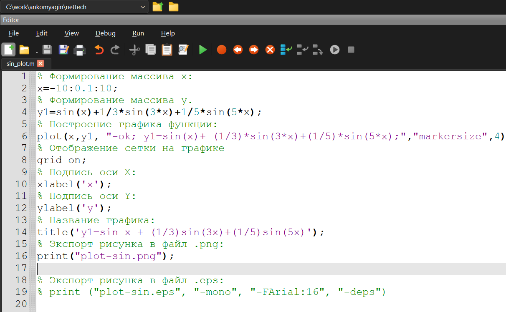{width=70%}

## Скрипт sincosplot.m

{width=70%}

## Код с двумя функциями

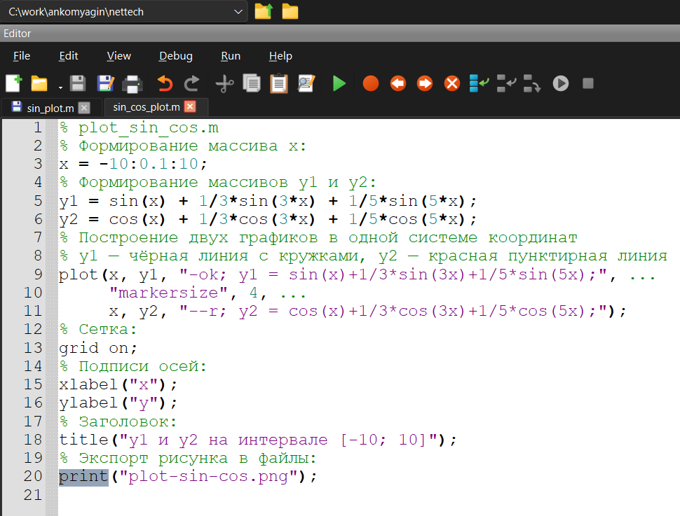{width=70%}

## График двух функций

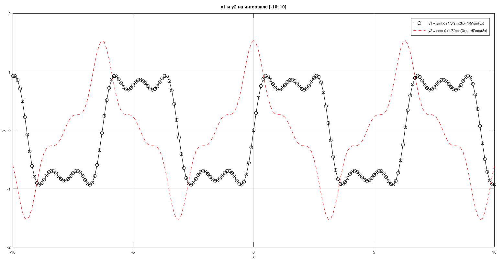{width=70%}

# Разложение в ряд Фурье

## Скрипт меандр (косинусные гармоники)

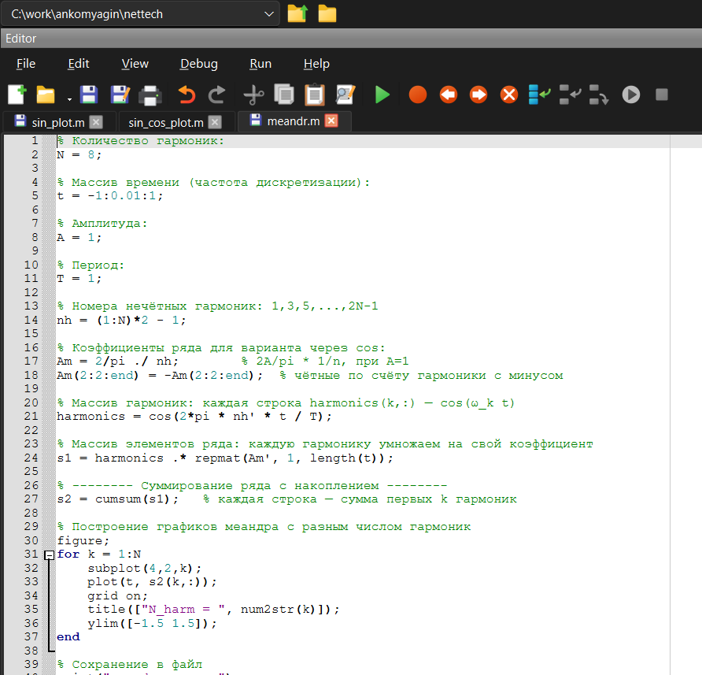{width=70%}

## График меандр (косинусные гармоники)

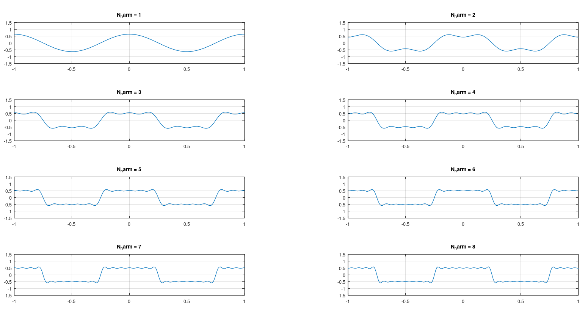{width=70%}

## Скрипт меандр (синусные гармоники)

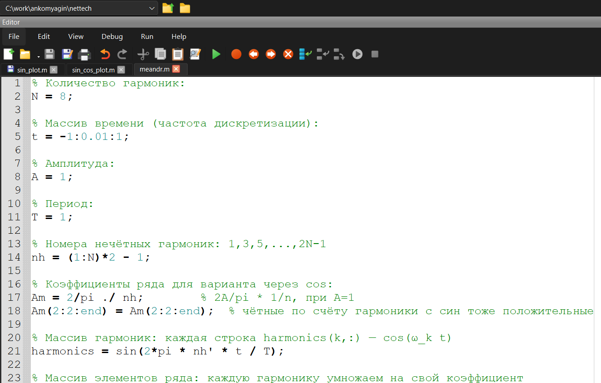{width=70%}

## График меандр (синусные гармоники)

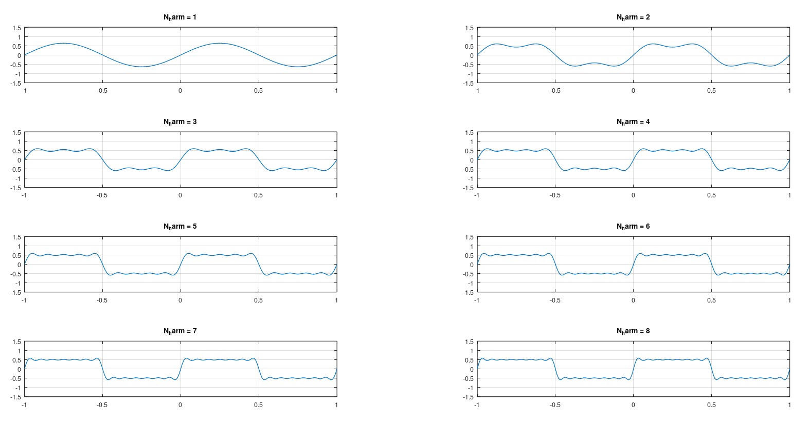{width=70%}

# Определение спектра и параметров сигнала

## Спектр суммарного сигнала

{width=70%}

## Синусоидальные графики разной частоты и спектры

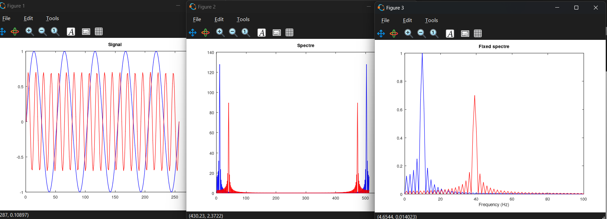{width=70%}

## график суммы при 64 измерениях

{width=70%}

## сигнал при 64 измерениях

{width=70%}

## Спектр при 64 измерениях

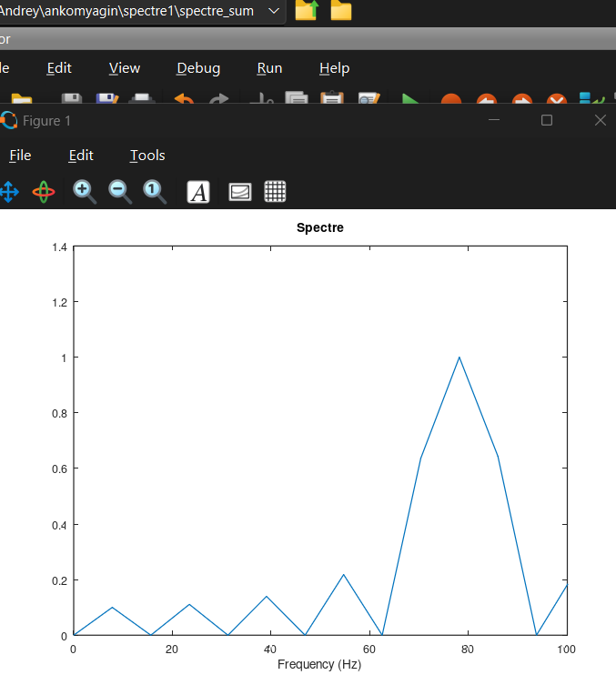{width=70%}

# Амплитудная модуляция

## Амплитудная модуляция

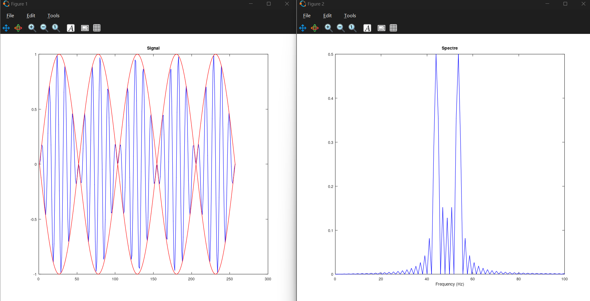{width=70%}

# Линейные коды

## Виды кодирования

- Unipolar (однополярное)

- AMI (альтернирующая инверсия нулей)

- Bipolar Non-Return to Zero (NRZ)

- Bipolar Return to Zero (RZ)

- Manchester (манчестерское)

- Differential Manchester (дифференциальное манчестерское)

## coding

{width=70%}

## coding

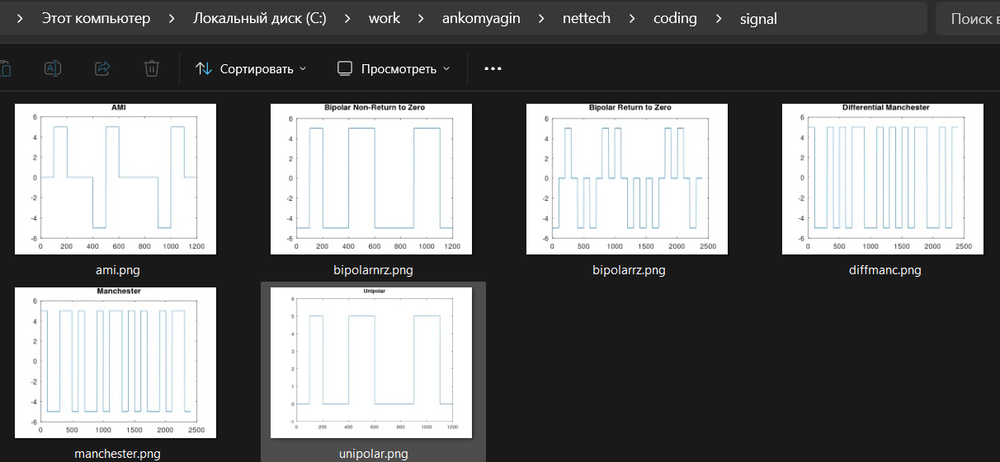{width=70%}

# Результаты и выводы

## Ключевые наблюдения

- Увеличение гармоник приближает форму к прямоугольному импульсу

- Явление Гиббса вблизи разрывов функции

- Коды Manchester обеспечивают симметрию спектра

- Разные коды имеют разную ширину спектра

## Заключение

- Получены навыки работы в Octave

- Исследованы временные и частотные характеристики

- Проведено сравнение видов кодирования

- Применены методы спектрального анализа
