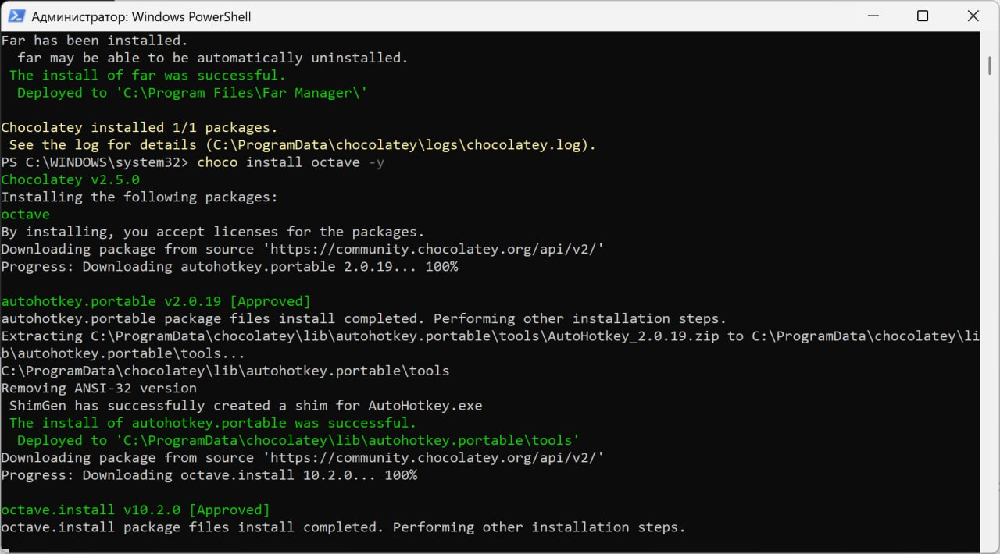
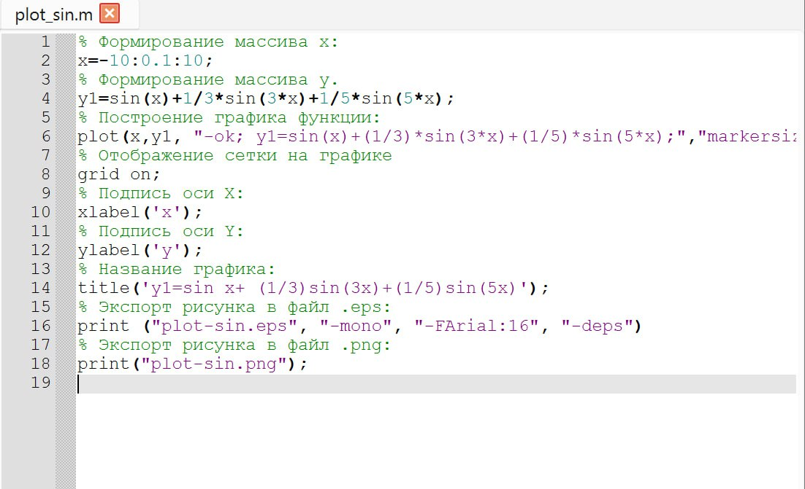
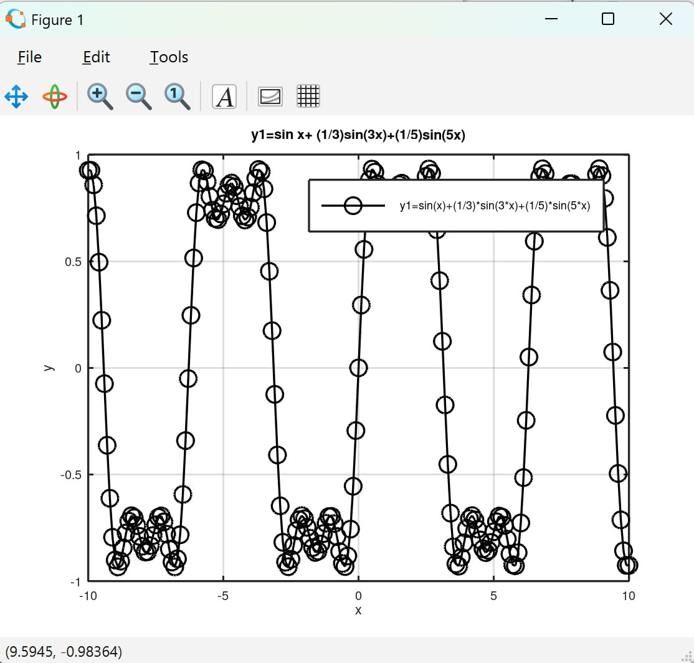
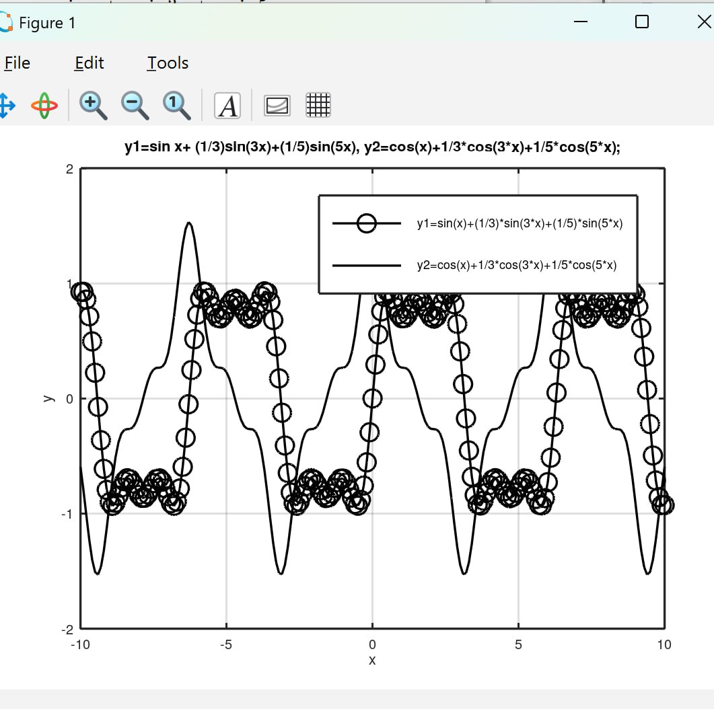
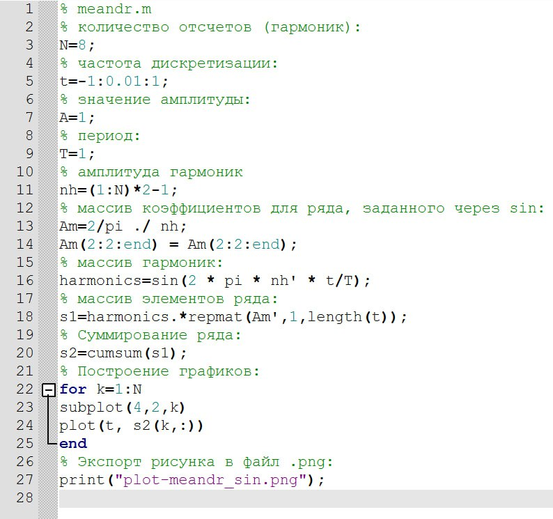
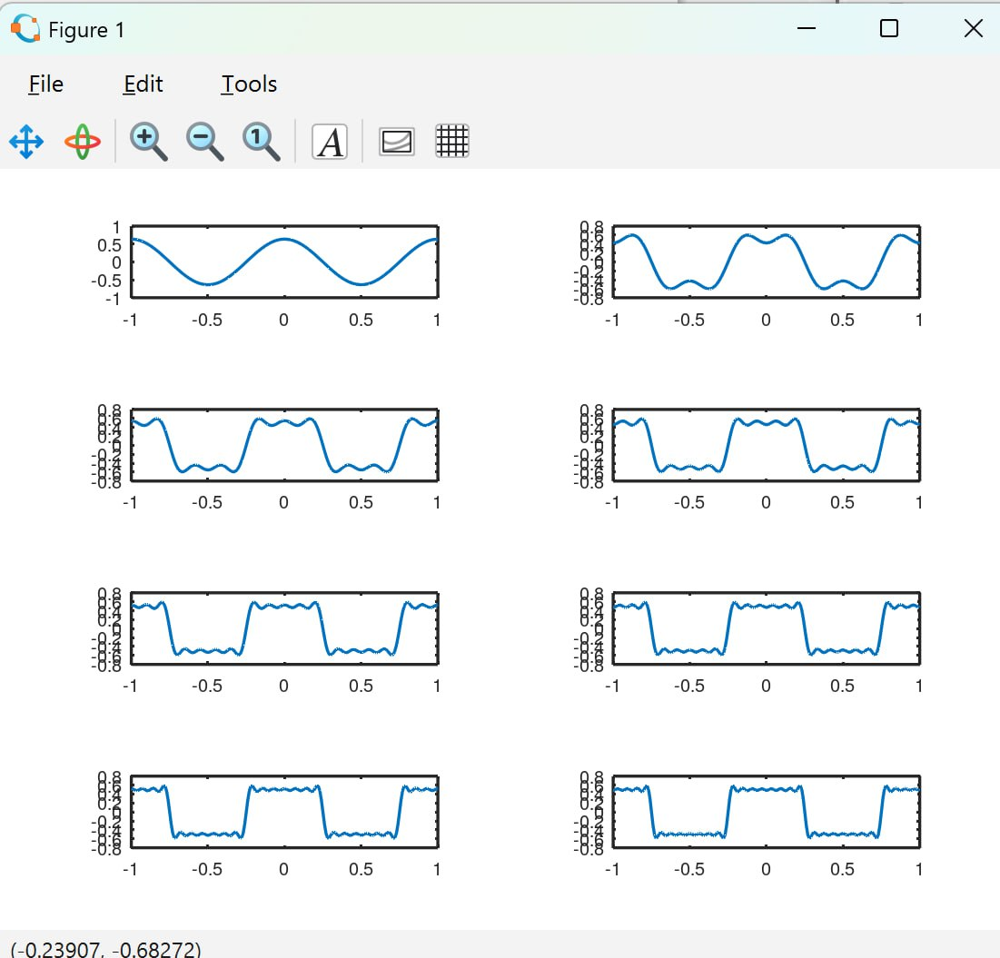
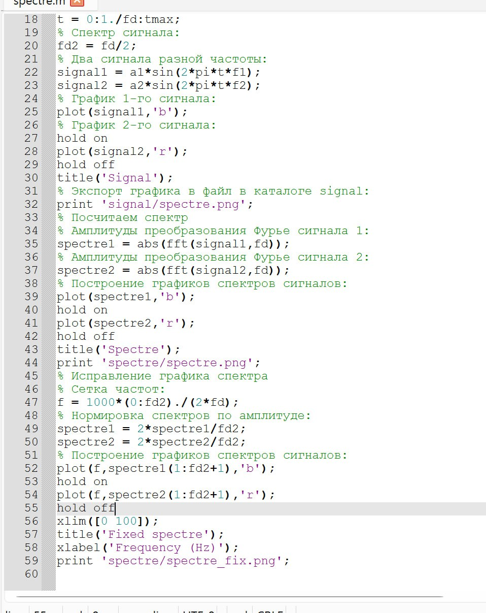
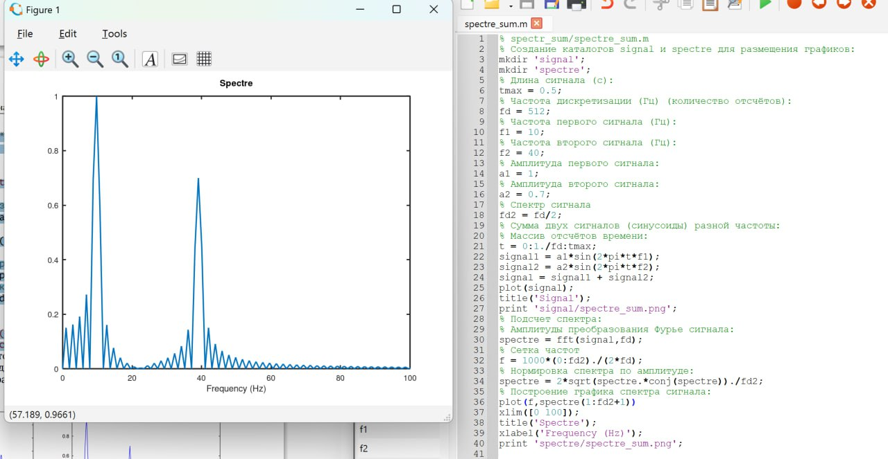

---
## Front matter
lang: ru-RU
title: Лабораторная №1
subtitle: Сетевые технологии
author:
  - Жибицкая Е.Д.
institute:
  - Российский университет дружбы народов, Москва, Россия

## i18n babel
babel-lang: russian
babel-otherlangs: english

## Formatting pdf
toc: false
toc-title: Содержание
slide_level: 2
aspectratio: 169
section-titles: true
theme: metropolis
header-includes:
 - \metroset{progressbar=frametitle,sectionpage=progressbar,numbering=fraction}
---

# Цель

## Цель работы

- Изучение методов кодирования и модуляции сигналов с помощью высокоуровнего языка программирования Octave. Определение спектра и параметров сигнала. Демонстрация принципов модуляции сигнала на примере аналоговой амплитудной модуляции. Исследование свойства самосинхронизации сигнала

# Ход работы 

## Подготовка

:::::::::::::: {.columns align=center}
::: {.column width="50%"}

Перед началом работы подготавливаем пространтсво, скачиваем все необходимое

:::
::: {.column width="50%"}

:::
::::::::::::::

## Sin_plot. Построение графика

:::::::::::::: {.columns align=center}
::: {.column width="40%"}

:::
::: {.column width="40%"}

:::
::::::::::::::

## Sin_cos_plot

:::::::::::::: {.columns align=center}
::: {.column width="50%"}

:::
::: {.column width="40%"}

:::
::::::::::::::

## Разложение импульсного сигнала в частичный ряд Фурье

:::::::::::::: {.columns align=center}
::: {.column width="40%"}

:::
::: {.column width="40%"}

:::
::::::::::::::

## График

:::::::::::::: {.columns align=center}
::: {.column width="40%"}

:::
::::::::::::::

## Определение спектра и параметров сигнала

:::::::::::::: {.columns align=center}

::: {.column width="40%"}

:::
::: {.column width="50%"}

Создаем каталог spectre1 и в нем файл spectre.m
:::
::::::::::::::

## Доработка кода и графика

:::::::::::::: {.columns align=center}
::: {.column width="40%"}

:::
::: {.column width="40%"}

:::
::::::::::::::

## Спектр суммы рассмотренных сигналов

:::::::::::::: {.columns align=center}
::: {.column width="40%"}

:::
::: {.column width="50%"}
 
:::
::::::::::::::

## Амплитудная модуляция

:::::::::::::: {.columns align=center}
::: {.column width="40%"}

Ознакомимся с амплитудной модуляцией, создадим каталог modulation cо сценарием am.m, увидим, что спектр произведения представляет собой свертку спектров
:::
::: {.column width="60%"}

:::
::::::::::::::

## Свойства самосинхронизуемости кодов по заданным битовым последовательностям

:::::::::::::: {.columns align=center}
::: {.column width="40%"}

:::
::: {.column width="60%"}

Создаем для работы каталог coding и в нём файлы main.m,
maptowave.m,unipolar.m,ami.m,bipolarnrz.m,bipolarrz.m,manchester.m,
diffmanc.m, calcspectre.m, убеждаемся, что у нас установлен пакет signal
:::
::::::::::::::

## Скрипты

:::::::::::::: {.columns align=center}
::: {.column width="40%"}

:::
::: {.column width="60%"}

В файле main.m подключаем пакет signal,задаем входные кодовые последовательности, прописываем вызовы функций построения спектров, модуляций сигналов. В остальных файлах прописываем сами функции
:::
::::::::::::::

## Графики

## Графики

# Выводы

## Вывод

- В ходе работы было произведено знакомство с Octavе. Были также изучены методы кодирования и модуляции сигнала, определены спектры и параметры сигнала, продемонстрированы принципы модуляции сигнала на примере аналоговой амплитудной модуляции и исследованы свойства самосинхронизации сигнала

