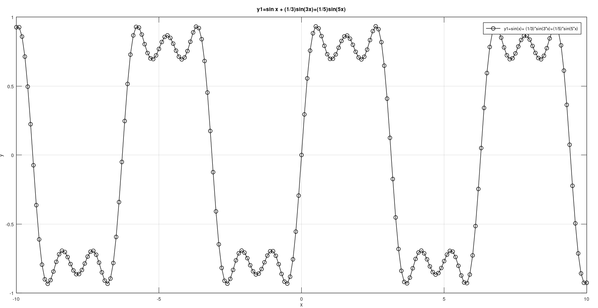
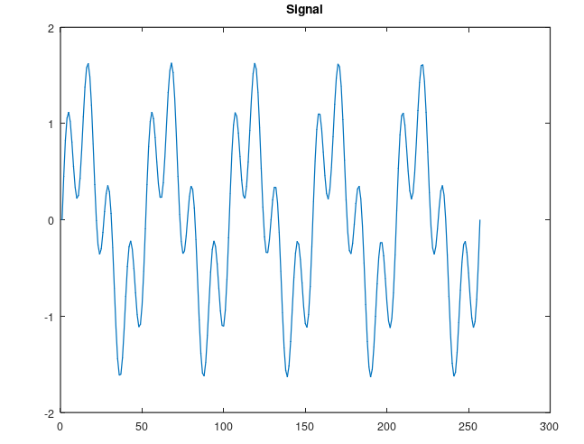
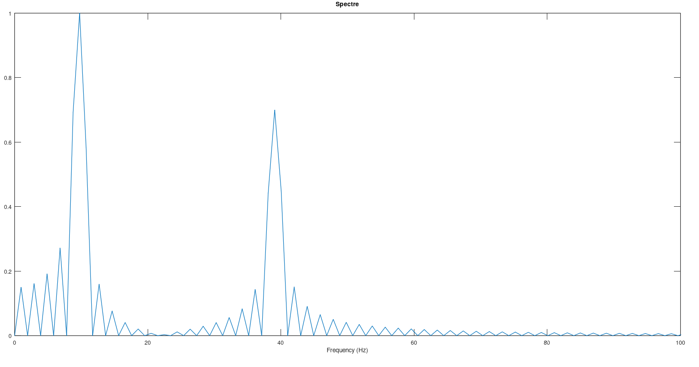
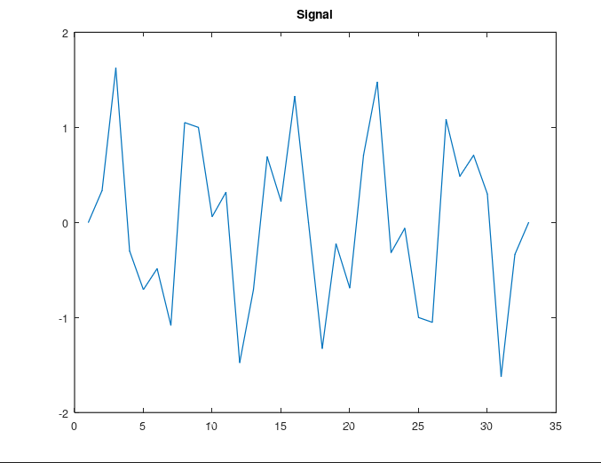
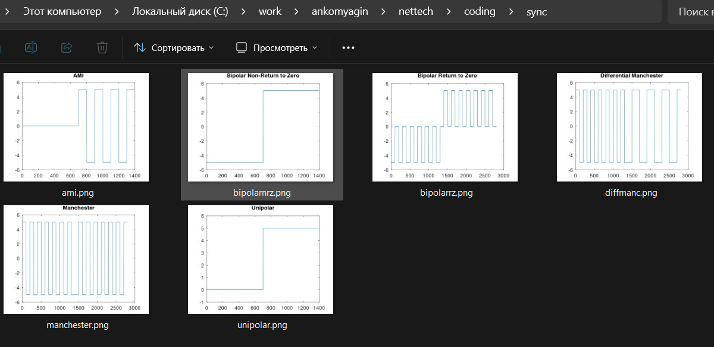

---
## Front matter
title: "Лабораторная работа №1"
subtitle: "Дисциплина: Сетевые технологии"
author: "Комягин Андрей Николаевич"

## Generic otions
lang: ru-RU
toc-title: "Содержание"

## Bibliography
bibliography: bib/cite.bib
csl: pandoc/csl/gost-r-7-0-5-2008-numeric.csl

## Pdf output format
toc: true # Table of contents
toc-depth: 2
lof: true # List of figures
lot: true # List of tables
fontsize: 12pt
linestretch: 1.5
papersize: a4
documentclass: scrreprt
## I18n polyglossia
polyglossia-lang:
  name: russian
  options:
  - spelling=modern
  - babelshorthands=true
polyglossia-otherlangs:
  name: english
## I18n babel
babel-lang: russian
babel-otherlangs: english
## Fonts
mainfont: IBM Plex Serif
romanfont: IBM Plex Serif
sansfont: IBM Plex Sans
monofont: IBM Plex Mono
mathfont: STIX Two Math
mainfontoptions: Ligatures=Common,Ligatures=TeX,Scale=0.94
romanfontoptions: Ligatures=Common,Ligatures=TeX,Scale=0.94
sansfontoptions: Ligatures=Common,Ligatures=TeX,Scale=MatchLowercase,Scale=0.94
monofontoptions: Scale=MatchLowercase,Scale=0.94,FakeStretch=0.9
mathfontoptions:
## Biblatex
biblatex: true
biblio-style: "gost-numeric"
biblatexoptions:
  - parentracker=true
  - backend=biber
  - hyperref=auto
  - language=auto
  - autolang=other*
  - citestyle=gost-numeric
## Pandoc-crossref LaTeX customization
figureTitle: "Рис."
tableTitle: "Таблица"
listingTitle: "Листинг"
lofTitle: "Список иллюстраций"
lotTitle: "Список таблиц"
lolTitle: "Листинги"
## Misc options
indent: true
header-includes:
  - \usepackage{indentfirst}
  - \usepackage{float} # keep figures where there are in the text
  - \floatplacement{figure}{H} # keep figures where there are in the text
---


# Введение

Целью лабораторной работы является освоение основ работы в среде Octave, построение и визуализация непрерывных и дискретных сигналов, а также исследование их спектральных характеристик методами численного эксперимента. В ходе выполнения работы изучаются базовые функции Octave, принципы формирования сигналов с помощью рядов Фурье, а также сравнение временных и частотных представлений сигналов.

# Теоретические сведения

Octave представляет собой свободную среду для численных расчетов, ориентированную на матричную алгебру и поддержку скриптов и функций, аналогичных по синтаксису MATLAB. Для анализа сигналов используются встроенные функции для вычисления элементарных функций, операций над массивами и вычисления быстрого преобразования Фурье.

При моделировании периодических сигналов (например, меандра) применяется разложение в ряд Фурье по нечетным гармоникам с амплитудами, обратно пропорциональными номеру гармоники. Спектральный анализ дискретных сигналов выполняется с помощью БПФ, что позволяет получить оценку амплитудно-частотного спектра и провести сравнение спектров разных видов сигналов и кодов линий связи.

# Ход выполнения работы

## 1. Построение суммарного гармонического сигнала

На первом этапе был создан скрипт sinplot.m для формирования суммарного сигнала как суммы нескольких синусоидальных компонент. В скрипте задавался вектор аргумента x в диапазоне от -10 до 10 с шагом 0.1, после чего вычислялась функция y1 как сумма синусоид с различными частотами и коэффициентами перед аргументом.

### 1.1. Скрипт sinplot.m

Ниже приведен код скрипта sinplot.m, формирующего сигнал y1 как сумму трех синусоид с кратными частотами:

```c
% sinplot.m
x = -10:0.1:10;
y1 = sin(x) + 1/3*sin(3*x) + 1/5*sin(5*x);
plot(x, y1, "-ok", "markersize", 4);
grid on;
xlabel("x");
ylabel("y");
title("y1 = sin x + 1/3 sin 3x + 1/5 sin 5x");
print "plot-sin.png";
print "plot-sin.eps", "-mono", "-FArial,16", "-deps";
```

На скрине изображен полученный график суммарного гармонического сигнала y1 во временной области.

 
График сигнала y1 = sin x + 1/3 sin 3x + 1/5 sin 5x

## 2. Построение сигналов sin и cos на одном графике

Для сравнения синусоидальной и косинусоидальной компонент была разработана программа sincosplot.m, формирующая два сигнала y1 и y2 и выводящая их на одном графике. Это позволяет наглядно сравнить фазовое смещение и форму сигналов при одинаковых наборах гармоник.

### 2.1. Скрипт sincosplot.m

В скрипте sincosplot.m определяется тот же диапазон x, вычисляются суммы синусов и косинусов, после чего строятся два графика с различными стилями линий:

```c
% sincosplot.m
x  = -10:0.1:10;
y1 = sin(x) + 1/3*sin(3*x) + 1/5*sin(5*x);
y2 = cos(x) + 1/3*cos(3*x) + 1/5*cos(5*x);
plot(x, y1, "-ok", "markersize", 4, x, y2, "--r");
grid on;
xlabel("x");
ylabel("y");
title("y1 и y2 — суммы синусоид и косинусоид");
print "plot-sin-cos.png";
```

На скрине показаны графики двух сигналов y1 и y2, построенных по общей сетке аргумента x.

 
 Графики y1 = sin x + 1/3 sin 3x + 1/5 sin 5x и y2 = cos x + 1/3 cos 3x + 1/5 cos 5x

## 3. Формирование меандра с помощью ряда Фурье

Следующим этапом лабораторной работы является приближение меандра с помощью конечного числа гармоник ряда Фурье. Для этого были написаны скрипты meandr.m, в которых задавалось количество гармоник N и формировались частичные суммы ряда для различных N.

### 3.1. Скрипт meandr.m: косинусные гармоники

В первой версии скрипта рассматривались косинусные гармоники с нечетными номерами и задаваемым амплитудным коэффициентом Am:


```c
% meandr.m (косинусные гармоники)
N = 8;
t = -1:0.01:1;
A = 1;
T = 1;
nh = 1:2:(2*N-1);
Am = 2./(pi*nh);
harmonics = zeros(N, length(t));
for k = 1:N
  w_k = 2*pi*nh(k)/T;
  harmonics(k, :) = Am(k)*cos(w_k*t);
end
s1 = harmonics;
s2 = cumsum(s1);
figure;
for k = 1:N
  subplot(4, 2, k);
  plot(t, s2(k, :));
  grid on;
  title(["Narm ", num2str(k)]);
  ylim([-1.5 1.5]);
end
```

На скрине представлены частичные суммы ряда по косинусным гармоникам при N = 1, 2, 3, 4, 5, 6, 7, 8.


 Формирование сигнала, приближающего меандр, по косинусным гармоникам (N = 1…8)

### 3.2. Скрипт meandr.m: синусные гармоники

Во второй версии скрипта в формирование сигнала включались синусные гармоники, что позволяет исследовать влияние фазовых сдвигов на форму аппроксимируемого сигнала:

```c
% meandr.m (синусные гармоники)
N = 8;
t = -1:0.01:1;
A = 1;
T = 1;
nh = 1:2:(2*N-1);
Am = 2./(pi*nh);
harmonics = zeros(N, length(t));
for k = 1:N
  w_k = 2*pi*nh(k)/T;
  harmonics(k, :) = Am(k)*sin(w_k*t);
end
s1 = harmonics;
s2 = cumsum(s1);
figure;
for k = 1:N
  subplot(4, 2, k);
  plot(t, s2(k, :));
  grid on;
  title(["Narm ", num2str(k)]);
  ylim([-1.5 1.5]);
end
```

Соответствующие графики частичных сумм ряда представлены на следующем скрине.


Формирование сигнала, приближающего меандр, по синусным гармоникам (N = 1…8)

## 4. Анализ гармонического сигнала и его спектра

### 4.1. Временная диаграмма сигнала

На данном этапе формировался одномерный сигнал во временной области, представляющий собой гармоническую последовательность значений с заданным шагом по времени. На скрине приведен пример графика такого сигнала, полученный с помощью стандартных функций построения графиков в Octave.

 
График дискретного гармонического сигнала (Signal)

### 4.2. Спектр и фиксированный спектр

Для полученного сигнала был вычислен спектр с использованием БПФ, а затем сформирован так называемый фиксированный спектр с ограничением по частоте. На рисунках представлены результаты расчета спектра и нормированного фиксированного спектра сигнала.

 
Спектр гармонического сигнала (Spectre)

 
Фиксированный спектр гармонического сигнала (Fixed spectre)

## 5. Исследование суммарного сигнала и его спектра

Для более сложного сигнала, сформированного как сумма нескольких гармонических компонент, был построен временной график и рассчитан его спектр. На рисунках приведены временная диаграмма суммарного сигнала и его спектральная характеристика.

 
Временной график суммарного гармонического сигнала (Signal)

 
Амплитудный спектр суммарного сигнала (Spectre)

## 6. Линейные коды и их спектральные характеристики

В завершающей части лабораторной работы исследовались различные виды линейного кодирования двоичной последовательности данных. Рассматривались следующие виды кодов: Unipolar, AMI, Bipolar Non-Return to Zero, Bipolar Return to Zero, Manchester и Differential Manchester. Для каждого вида кодирования строилась временная диаграмма сигнала, а также оценивался его спектр.

### 6.1. Временные диаграммы линейных кодов

Графики временных сигналов для различных видов кодирования приведены ниже.

 
Временные диаграммы сигналов: Unipolar, AMI, Bipolar NRZ, Bipolar RZ, Manchester, Differential Manchester

Дополнительно были построены отдельные графики для каждого вида сигнала, где можно более детально рассмотреть форму импульсов.

 
 Временной сигнал при unipolar кодировании

 
Временной сигнал при AMI кодировании

 
Временной сигнал при Bipolar Non-Return to Zero кодировании

 
Временной сигнал при Bipolar Return to Zero кодировании

 
Временной сигнал при Manchester кодировании

 
Временной сигнал при Differential Manchester кодировании

(Спектры соответствующих кодов, при необходимости, могут быть приведены аналогично временным диаграммам, с указанием отдельных рисунков для каждого типа кодирования.)

# Анализ результатов

При увеличении числа гармоник в разложении меандра форма сигнала во временной области приближается к идеальному прямоугольному импульсу, при этом вблизи точек разрыва сохраняется характерный выброс (явление Гиббса). Спектрально это соответствует расширению набора частотных компонент и уменьшению амплитуды высокочастотных гармоник по мере роста их номера.

Для различных видов линейного кодирования наблюдается различная ширина спектра и положение основной полосы энергии. Коды Manchester и Differential Manchester обеспечивают симметрию спектра и отсутствие постоянной составляющей, однако требуют более широкой полосы пропускания по сравнению с unipolar и AMI кодами.

# Заключение

В ходе выполнения лабораторной работы были получены навыки работы в среде Octave, включая написание скриптов, построение графиков и сохранение результатов в графические форматы. Исследованы временные и частотные характеристики гармонических сигналов, приближающих меандр, а также проведен сравнительный анализ спектров различных видов линейного кодирования сигналов.

