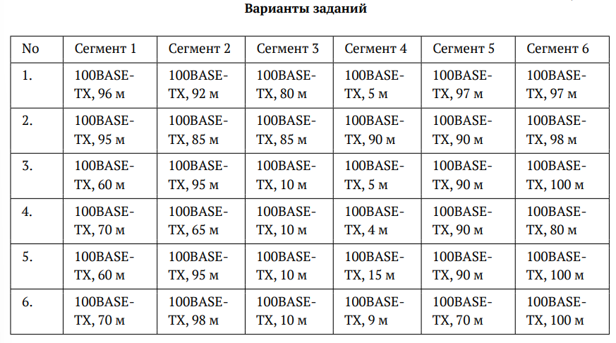
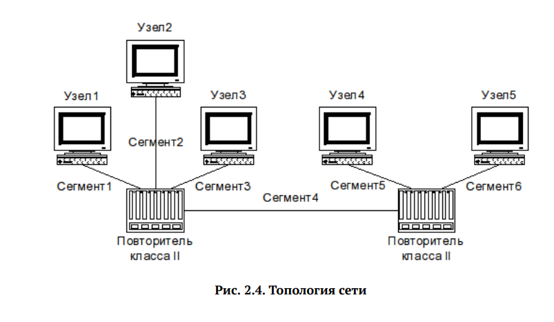
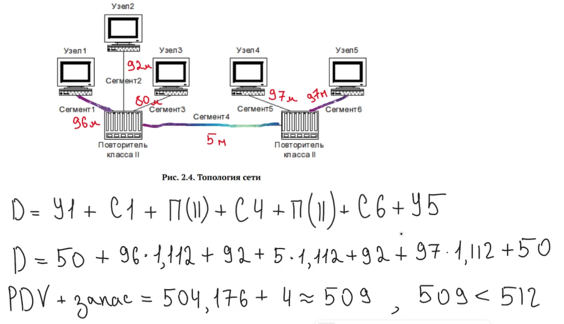
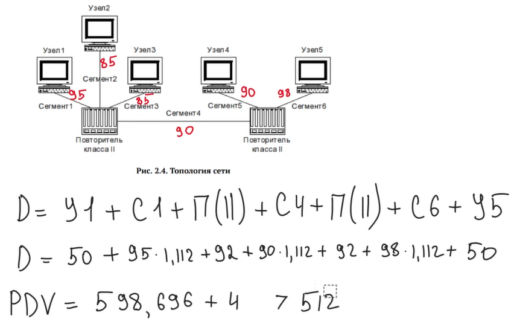
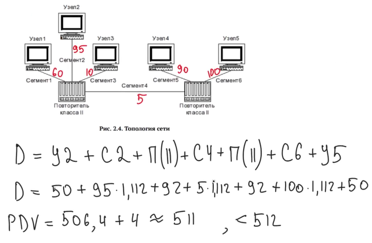

---
## Front matter
lang: ru-RU
title: Лабораторная №2
subtitle: Сетевые технологии
  - Комягин А.Н.
institute:
  - Российский университет дружбы народов, Москва, Россия

## i18n babel
babel-lang: russian
babel-otherlangs: english

## Formatting pdf
toc: false
toc-title: Содержание
slide_level: 2
aspectratio: 169
section-titles: true
theme: metropolis
header-includes:
 - \metroset{progressbar=frametitle,sectionpage=progressbar,numbering=fraction}
 

## Fonts
mainfont: IBM Plex Serif
romanfont: IBM Plex Serif
sansfont: IBM Plex Sans
monofont: IBM Plex Mono
mathfont: STIX Two Math
mainfontoptions: Ligatures=Common,Ligatures=TeX,Scale=0.94
romanfontoptions: Ligatures=Common,Ligatures=TeX,Scale=0.94
sansfontoptions: Ligatures=Common,Ligatures=TeX,Scale=MatchLowercase,Scale=0.94
monofontoptions: Scale=MatchLowercase,Scale=0.94,FakeStretch=0.9
 
---

# Цель

## Цель работы

- Изучение принципов технологий Ethernet и Fast Ethernet. Приобретение навыков оценки работоспособности сети, построенной на базе технологии Fast Ethernet.

# Ход работы 

## Задание

Требуется оценить работоспособность 100-мегабитной сети Fast Ethernet в соответствии с первой и второй моделями.

## Конфигурация и топология сети

## Данные

Из конфигурации сети следуют, что все сегменты это 100base-TX, также используется 2 повторителя, значит в таблице 2.1 нам подходит последняя строка первого столбца со значением 205 при расчетах 1 способом.

Для расчета вторым способом в таблице  2.2 используем значение удельной задержки 1,112 би/м, так как в нашем случае, исходя из теоретической справки и примера расчетов нам нужна витая пара категории 5, сравниваем со значением 512би.

## Данные

Сеть состоит из двух повторителей класса II. Самый длинный путь всегда будет проходить через оба повторителя и соединяющий их сегмент (Сегмент 4). Для расчёта диаметра и PDV нужно найти два самых длинных сегмента, подключённых к разным повторителям.

## Расчеты. Вариант 1

1 модель: 96м + 5м + 97м = 198м (< 205)

{width=66%}

Вывод: сеть **соответствует** стандартам fast ethernet

## Расчеты. Вариант 2

1 модель: 95 + 90 + 98 = 283м (> 205)

{width=66%}

Вывод: сеть **не соответствует** стандартам fast ethernet

## Расчеты. Вариант 3

1 модель:  95 + 5 + 100 = 200м (< 205)

{width=66%}

Вывод: сеть **соответствует** стандартам fast ethernet

## Расчеты. Вариант 4

Самый длинный маршрут: 
Узел 1 -> Сегмент 1 -> Повторитель -> Сегмент 4 -> Повторитель -> сегмент 5 -> Узел 4

1 модель:  70 + 4 + 90 = 164м

164 < 205  => конфигурация сети  соответствует требованиям 1й модели

2 модель: (70 + 4 + 90) * 1,112 + 92 + 92 + 100 + 4 = 470,368м

470,368 < 512  => конфигурация сети соответствует требованиям 2й модели

Вывод: сеть **соответствует** стандартам fast ethernet

## Расчеты. Вариант 5

Самый длинный маршрут: 
Узел 2 -> Сегмент 2 -> Повторитель -> Сегмент 4 -> Повторитель -> сегмент 6 -> Узел 5

1 модель: 95 + 15 + 100 = 210м

210 > 205  => конфигурация сети не соответствует требованиям 1й модели

2 модель: (95 + 15 + 90) * 1,112 + 92 + 92 + 100 + 4 = 521.52

521,52 > 512  => конфигурация сети не  соответствует требованиям 2й модели

Вывод: сеть **не соответствует стандартам** fast ethernet

## Расчеты. Вариант 6

Самый длинный маршрут: 
Узел 2 -> Сегмент 2 -> Повторитель -> Сегмент 4 -> Повторитель -> сегмент 6 -> Узел 5

1 модель: 98 + 9 + 100 = 207м

207 > 205  => конфигурация сети не  соответствует требованиям 1й модели

2 модель: (98 + 9 + 90) * 1,112 + 92 + 92 + 100 + 4 = 518.184

518.184 >  512  => конфигурация сети не  соответствует требованиям 2й модели

Вывод: сеть **не соответствует стандартам** fast ethernet

# Выводы

## Вывод

- В ходе работы были изучены принципы технологий Ethernet и Fast Ethernet и приобретены навыки оценки работоспособности сети, построенной на базе технологии Fast Ethernet различными способами

