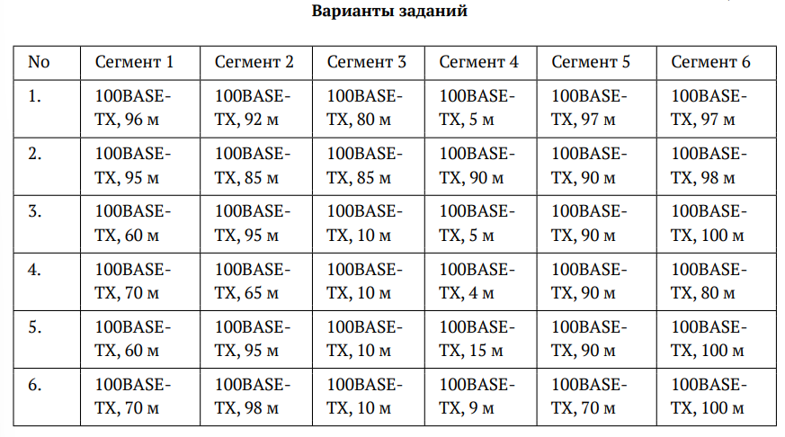
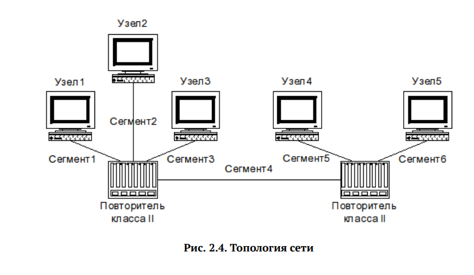
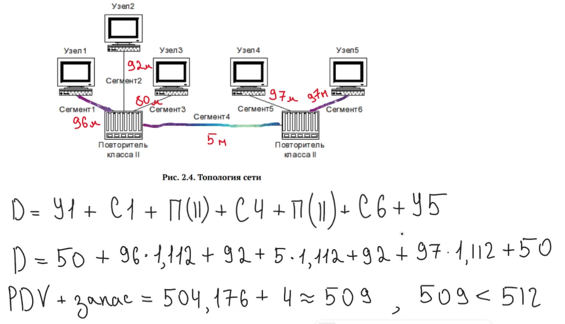
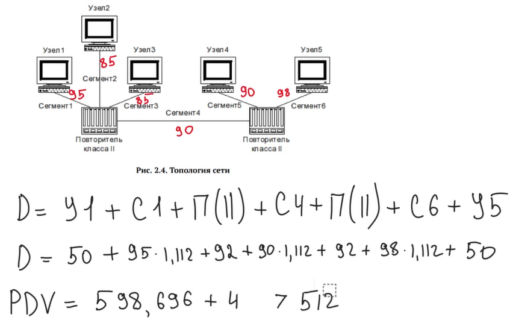
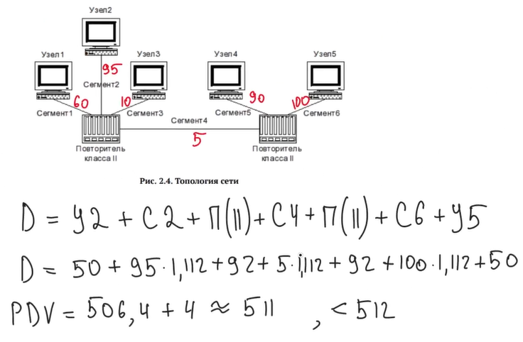

---
## Front matter
title: "Лабораторная работа №2"
subtitle: "Дисциплина: Сетевые технологии"
author: "Комягин Андрей Николаевич"

## Generic otions
lang: ru-RU
toc-title: "Содержание"

## Bibliography
bibliography: bib/cite.bib
csl: pandoc/csl/gost-r-7-0-5-2008-numeric.csl

## Pdf output format
toc: true # Table of contents
toc-depth: 2
lof: true # List of figures
lot: true # List of tables
fontsize: 12pt
linestretch: 1.5
papersize: a4
documentclass: scrreprt
## I18n polyglossia
polyglossia-lang:
  name: russian
  options:
  - spelling=modern
  - babelshorthands=true
polyglossia-otherlangs:
  name: english
## I18n babel
babel-lang: russian
babel-otherlangs: english
## Fonts
mainfont: IBM Plex Serif
romanfont: IBM Plex Serif
sansfont: IBM Plex Sans
monofont: IBM Plex Mono
mathfont: STIX Two Math
mainfontoptions: Ligatures=Common,Ligatures=TeX,Scale=0.94
romanfontoptions: Ligatures=Common,Ligatures=TeX,Scale=0.94
sansfontoptions: Ligatures=Common,Ligatures=TeX,Scale=MatchLowercase,Scale=0.94
monofontoptions: Scale=MatchLowercase,Scale=0.94,FakeStretch=0.9
mathfontoptions:
## Biblatex
biblatex: true
biblio-style: "gost-numeric"
biblatexoptions:
  - parentracker=true
  - backend=biber
  - hyperref=auto
  - language=auto
  - autolang=other*
  - citestyle=gost-numeric
## Pandoc-crossref LaTeX customization
figureTitle: "Рис."
tableTitle: "Таблица"
listingTitle: "Листинг"
lofTitle: "Список иллюстраций"
lotTitle: "Список таблиц"
lolTitle: "Листинги"
## Misc options
indent: true
header-includes:
  - \usepackage{indentfirst}
  - \usepackage{float} # keep figures where there are in the text
  - \floatplacement{figure}{H} # keep figures where there are in the text
---

# Цель

## Цель работы

- Изучение принципов технологий Ethernet и Fast Ethernet. Приобретение навыков оценки работоспособности сети, построенной на базе технологии Fast Ethernet.

# Ход работы 

## Задание

Требуется оценить работоспособность 100-мегабитной сети Fast Ethernet в соответствии с первой и второй моделями.

## Конфигурация и топология сети

## Данные

Из конфигурации сети следуют, что все сегменты это 100base- TX , также используется 2 повторителя, значит в таблице 2.1 нам подходит последняя строка первого столбца со значением 205 при расчетах 1 способом.

Для расчета вторым способом в таблице  2.2 используем значение удельной задержки 1,112 би/м, так как в нашем случае, исходя из теоретической справки и примера расчетов нам нужна витая пара категории 5, сравниваем со значением 512би.

Сеть состоит из двух повторителей класса II. Самый длинный путь всегда будет проходить через оба повторителя и соединяющий их сегмент (Сегмент 4), потому что длина сегментов меньше или равна 100м. 

## Условия

Первая модель: 

* все сегменты должны быть меньше 100м (для 100base-TX). Это требование всегда выполнено
* доменный диаметр должен быть меньше 205м (2 повторителя)
* должно быть не больше 2-х повторителей 2 класса (у нас всегда выполнено)
* должно быть не больше 1-го повторителя 1 класса (у нас всегда выполнено)

Вторая модель:

* PDV должен быть меньше 512.

В расчёт PDV (время двойного оборота) входит следующее:

* Пара терминалов (узлов) занимает 100 би времени
* Витая пара из нашего условия занимает 1.112 би на метр кабеля
* Повторитель 2го класса занимает 92 би времени

## Расчеты. Вариант 1

Самый длинный маршрут: 

Узел 1 -> Сегмент 1 -> Повторитель -> Сегмент 4 -> Повторитель -> сегмент 6 -> Узел 5

1 модель: 96м + 5м + 97м = 198м

198м < 205  => конфигурация сети соответствует требованиям 1й модели

2 модель: (96+5+97) * 1,112 + 92 + 92 + 100 + 4 = 508.176

508.176 < 512  => конфигурация сети соответствует требованиям 2й модели

Вывод: сеть **соответствует** стандартам fast ethernet

## Расчеты. Вариант 2

Самый длинный маршрут: 
Узел 1 -> Сегмент 1 -> Повторитель -> Сегмент 4 -> Повторитель -> сегмент 6 -> Узел 5

1 модель: 95 + 90 + 98 = 283м
283м >  205  => конфигурация сети не соответствует требованиям 1й модели

2 модель: (95 + 90 + 98) * 1,112 + 92 + 92 + 100 + 4 = 602.696

602.6 > 512  => конфигурация сети не соответствует требованиям 2й модели

Вывод: сеть **не соответствует** стандартам fast ethernet

## Расчеты. Вариант 3

Самый длинный маршрут: 
Узел 2 -> Сегмент 2 -> Повторитель -> Сегмент 4 -> Повторитель -> сегмент 6 -> Узел 5

1 модель:  95 + 5 + 100 = 200м

200 < 205  => конфигурация сети соответствует требованиям 1й модели

2 модель: (95 + 5 + 100) * 1,112 + 92 + 92 + 100 + 4 = 510,4

510,4 < 512  => конфигурация сети соответствует требованиям 2й модели

Вывод: сеть **соответствует** стандартам fast ethernet

## Расчеты. Вариант 4

Самый длинный маршрут: 
Узел 1 -> Сегмент 1 -> Повторитель -> Сегмент 4 -> Повторитель -> сегмент 5 -> Узел 4

1 модель:  70 + 4 + 90 = 164м

164 < 205  => конфигурация сети  соответствует требованиям 1й модели

2 модель: (70 + 4 + 90) * 1,112 + 92 + 92 + 100 + 4 = 470,368м

470,368 < 512  => конфигурация сети соответствует требованиям 2й модели

Вывод: сеть **соответствует** стандартам fast ethernet

## Расчеты. Вариант 5

Самый длинный маршрут: 
Узел 2 -> Сегмент 2 -> Повторитель -> Сегмент 4 -> Повторитель -> сегмент 6 -> Узел 5

1 модель: 95 + 15 + 100 = 210м

210 > 205  => конфигурация сети не соответствует требованиям 1й модели

2 модель: (95 + 15 + 90) * 1,112 + 92 + 92 + 100 + 4 = 521.52

521,52 > 512  => конфигурация сети не  соответствует требованиям 2й модели

Вывод: сеть **не соответствует стандартам** fast ethernet

## Расчеты. Вариант 6

Самый длинный маршрут: 
Узел 2 -> Сегмент 2 -> Повторитель -> Сегмент 4 -> Повторитель -> сегмент 6 -> Узел 5

1 модель: 98 + 9 + 100 = 207м

207 > 205  => конфигурация сети не  соответствует требованиям 1й модели

2 модель: (98 + 9 + 90) * 1,112 + 92 + 92 + 100 + 4 = 518.184

518.184 >  512  => конфигурация сети не  соответствует требованиям 2й модели

Вывод: сеть **не соответствует стандартам** fast ethernet

# Выводы

В ходе работы были изучены принципы технологий Ethernet и Fast Ethernet и приобретены навыки оценки работоспособности сети, построенной на базе технологии Fast Ethernet различными способами.

# Список литературы{.unnumbered}

(ТУИС)[https://esystem.rudn.ru/pluginfile.php/2858357/mod_resource/content/3/002-lab_ethernet.pdf]

