---
## Front matter
lang: ru-RU
title: Лабораторная №3
subtitle: Сетевые технологии
  - Комягин А.Н.
institute:
  - Российский университет дружбы народов, Москва, Россия

## i18n babel
babel-lang: russian
babel-otherlangs: english

## Formatting pdf
toc: false
toc-title: Содержание
slide_level: 2
aspectratio: 169
section-titles: true
theme: metropolis
header-includes:
 - \metroset{progressbar=frametitle,sectionpage=progressbar,numbering=fraction}
 

## Fonts
mainfont: IBM Plex Serif
romanfont: IBM Plex Serif
sansfont: IBM Plex Sans
monofont: IBM Plex Mono
mathfont: STIX Two Math
mainfontoptions: Ligatures=Common,Ligatures=TeX,Scale=0.94
romanfontoptions: Ligatures=Common,Ligatures=TeX,Scale=0.94
sansfontoptions: Ligatures=Common,Ligatures=TeX,Scale=MatchLowercase,Scale=0.94
monofontoptions: Scale=MatchLowercase,Scale=0.94,FakeStretch=0.9
 
---

# Цель

## Цель работы

Изучение посредством Wireshark кадров Ethernet, анализ PDU протоколов транспортного и прикладного уровней стека TCP/IP.

# MAC-адресация

## С помощью команды ipconfig определить основные параметры сетевого соединения.

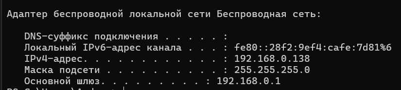{width=70%}

# Анализ кадров канального уровня в Wireshark

## Захватить и проанализировать пакеты ARP и ICMP в части кадров канального уровня (Ethernet II).

Для генерации трафика была выполнена команда ping 192.168.0.1 (ping основного шлюза). В Wireshark был применен фильтр **arp or icmp**.

## Анализ ICMP-трафика

На скриншоте ниже виден обмен ICMP-пакетами (эхо-запросы и эхо-ответы). 

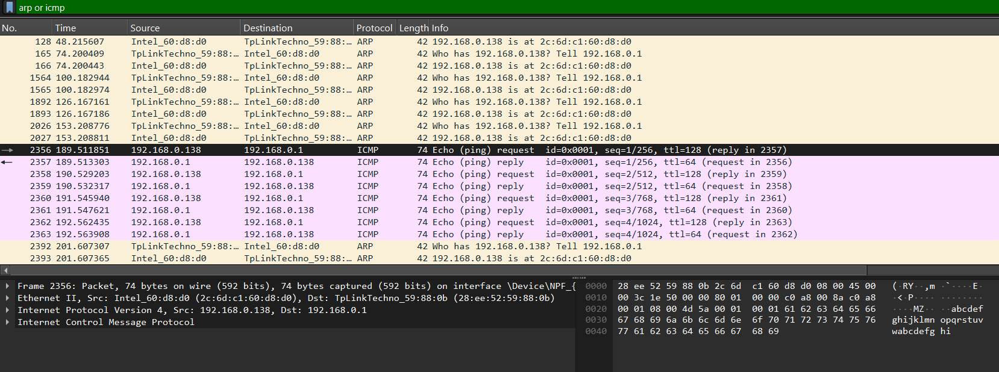{width=70%}

## Анализ ICMP-трафика

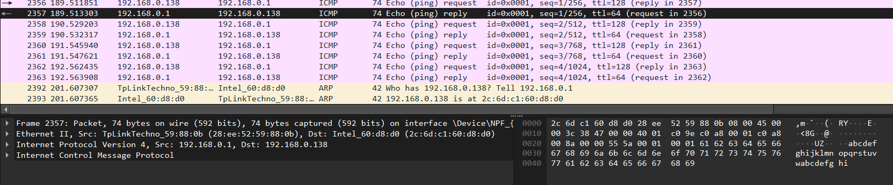{width=70%}

## Анализ ARP-трафика

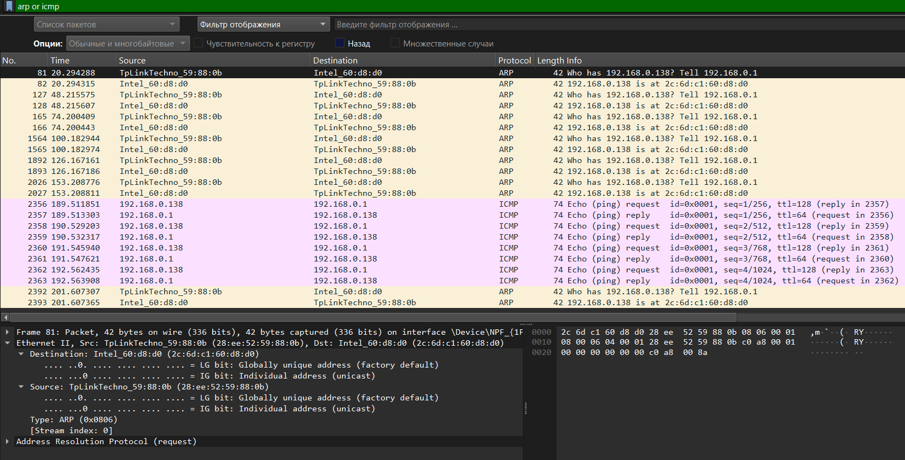{width=70%}

## Анализ ARP-трафика

{width=70%}

# Анализ протоколов транспортного уровня

## HTTP GET Request (пакет №152)

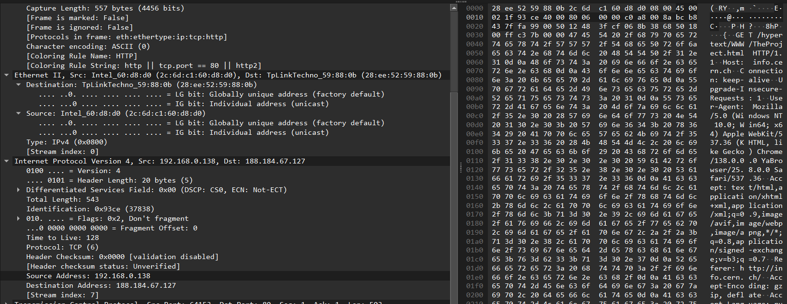{width=70%}

## HTTP 200 OK Response (пакет №191)

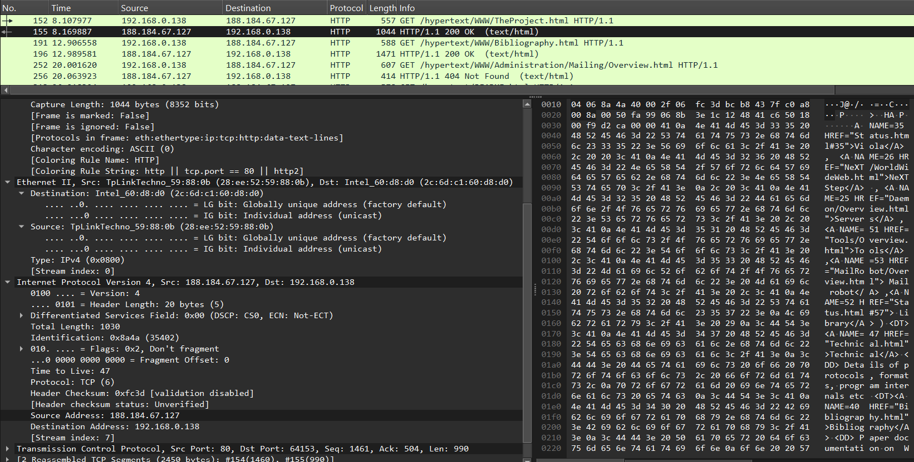{width=70%}

## DNS Standard Query (пакет №63)

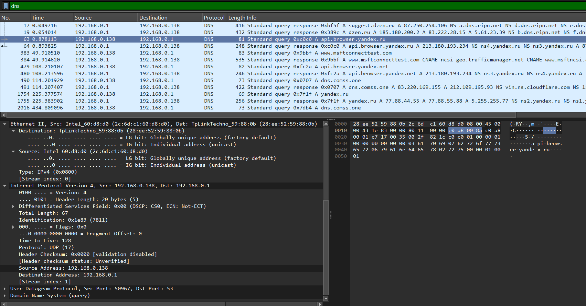{width=70%}

## DNS Standard Query Response (пакет №64)

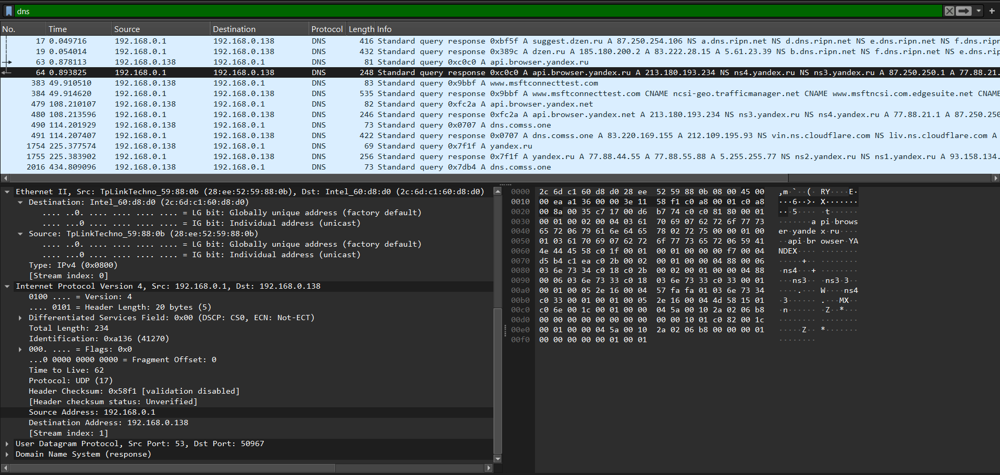{width=70%}

## Проанализировать информацию по протоколу QUIC.

Был захвачен трафик к современному веб-ресурсу, использующему протокол QUIC.

Описание: QUIC (Quick UDP Internet Connections) — это транспортный протокол, работающий поверх UDP. Он обеспечивает шифрование по умолчанию и более быстрое установление соединения.

На скриншотах виден обмен пакетами Initial и Handshake, которые служат для установления защищенного соединения между клиентом 192.168.0.138 и сервером 142.250.74.131.

## QUIC.

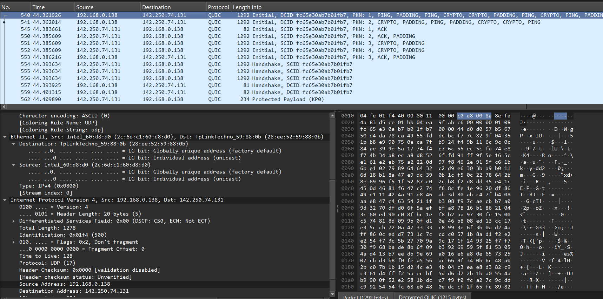{width=70%}

# Анализ handshake протокола TCP

## handshake

С помощью Wireshark проанализировать handshake протокола TCP.

Было инициировано соединение с веб-сервером, трафик был отфильтрован по tcp.port == 80. Были проанализированы первые три пакета, составляющие трёхступенчатое рукопожатие.

## Шаг 1: SYN (пакет №143)

Клиент (192.168.0.138) отправляет серверу (188.184.67.127) сегмент с установленным флагом SYN (Synchronize). Это запрос на установку соединения.

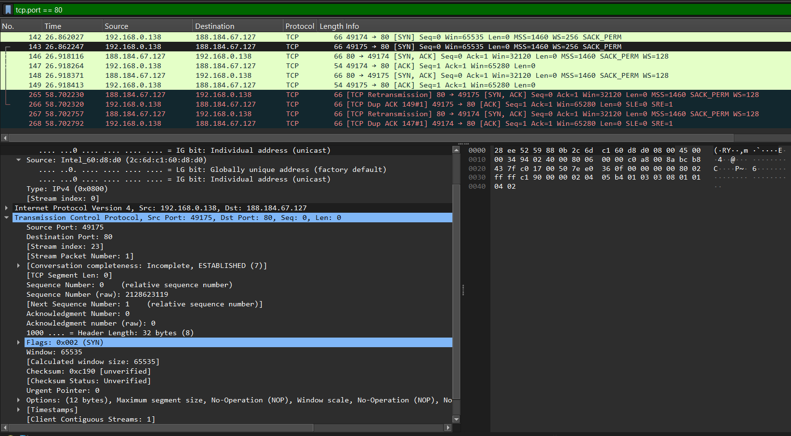{width=70%}

## Шаг 2: SYN, ACK (пакет №146)

Сервер отвечает сегментом с двумя флагами: SYN (он также предлагает синхронизировать номер последовательности) и ACK (Acknowledgment - подтверждает получение первого пакета от клиента).

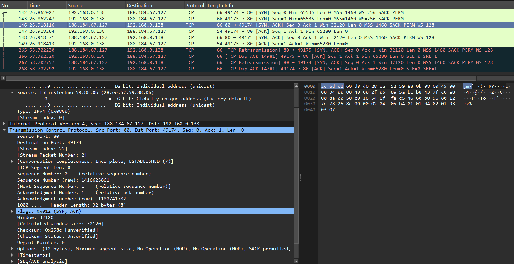{width=70%}

## ACK (пакет №147)

Клиент отправляет серверу сегмент с флагом ACK, подтверждая получение пакета SYN, ACK от сервера. На этом рукопожатие завершается, и соединение считается установленным.

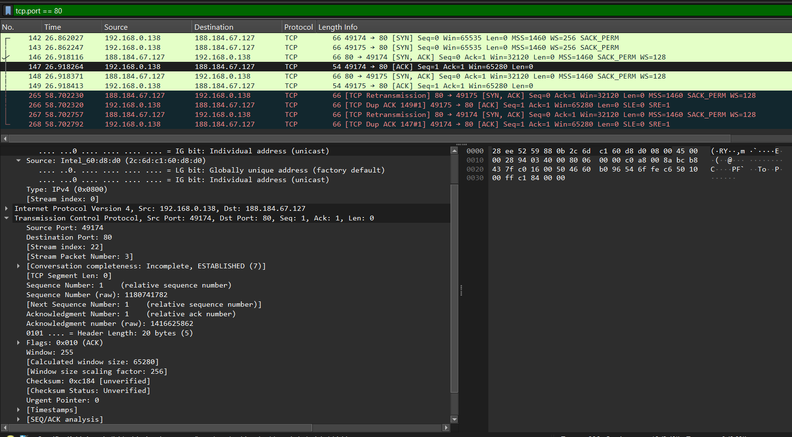{width=70%}

## График Потока

Для визуализации обмена был построен график потока, на котором наглядно представлено всё TCP-соединение, включая начальное трёхступенчатое рукопожатие и последующие повторные передачи (Retransmissions).

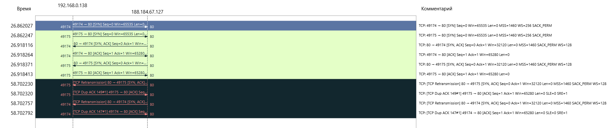{width=70%}

# Выводы

## Вывод

В ходе работы изучение посредством Wireshark кадров Ethernet, анализ PDU протоколов транспортного и прикладного уровней стека TCP/IP прошли успешно.

