---
## Front matter
title: "Лабораторная работа №3"
subtitle: "Дисциплина: Сетевые технологии"
author: "Комягин Андрей Николаевич"

## Generic otions
lang: ru-RU
toc-title: "Содержание"

## Bibliography
bibliography: bib/cite.bib
csl: pandoc/csl/gost-r-7-0-5-2008-numeric.csl

## Pdf output format
toc: true # Table of contents
toc-depth: 2
lof: true # List of figures
lot: true # List of tables
fontsize: 12pt
linestretch: 1.5
papersize: a4
documentclass: scrreprt
## I18n polyglossia
polyglossia-lang:
  name: russian
  options:
  - spelling=modern
  - babelshorthands=true
polyglossia-otherlangs:
  name: english
## I18n babel
babel-lang: russian
babel-otherlangs: english
## Fonts
mainfont: IBM Plex Serif
romanfont: IBM Plex Serif
sansfont: IBM Plex Sans
monofont: IBM Plex Mono
mathfont: STIX Two Math
mainfontoptions: Ligatures=Common,Ligatures=TeX,Scale=0.94
romanfontoptions: Ligatures=Common,Ligatures=TeX,Scale=0.94
sansfontoptions: Ligatures=Common,Ligatures=TeX,Scale=MatchLowercase,Scale=0.94
monofontoptions: Scale=MatchLowercase,Scale=0.94,FakeStretch=0.9
mathfontoptions:
## Biblatex
biblatex: true
biblio-style: "gost-numeric"
biblatexoptions:
  - parentracker=true
  - backend=biber
  - hyperref=auto
  - language=auto
  - autolang=other*
  - citestyle=gost-numeric
## Pandoc-crossref LaTeX customization
figureTitle: "Рис."
tableTitle: "Таблица"
listingTitle: "Листинг"
lofTitle: "Список иллюстраций"
lotTitle: "Список таблиц"
lolTitle: "Листинги"
## Misc options
indent: true
header-includes:
  - \usepackage{indentfirst}
  - \usepackage{float} # keep figures where there are in the text
  - \floatplacement{figure}{H} # keep figures where there are in the text
---

# Цель

## Цель работы

Изучение посредством Wireshark кадров Ethernet, анализ PDU протоколов транспортного и прикладного уровней стека TCP/IP.

# Ход работы 

## MAC-адресация

**С помощью команды ipconfig определить основные параметры сетевого соединения.**

Для определения текущих сетевых настроек была использована команда ipconfig в консоли Windows.

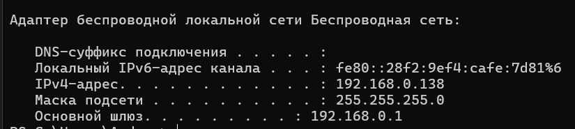

Из полученных данных были определены ключевые параметры адаптера беспроводной сети:

* IPv4-адрес: 192.168.0.138 — текущий IP-адрес моего устройства в локальной сети.

* Маска подсети: 255.255.255.0 — определяет, какая часть IP-адреса относится к сети, а какая — к узлу.

* Основной шлюз: 192.168.0.1 — IP-адрес маршрутизатора (роутера), через который осуществляется выход в другие сети, включая Интернет.

MAC-адрес моего устройства (2c:6d:c1:60:d8:d0) был определен в ходе последующего анализа трафика в Wireshark.

## Анализ кадров канального уровня в Wireshark

**Захватить и проанализировать пакеты ARP и ICMP в части кадров канального уровня (Ethernet II).**

Для генерации трафика была выполнена команда ping 192.168.0.1 (ping основного шлюза). В Wireshark был применен фильтр **arp or icmp**.

### Анализ ICMP-трафика

На скриншоте ниже виден обмен ICMP-пакетами (эхо-запросы и эхо-ответы). 

1. ICMP Echo (ping) Request (пакет №2356):

Описание: Мое устройство (192.168.0.138) отправляет эхо-запрос на основной шлюз (192.168.0.1).

Заголовок Ethernet II:

Source MAC: Intel_60:d8:d0 (2c:6d:c1:60:d8:d0) (мой ПК)

Destination MAC: TpLinkTechno_59:88:0b (28:ee:52:59:88:0b) (мой роутер)

Type: IPv4 (0x0800)

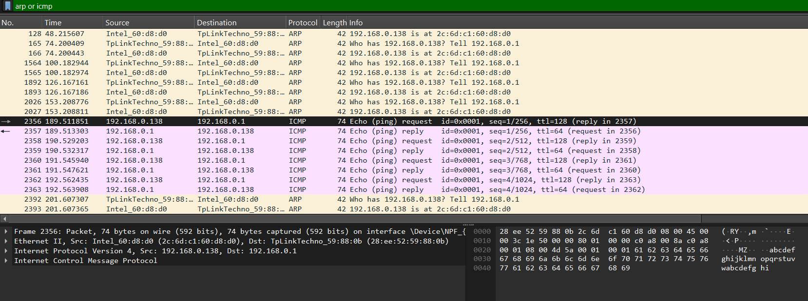

2. ICMP Echo (ping) Reply (пакет №2357):

Описание: Основной шлюз (192.168.0.1) отвечает на запрос, подтверждая свою доступность.

Заголовок Ethernet II:

Source MAC: TpLinkTechno_59:88:0b (мой роутер)

Destination MAC: Intel_60:d8:d0 (мой ПК)

Type: IPv4 (0x0800)

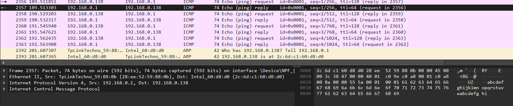

### Анализ ARP-трафика

На скриншотах ниже представлен детальный анализ ARP-запроса и ответа.

1. ARP Request (пакет №81):

Описание: Роутер (TpLinkTechno) выполняет широковещательный запрос с целью узнать MAC-адрес устройства с IP 192.168.0.138. Запрос звучит как: "Кто имеет IP 192.168.0.138? Сообщите 192.168.0.1".

Заголовок Ethernet II:

Destination MAC: Broadcast (ff:ff:ff:ff:ff:ff) (отправка всем устройствам в сети)

Source MAC: TpLinkTechno_59:88:0b

Type: ARP (0x0806)

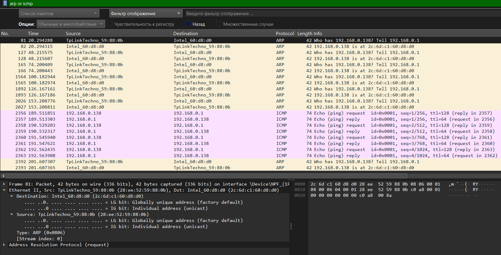

2. ARP Reply (пакет №82):

Описание: Мое устройство отвечает на ARP-запрос, сообщая свой MAC-адрес. Ответ звучит как: "192.168.0.138 находится по MAC-адресу 2c:6d:c1:60:d8:d0".

Заголовок Ethernet II:
Destination MAC: TpLinkTechno_59:88:0b (адресный ответ, не широковещательный)

Source MAC: Intel_60:d8:d0

Type: ARP (0x0806)

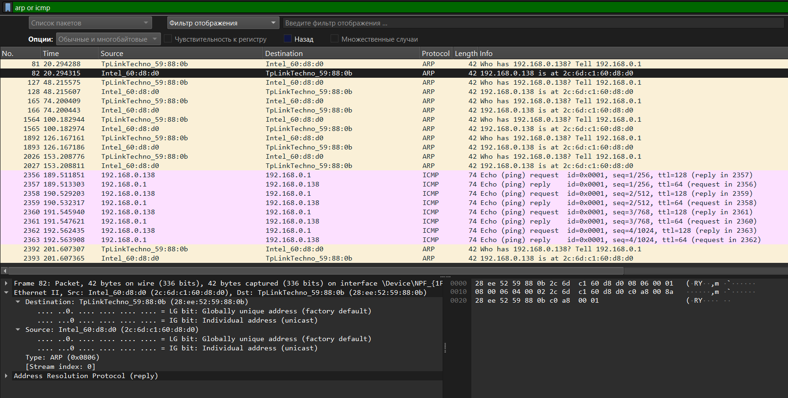

## Анализ протоколов транспортного уровня

### Анализ HTTP

**Проанализировать информацию по протоколу TCP в случае HTTP-запросов и ответов.**

Был осуществлен переход на сайт http://info.cern.ch/, после чего трафик был отфильтрован по http.

1. HTTP GET Request (пакет №152):

Описание: Клиент (мой ПК) запрашивает у сервера 188.184.67.127 корневую страницу /hypertext/WWW/TheProject.html.

Протокол TCP: Запрос инкапсулирован в TCP-сегмент. Source Port - динамический (49153), Destination Port - 80 (стандартный для HTTP).

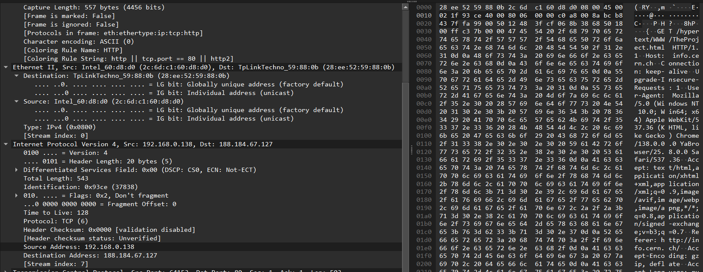

2. HTTP 200 OK Response (пакет №191):

Описание: Сервер успешно отвечает на запрос, отправляя содержимое HTML-страницы.

Протокол TCP: Ответ также передается по TCP. Source Port - 80, Destination Port - 49153.

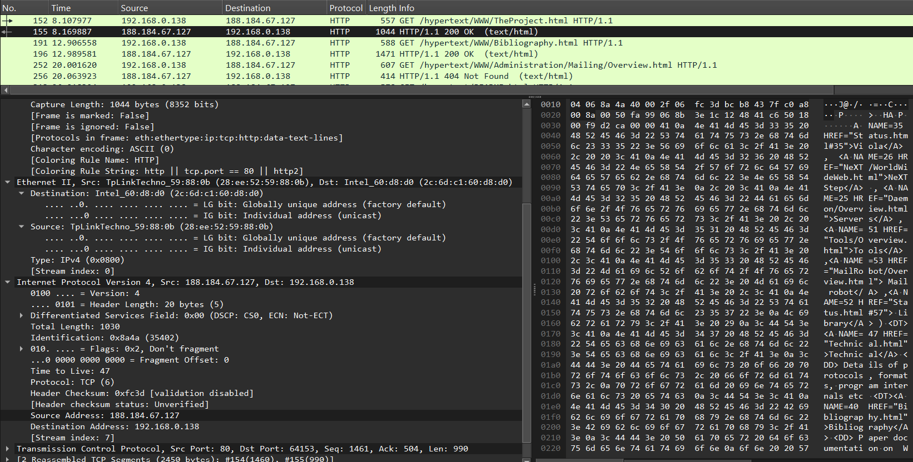

### Анализ DNS

**Проанализировать информацию по протоколу UDP в случае DNS-запросов и ответов.**

Был захвачен трафик во время работы в браузере и отфильтрован по dns.

1. DNS Standard Query (пакет №63):

Описание: Клиент запрашивает у DNS-сервера (192.168.0.1) IP-адрес для домена api.browser.yandex.ru.

Протокол UDP: Запрос инкапсулирован в UDP-дейтаграмму. Source Port - динамический (58384), Destination Port - 53 (стандартный для DNS).

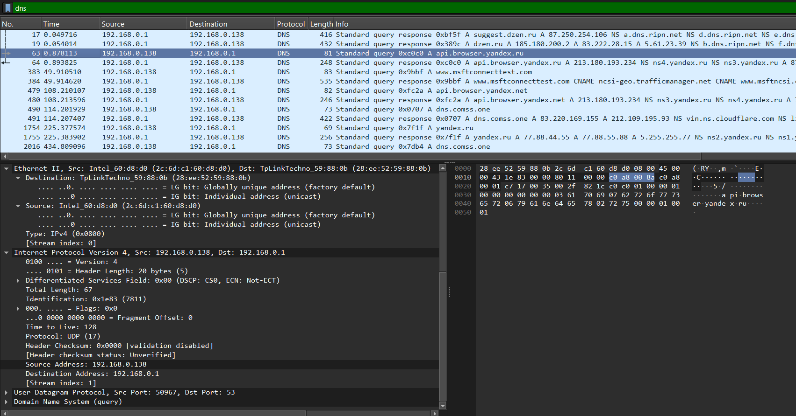

2. DNS Standard Query Response (пакет №64):

Описание: DNS-сервер отвечает, предоставляя IP-адрес для запрошенного домена.

Протокол UDP: Source Port - 53, Destination Port - 58384.

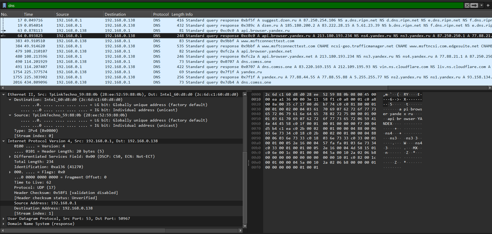

### Анализ QUIC

**Проанализировать информацию по протоколу QUIC.**

Был захвачен трафик к современному веб-ресурсу, использующему протокол QUIC.

Описание: QUIC (Quick UDP Internet Connections) — это транспортный протокол, работающий поверх UDP. Он обеспечивает шифрование по умолчанию и более быстрое установление соединения.

На скриншотах виден обмен пакетами Initial и Handshake, которые служат для установления защищенного соединения между клиентом 192.168.0.138 и сервером 142.250.74.131.

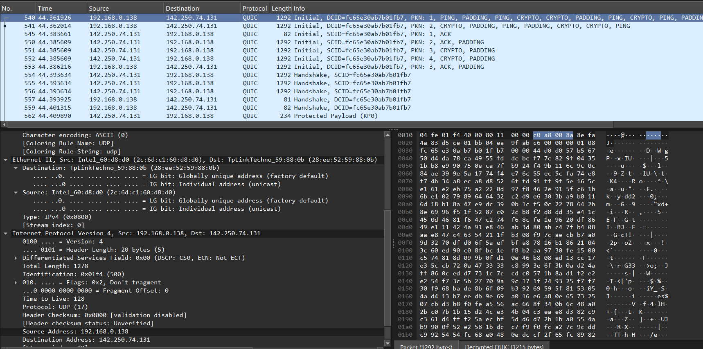

.png)

## Анализ handshake протокола TCP

### handshake

**С помощью Wireshark проанализировать handshake протокола TCP.**

Было инициировано соединение с веб-сервером, трафик был отфильтрован по tcp.port == 80. Были проанализированы первые три пакета, составляющие трёхступенчатое рукопожатие.

Шаг 1: SYN (пакет №143)

Клиент (192.168.0.138) отправляет серверу (188.184.67.127) сегмент с установленным флагом SYN (Synchronize). Это запрос на установку соединения.

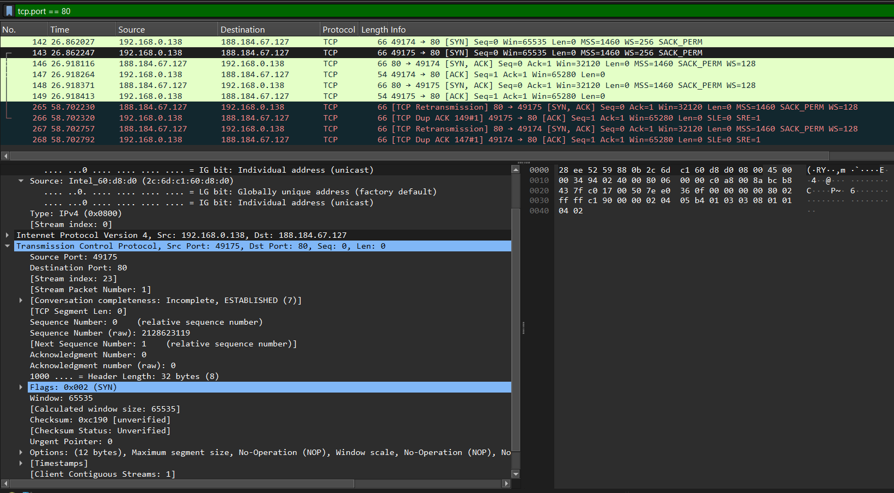

Шаг 2: SYN, ACK (пакет №146)

Сервер отвечает сегментом с двумя флагами: SYN (он также предлагает синхронизировать номер последовательности) и ACK (Acknowledgment - подтверждает получение первого пакета от клиента).

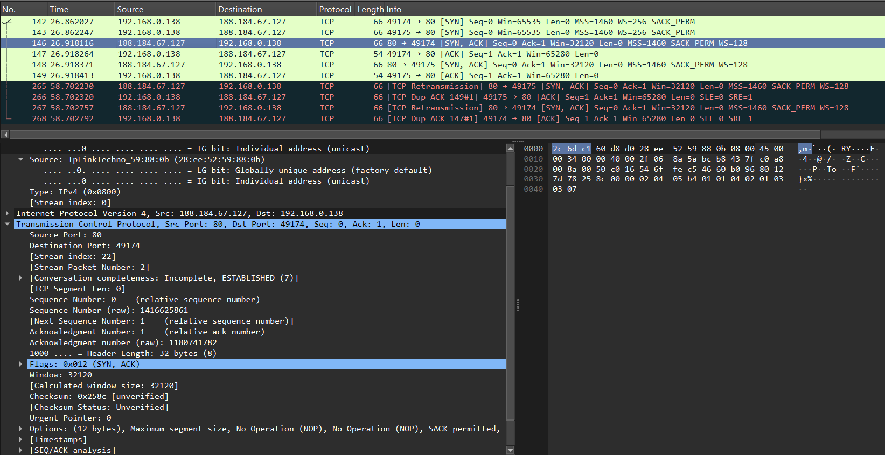

Шаг 3: ACK (пакет №147)

Клиент отправляет серверу сегмент с флагом ACK, подтверждая получение пакета SYN, ACK от сервера. На этом рукопожатие завершается, и соединение считается установленным.

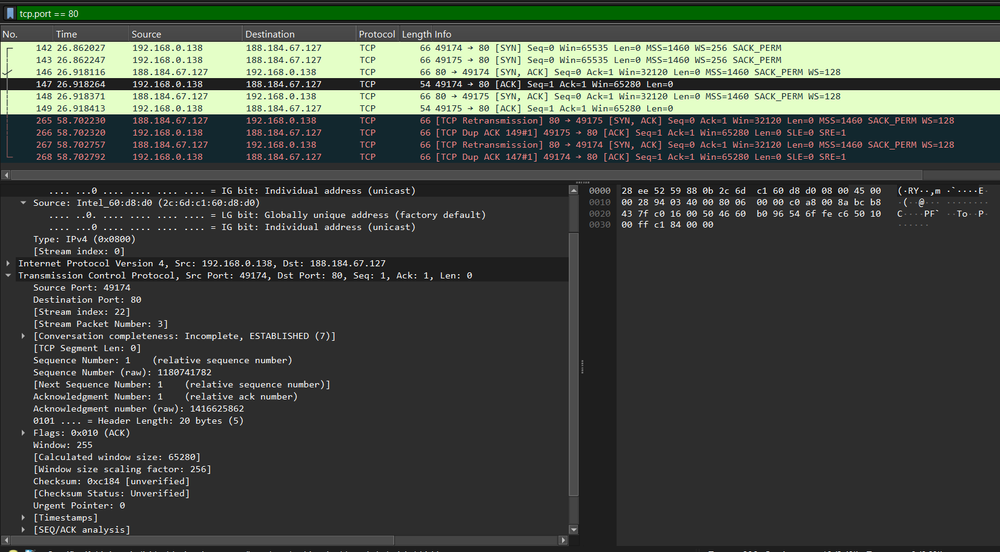

### График Потока

Для визуализации обмена был построен график потока, на котором наглядно представлено всё TCP-соединение, включая начальное трёхступенчатое рукопожатие и последующие повторные передачи (Retransmissions).

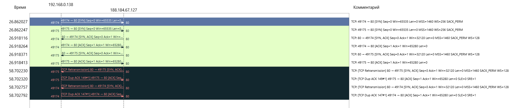

# Выводы

В ходе работы изучение посредством Wireshark кадров Ethernet, анализ PDU протоколов транспортного и прикладного уровней стека TCP/IP прошли успешно.

# Список литературы{.unnumbered}

(ТУИС)[https://esystem.rudn.ru/course/view.php?id=9060]

