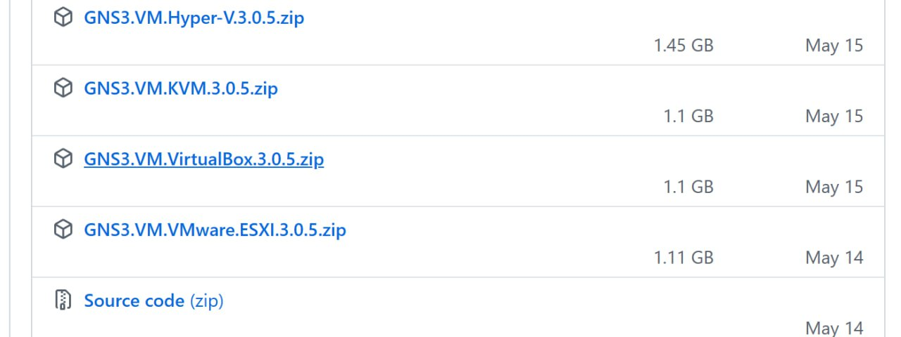
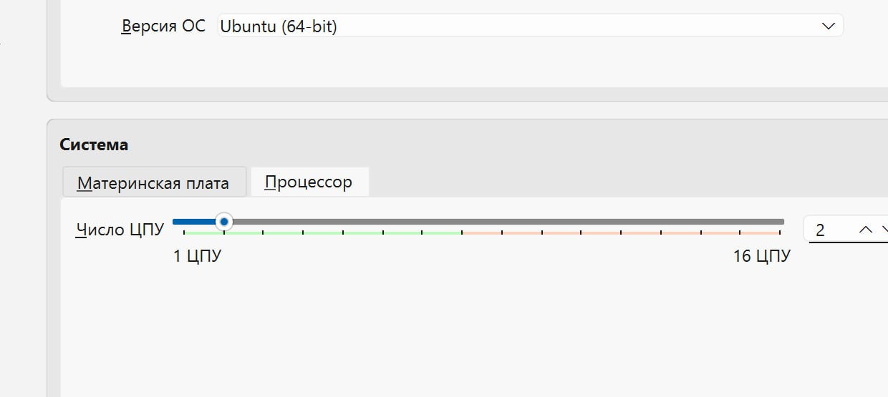
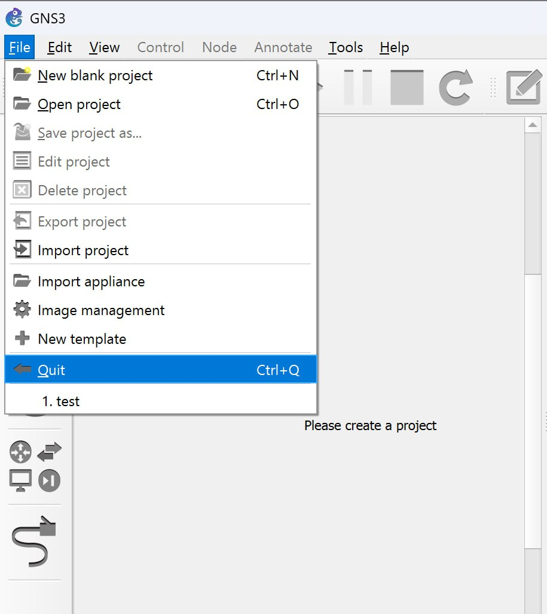
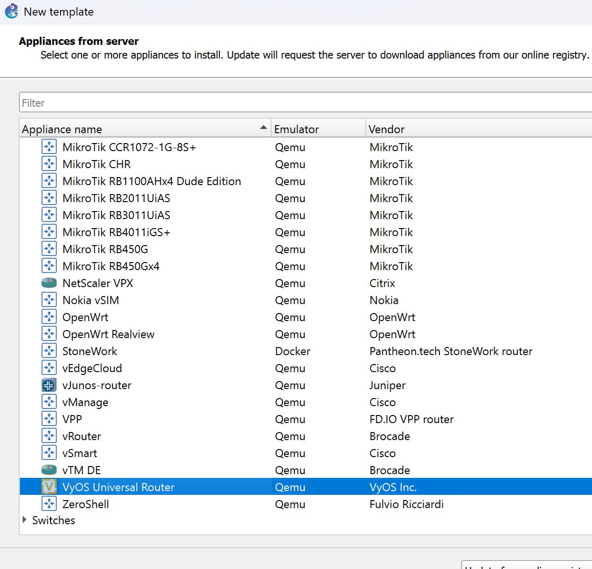

---
## Front matter
lang: ru-RU
title: Лабораторная №4
subtitle: Сетевые технологии
author:
  - Комягин А.Н.
institute:
  - Российский университет дружьы народов, Москва, Россия

## i18n babel
babel-lang: russian
babel-otherlangs: english

## Formatting pdf
toc: false
toc-title: Содержание
slide_level: 2
aspectratio: 169
section-titles: true
theme: metropolis
header-includes:
 - \metroset{progressbar=frametitle,sectionpage=progressbar,numbering=fraction}
 

## Fonts
mainfont: IBM Plex Serif
romanfont: IBM Plex Serif
sansfont: IBM Plex Sans
monofont: IBM Plex Mono
mathfont: STIX Two Math
mainfontoptions: Ligatures=Common,Ligatures=TeX,Scale=0.94
romanfontoptions: Ligatures=Common,Ligatures=TeX,Scale=0.94
sansfontoptions: Ligatures=Common,Ligatures=TeX,Scale=MatchLowercase,Scale=0.94
monofontoptions: Scale=MatchLowercase,Scale=0.94,FakeStretch=0.9
 
---

# Цель

## Цель

- Знакомство с GNS3. Установка и настройка GNS3 и сопутствующего программного обеспечения.

# Ход работы

## Установка
:::::::::::::: {.columns align=center}
::: {.column width="50%"}

Для начала работы необходимо установить все приложения и пакеты. С помощью менеджера пакетов Chocolatey устанавливаем gns3.
:::
::: {.column width="50%"}

:::
::::::::::::::

## Установка
:::::::::::::: {.columns align=center}
::: {.column width="50%"}

:::
::: {.column width="50%"}

В процессе установки при выборе комплектации требуется отметить MSVC Runtime, GNS3-Desktop, GNS3-VM, Tools. Расположение устанавливаемого пакета оставляем по умолчанию. В следующем окне отмечаем VirtualBox и завершаем установку.

:::
::::::::::::::

## Установка GNS3 VM
:::::::::::::: {.columns align=center}
::: {.column width="45%"}

Устанавливаем GNS3 VM для VirtualBox. Скачиваем архив с образом виртуальной машины с сайта GNS3. Проверяем, чтобы версии совпадали.

:::
::: {.column width="50%"}

:::
::::::::::::::

## Импорт в VirtualBox
:::::::::::::: {.columns align=center}
::: {.column width="50%"}

:::
::: {.column width="50%"}

:::
::::::::::::::

## Уточнение параметров
:::::::::::::: {.columns align=center}
::: {.column width="50%"}

:::
::: {.column width="50%"}

:::
::::::::::::::

## Запуск GNS3
:::::::::::::: {.columns align=center}
::: {.column width="50%"}

:::
::: {.column width="50%"}

Запускаем экземпляр GNS3 в VirtualBox. Параллельно запускаем само приложение GNS3, проверяем путь к серверу, порт и IP-адрес.
:::
::::::::::::::

## Запуск GNS3
:::::::::::::: {.columns align=center}
::: {.column width="50%"}

:::
::: {.column width="40%"}

:::
::::::::::::::

## Подключение образа оборудования
:::::::::::::: {.columns align=center}
::: {.column width="50%"}

Подключим маршрутизатор. Выберем Routers и образ FRR, подгрузим файлы, импортируем их и завершим установку.
:::
::: {.column width="40%"}

:::
::::::::::::::

## Подключение образа оборудования
:::::::::::::: {.columns align=center}
::: {.column width="50%"}

:::
::: {.column width="50%"}

:::
::::::::::::::

## Подключение образа оборудования
:::::::::::::: {.columns align=center}
::: {.column width="70%"}

:::

::::::::::::::

## Настройка образа
:::::::::::::: {.columns align=center}
::: {.column width="50%"}

В открывшемся окне во вкладке «General settings» в поле «On close» выбираем `Send the shutdown signal (ACPI)`. Во вкладке «HDD» ставим галочку `Automatically create a config disk on HDD`.
:::
::: {.column width="50%"}

:::
::::::::::::::

## Добавление образа VyOS
:::::::::::::: {.columns align=center}
::: {.column width="100%"}
Также необходимо произвести добавление образа маршрутизатора VyOS. С официального сайта устанавливаем необходимую версию, производим аналогичные действия по установке и конфигурации образа.
:::
::::::::::::::

## Добавление образа VyOS
:::::::::::::: {.columns align=center}
::: {.column width="50%"}

:::
::: {.column width="50%"}

:::
::::::::::::::

## Добавление образа VyOS
:::::::::::::: {.columns align=center}
::: {.column width="50%"}

:::
::: {.column width="50%"}

:::
::::::::::::::

# Вывод

## Вывод

- В ходе работы было произведено знакомство с GNS3, установлено и настроено GNS3, а также добавлены образы маршрутизаторов и сопутствующее программное обеспечение.
