---
## Front matter
title: "Лабораторная работа №4"
subtitle: "Дисциплина: Сетевые технологии"
author: "Комягин Андрей Николаевич"

## Generic otions
lang: ru-RU
toc-title: "Содержание"

## Bibliography
bibliography: bib/cite.bib
csl: pandoc/csl/gost-r-7-0-5-2008-numeric.csl

## Pdf output format
toc: true # Table of contents
toc-depth: 2
lof: true # List of figures
lot: true # List of tables
fontsize: 12pt
linestretch: 1.5
papersize: a4
documentclass: scrreprt
## I18n polyglossia
polyglossia-lang:
  name: russian
  options:
  - spelling=modern
  - babelshorthands=true
polyglossia-otherlangs:
  name: english
## I18n babel
babel-lang: russian
babel-otherlangs: english
## Fonts
mainfont: IBM Plex Serif
romanfont: IBM Plex Serif
sansfont: IBM Plex Sans
monofont: IBM Plex Mono
mathfont: STIX Two Math
mainfontoptions: Ligatures=Common,Ligatures=TeX,Scale=0.94
romanfontoptions: Ligatures=Common,Ligatures=TeX,Scale=0.94
sansfontoptions: Ligatures=Common,Ligatures=TeX,Scale=MatchLowercase,Scale=0.94
monofontoptions: Scale=MatchLowercase,Scale=0.94,FakeStretch=0.9
mathfontoptions:
## Biblatex
biblatex: true
biblio-style: "gost-numeric"
biblatexoptions:
  - parentracker=true
  - backend=biber
  - hyperref=auto
  - language=auto
  - autolang=other*
  - citestyle=gost-numeric
## Pandoc-crossref LaTeX customization
figureTitle: "Рис."
tableTitle: "Таблица"
listingTitle: "Листинг"
lofTitle: "Список иллюстраций"
lotTitle: "Список таблиц"
lolTitle: "Листинги"
## Misc options
indent: true
header-includes:
  - \usepackage{indentfirst}
  - \usepackage{float} # keep figures where there are in the text
  - \floatplacement{figure}{H} # keep figures where there are in the text
---

# Цель

Знакомство с GNS3. Установка и настройка GNS3 и сопутствующего программного обеспечения.
Выполнение лабораторной работы
В первую очередь необходимо установить все требуемые приложения. С помощью менеджера пакетов Chocolatey устанавливаем GNS3.

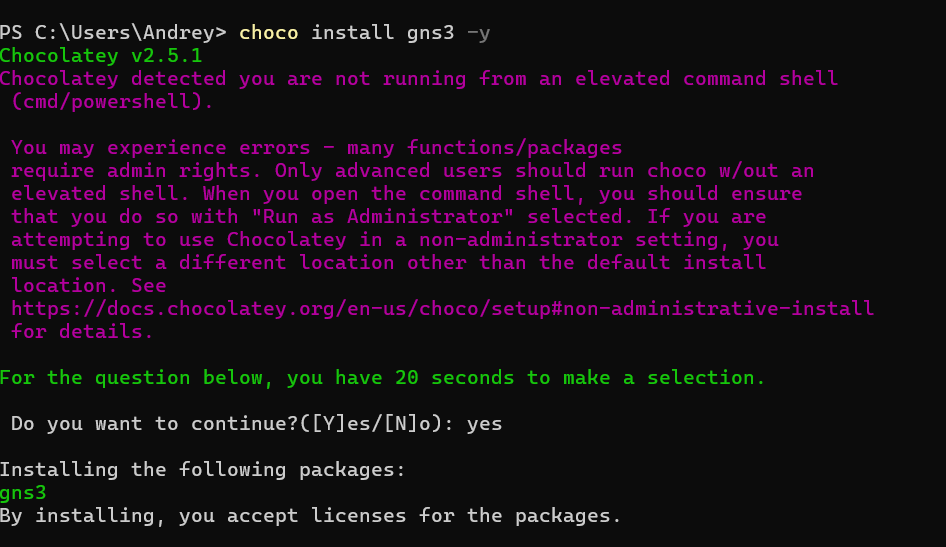

В процессе установки, при выборе компонентов, необходимо отметить MSVC Runtime, GNS3-Desktop, GNS3-VM, Tools и VirtualBox.

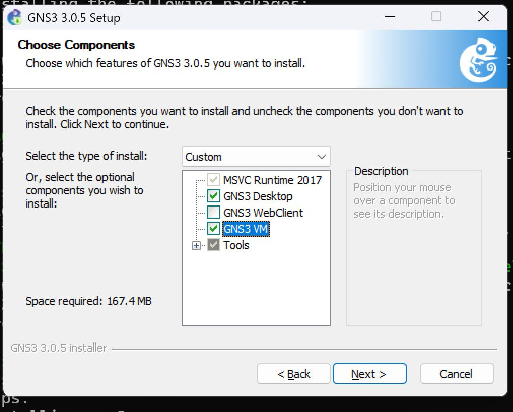

Далее устанавливаем GNS3 VM для VirtualBox. Скачиваем архив с образом виртуальной машины с официального репозитория, убедившись, что версии GNS3 и GNS3 VM совпадают.

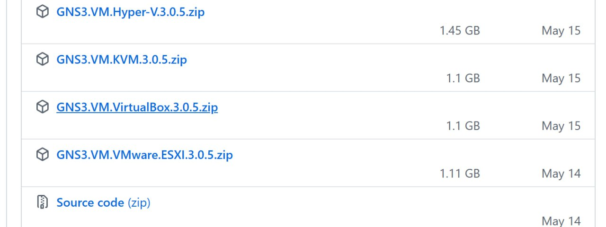

Запускаем VirtualBox и импортируем скачанную конфигурацию виртуальной машины.

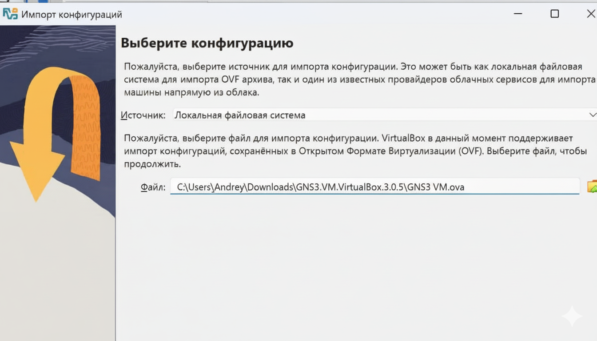

В настройках импортированной машины изменяем политику MAC-адреса.

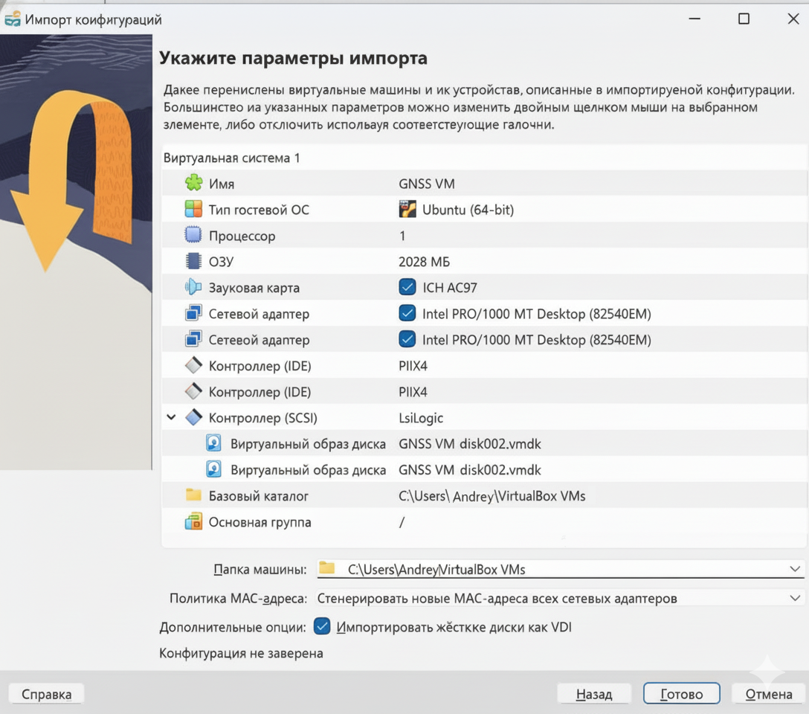

выделяем необходимые ресурсы

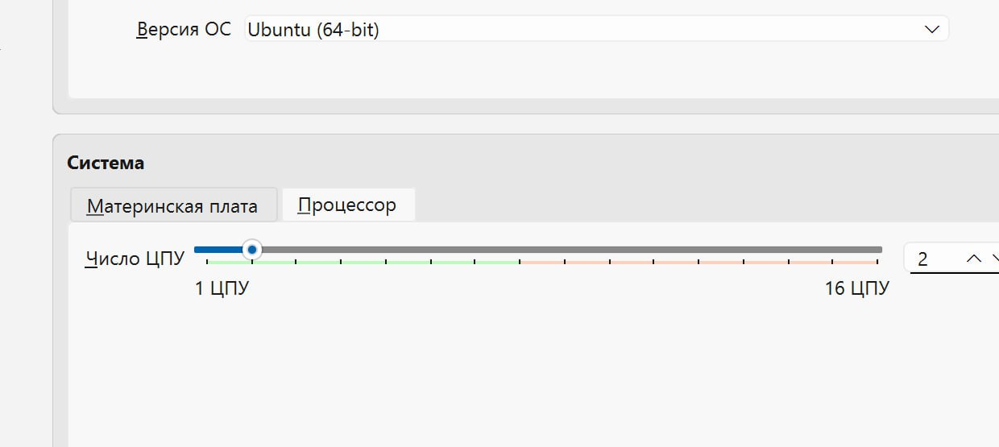

и включаем вложенную виртуализацию

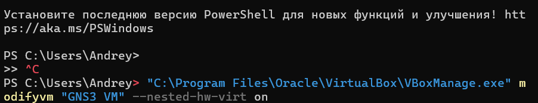

Запускаем виртуальную машину GNS3 VM в VirtualBox. 

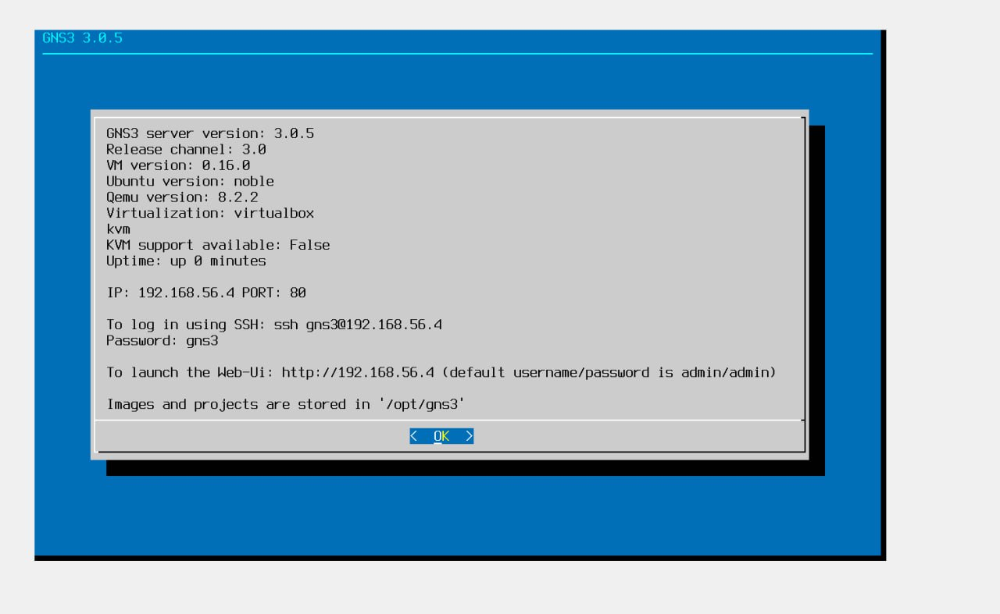

а затем и само приложение GNS3. Проверяем корректность путей и сетевых настроек сервера.

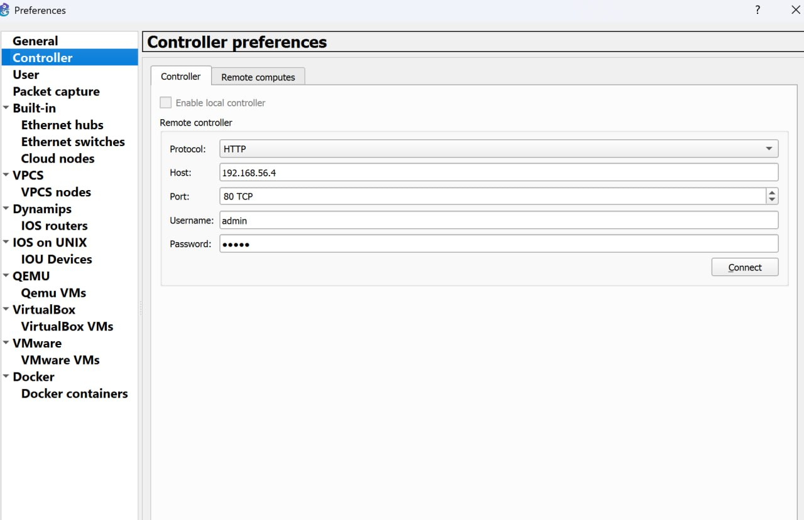

Для корректного выключения виртуальной машины из ее консоли используется команда quit.

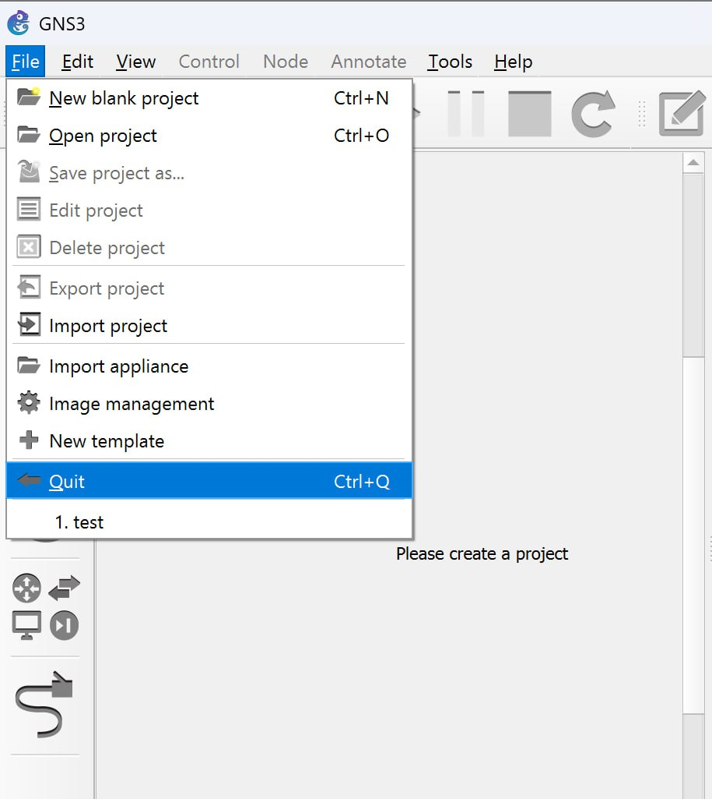

Далее необходимо подключить образы сетевого оборудования. Добавим маршрутизатор FRR. Для этого создаем новый шаблон, выбираем Routers и образ FRR, после чего импортируем необходимые файлы и завершаем установку.

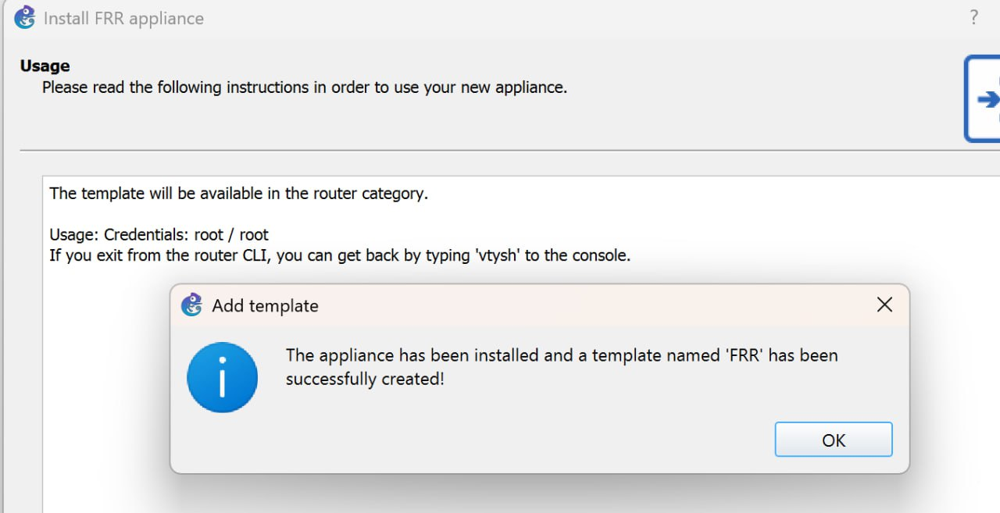

В настройках созданного шаблона маршрутизатора указываем "Send the shutdown signal (ACPI)" в качестве действия при закрытии и активируем опцию "Automatically create a config disk on HDD".

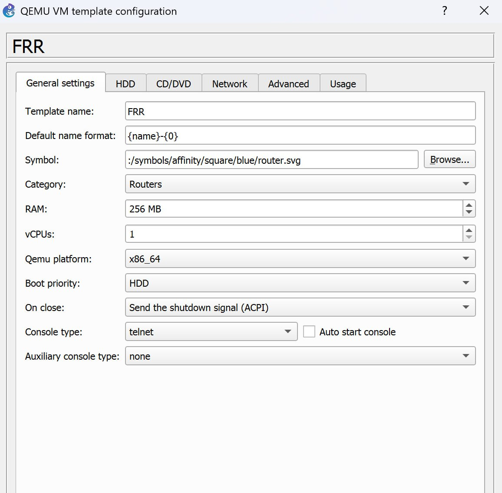

Аналогичным образом производим добавление и настройку образа маршрутизатора VyOS, предварительно скачав его с официального сайта.

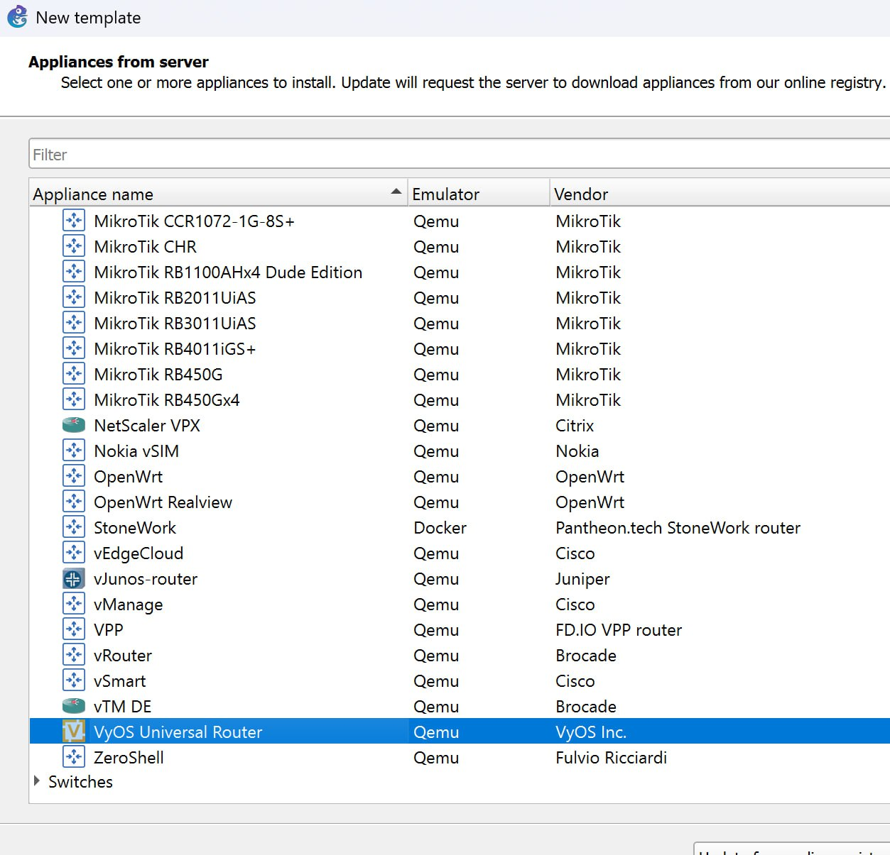

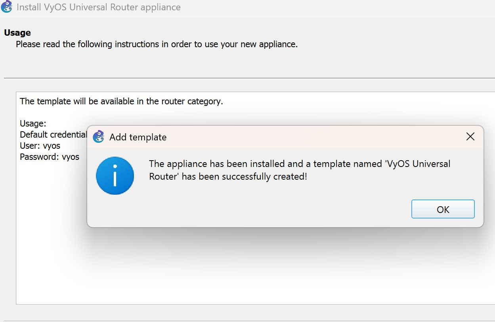

# Выводы
В ходе работы было произведено знакомство с GNS3, установлено и настроено GNS3 - добавлены образы маршрутизаторов и сопутствующее программное обеспечение.

# Список литературы{.unnumbered}

(ТУИС)[https://esystem.rudn.ru]

