---
## Front matter
title: "Лабораторная работа №5"
subtitle: "Дисциплина: Сетевые технологии"
author: "Комягин Андрей Николаевич"

## Generic otions
lang: ru-RU
toc-title: "Содержание"

## Bibliography
bibliography: bib/cite.bib
csl: pandoc/csl/gost-r-7-0-5-2008-numeric.csl

## Pdf output format
toc: true # Table of contents
toc-depth: 2
lof: true # List of figures
lot: true # List of tables
fontsize: 12pt
linestretch: 1.5
papersize: a4
documentclass: scrreprt
## I18n polyglossia
polyglossia-lang:
  name: russian
  options:
  - spelling=modern
  - babelshorthands=true
polyglossia-otherlangs:
  name: english
## I18n babel
babel-lang: russian
babel-otherlangs: english
## Fonts
mainfont: IBM Plex Serif
romanfont: IBM Plex Serif
sansfont: IBM Plex Sans
monofont: IBM Plex Mono
mathfont: STIX Two Math
mainfontoptions: Ligatures=Common,Ligatures=TeX,Scale=0.94
romanfontoptions: Ligatures=Common,Ligatures=TeX,Scale=0.94
sansfontoptions: Ligatures=Common,Ligatures=TeX,Scale=MatchLowercase,Scale=0.94
monofontoptions: Scale=MatchLowercase,Scale=0.94,FakeStretch=0.9
mathfontoptions:
## Biblatex
biblatex: true
biblio-style: "gost-numeric"
biblatexoptions:
  - parentracker=true
  - backend=biber
  - hyperref=auto
  - language=auto
  - autolang=other*
  - citestyle=gost-numeric
## Pandoc-crossref LaTeX customization
figureTitle: "Рис."
tableTitle: "Таблица"
listingTitle: "Листинг"
lofTitle: "Список иллюстраций"
lotTitle: "Список таблиц"
lolTitle: "Листинги"
## Misc options
indent: true
header-includes:
  - \usepackage{indentfirst}
  - \usepackage{float} # keep figures where there are in the text
  - \floatplacement{figure}{H} # keep figures where there are in the text
---

# Цель работы

Построение простейших моделей сети на базе коммутатора и маршрутизаторов FRR и VyOS в GNS3, анализ трафика посредством Wireshark.

# Выполнение лабораторной работы

Запустим GNS3 VM и GNS3. Создадим новый проект.

## Простейшая модель сети на базе коммутатора

В рабочей области GNS3 разместим коммутатор Ethernet и два VPCS. Изменим название устройства, включив в имя устройства имя учётной записи. Коммутатору присвоим название `msk-ankomyagin-sw-01`. Соединим VPCS с коммутатором. Отобразим обозначение интерфейсов соединения ([рис. @fig:001]).

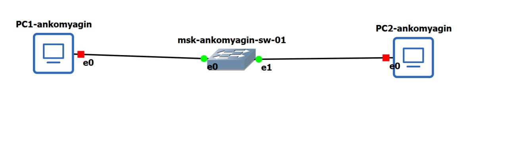{#fig:001 width=70%}

Зададим IP-адреса VPCS. Для `PC1-ankomyagin` зададим IP-адрес `192.168.1.11/24`, для `PC2-ankomyagin` - `192.168.1.12/24`. Просмотрим синтаксис и введем команды, сохранив изменения ([рис. @fig:002] и рис. [@fig:003]).

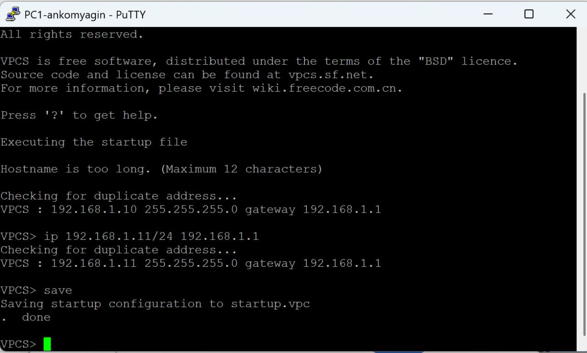{#fig:002 width=70%}

{#fig:003 width=70%}

Командой `ping 192.168.1.11` с `PC2-ankomyagin` проверяем работоспособность соединения и останавливаем все узлы ([рис. @fig:004] и [рис. @fig:005]).

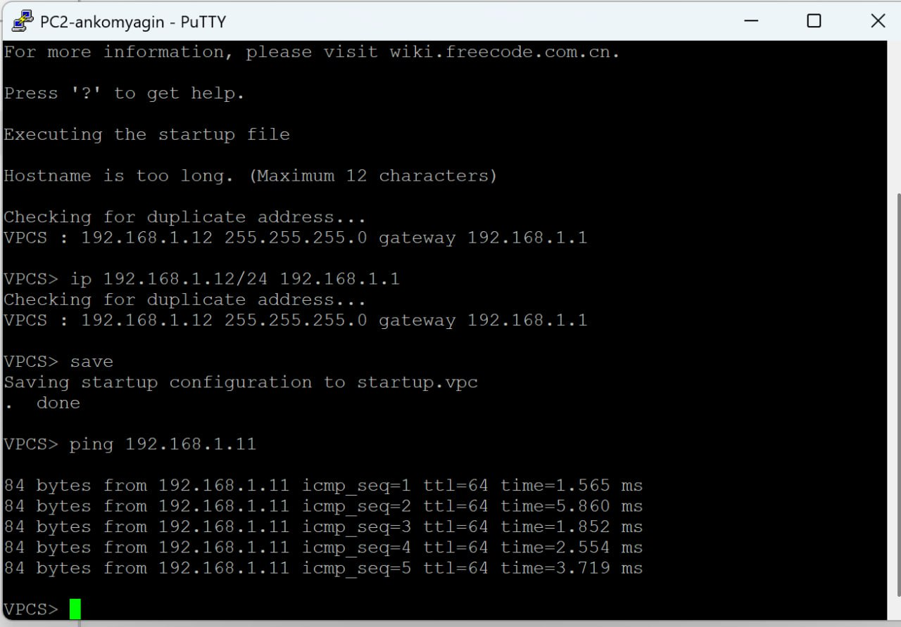{#fig:004 width=70%}

{#fig:005 width=70%}

### Анализ трафика с помощью Wireshark

Перейдем к анализу трафика в GNS3 посредством Wireshark.

Запускаем анализ трафика, стартуем все узлы и видим информацию по протоколу ARP - были успешно захвачены широковещательные ARP-сообщения, которые устройства рассылают при запуске для объявления своих адресов ([рис. @fig:006] и [рис. @fig:007]).

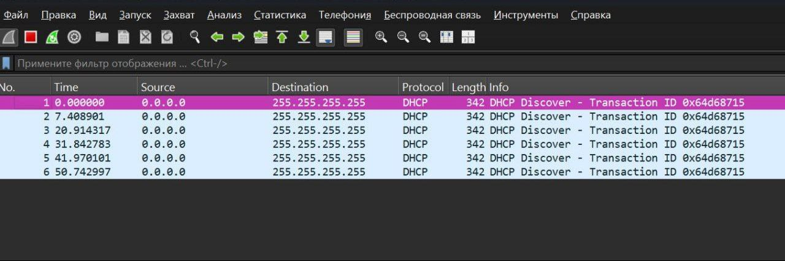{#fig:006 width=70%}

{#fig:007 width=70%}

В терминале PC-2 посмотрим информацию по опциям команды ping, введя `ping /?` ([рис. @fig:008]). Затем сделаем эхо-запрос в ICMP-моде к узлу PC-1 ([рис. @fig:009]) и посмотрим окно Wireshark ([рис. @fig:010]).

{#fig:008 width=70%}

{#fig:009 width=70%}

{#fig:010 width=70%}

Аналогично сделаем эхо-запросы в UDP-моде и в TCP-моде к узлу PC-1 ([рис. @fig:011] и [рис. @fig:012], [рис. @fig:013] и [рис. @fig:014]). Были захвачены и проанализированы ICMP-пакеты, наглядно демонстрирующие процесс проверки связности с помощью утилиты `ping`. Виден полный цикл: предварительный ARP-запрос для определения MAC-адреса и последующий обмен эхо-запросами и ответами. Было успешно захвачено и проанализировано взаимодействие по протоколу TCP. Видны все этапы: "тройное рукопожатие" для установки соединения, передача данных с подтверждением и корректное завершение сеанса. Остановим захват пакетов.

{#fig:011 width=70%}

{#fig:012 width=70%}

{#fig:013 width=70%}

{#fig:014 width=70%} 

## Моделирование простейшей сети на базе маршрутизатора FRR

Далее перейдем к моделированию простейшей сети на базе маршрутизатора FRR в GNS3.

Создаем новый проект, разместив VPCS, коммутатор Ethernet и маршрутизатор FRR ([рис. @fig:015]).

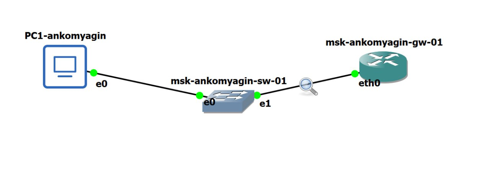{#fig:015 width=70%}

Включим захват трафика на соединении между коммутатором и маршрутизатором. Запустим все устройства проекта. Откроем консоль всех устройств проекта и настроим IP-адресацию для интерфейса узла `PC1-ankomyagin`: `ip 192.168.1.10/24 192.168.1.1` ([рис. @fig:016]).

{#fig:016 width=70%}

Настроим IP-адресацию для интерфейса локальной сети маршрутизатора, задав имя узла `msk-ankomyagin-gw-01` ([рис. @fig:017] и [рис. @fig:018]).

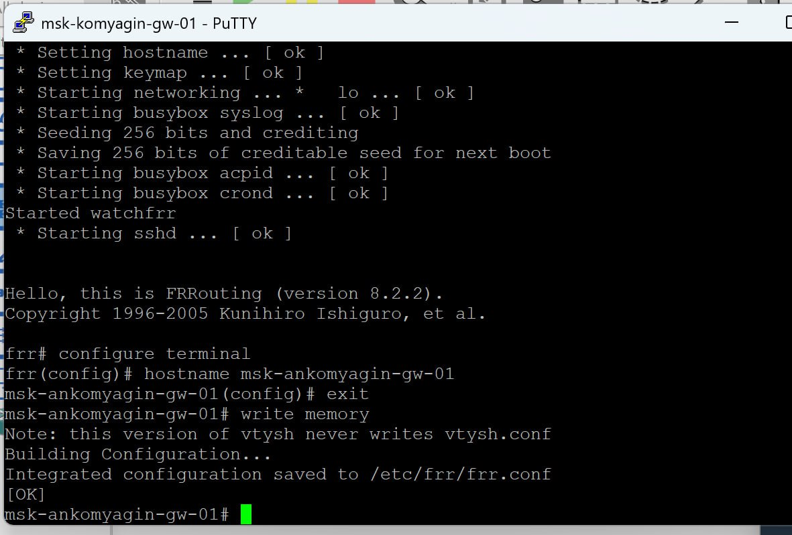{#fig:017 width=70%}

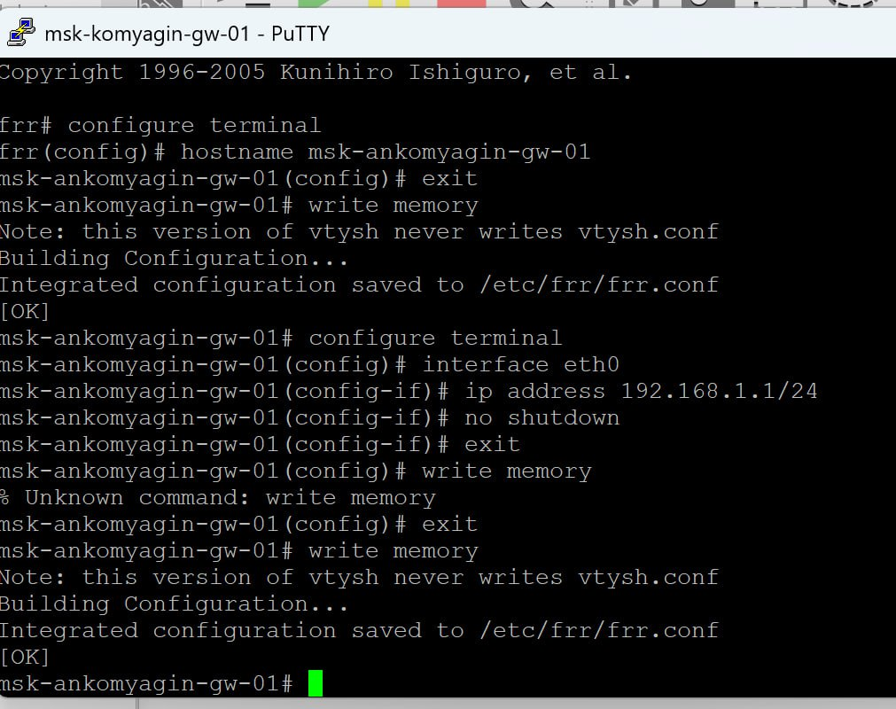{#fig:018 width=70%}

Проверим конфигурацию маршрутизатора с помощью `show running-config` и `show interface brief`, а также проверим подключение, выполнив `ping` с PC1 на шлюз `192.168.1.1` ([рис. @fig:019] и [рис. @fig:020]).

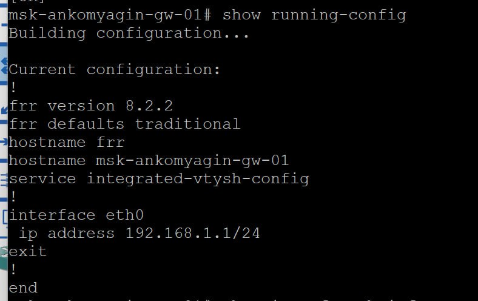{#fig:019 width=70%}

{#fig:020 width=70%}

Просмотрим информацию в окне Wireshark. В захвате видны ARP-запросы для определения MAC-адресов PC1 (192.168.1.10) и шлюза (192.168.1.1), а также последующий обмен ICMP-пакетами (Echo request/reply) ([рис. @fig:021]).

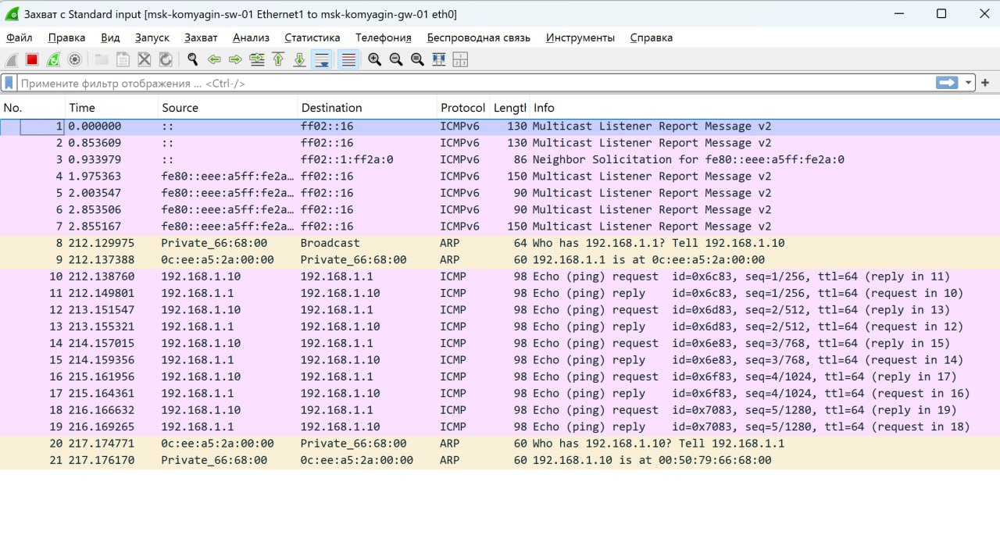{#fig:021 width=70%}

## Моделирование простейшей сети на базе маршрутизатора VyOS

Наконец, перейдем к моделированию простейшей сети на базе маршрутизатора VyOS в GNS3.

Создаем новый проект и размещаем объекты - VPCS, коммутатор Ethernet и маршрутизатор VyOS ([рис. @fig:022]).

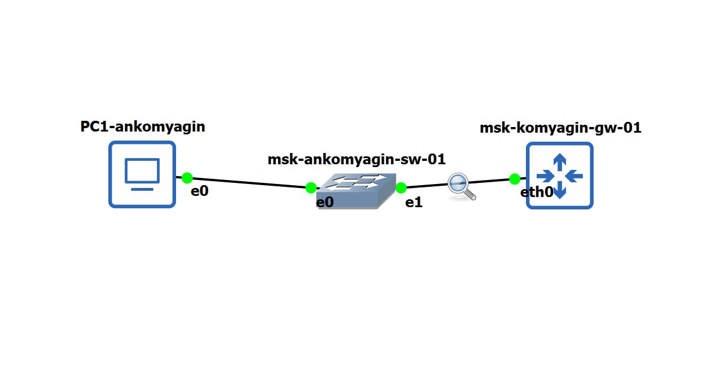{#fig:022 width=70%}

Включаем захват трафика, запускаем все устройства проекта и настраиваем IP-адресацию для интерфейса узла `PC1-ankomyagin`: `ip 192.168.1.10/24 192.168.1.1` ([рис. @fig:023]).

{#fig:023 width=70%}

Далее настраиваем маршрутизатор VyOS. Вводим логин, пароль ([рис. @fig:024]), после проверки установки в режиме конфигурирования изменяем имя устройства на `msk-ankomyagin-gw-01`, задаем ip-адрес `192.168.1.1/24`, просматриваем и применяем изменения ([рис. @fig:025]).

{#fig:024 width=70%}

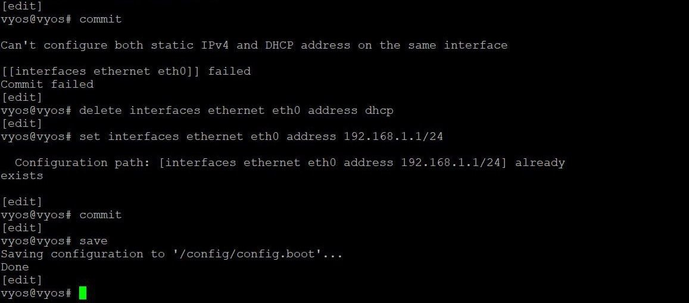{#fig:025 width=70%}

Проверяем подключение. Узел `PC1-ankomyagin` должен успешно отправлять эхо-запросы на адрес маршрутизатора `192.168.1.1` ([рис. @fig:026]).

{#fig:026 width=70%}

Просмотрим информацию в окне Wireshark, остановим захват и завершим работу ([рис. @fig:027]).

{#fig:027 width=70%}

# Выводы

В ходе работы были получены навыки по построению простейших моделей сети на базе коммутатора и маршрутизаторов FRR и VyOS в GNS3, произведен анализ трафика (ARP, ICMP, UDP, TCP) посредством Wireshark.

# Список литературы{.unnumbered}

[ТУИС](https://esystem.rudn.ru/pluginfile.php/2858375/mod_resource/content/2/005-lab_datalink-layer-GNS3-WSh.pdf)

