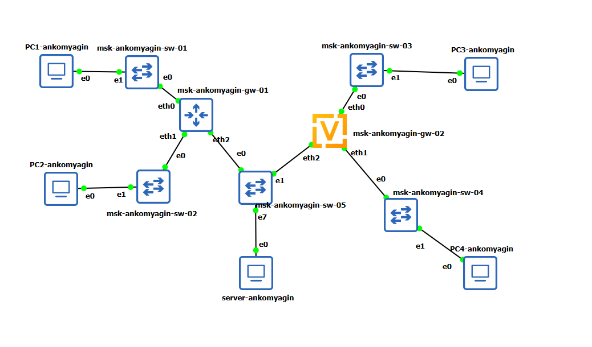
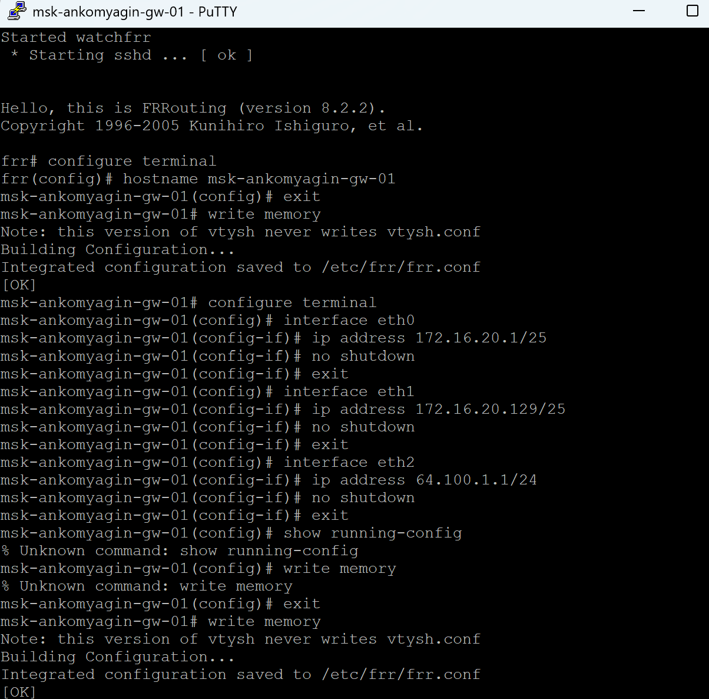
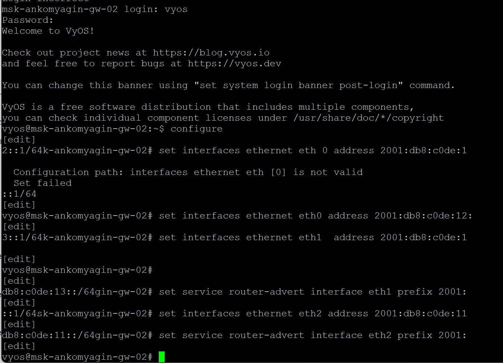
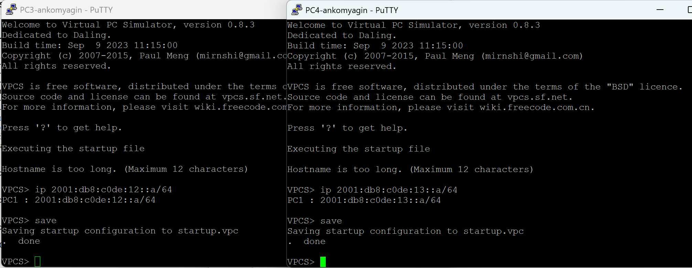
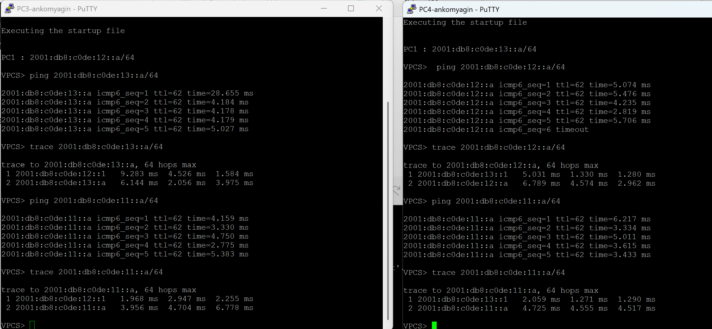
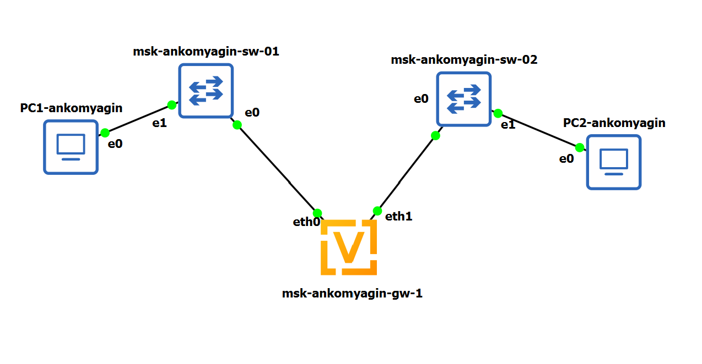

---
## Front matter
lang: ru-RU
title: Лабораторная работа №6
subtitle: Адресация IPv4 и IPv6. Двойной стек
author:
 - Комягин А.А.
institute:
 - Российский университет дружбы народов, Москва, Россия

## i18n babel
babel-lang: russian
babel-otherlangs: english

## Formatting pdf
toc: false
toc-title: Содержание
slide_level: 2
aspectratio: 169
section-titles: true
theme: metropolis
header-includes:
 - \metroset{progressbar=frametitle,sectionpage=progressbar,numbering=fraction}
---

# Цель работы

## Цель

Изучение принципов распределения и настройки адресного пространства на устройствах сети, а также реализация сети с двойным стеком протоколов (IPv4 и IPv6).

# Задачи

## Основные задачи

1. Расчет подсетей IPv4 (VLSM) и IPv6.

2. Реализация топологии сети в GNS3.

3. Настройка маршрутизатора FRR (IPv4).

4. Настройка маршрутизатора VyOS (IPv6).

5. Конфигурирование конечных устройств.

6. Анализ трафика и проверка связности.

# Расчетная часть

## Разбиение сети IPv4

**Задача:** Разбить сеть `172.16.20.0/24` на 3 подсети (126, 62, 62 узла).

**Решение:**

1. **126 узлов:** Префикс **/25** (128 адресов).

   * Сеть: `172.16.20.0/25`

2. **62 узла:** Префикс **/26** (64 адреса).

   * Сеть: `172.16.20.128/26`

3. **62 узла:** Префикс **/26** (64 адреса).

   * Сеть: `172.16.20.192/26`

## Разбиение сети IPv6

**Задача:** Разбить сеть `2001:db8:c0de::/48`.

**Решение:**

Используем идентификатор подсети (Subnet ID):

1. Подсеть 1: `2001:db8:c0de:1::/64`

2. Подсеть 2: `2001:db8:c0de:2::/64`

3. ...

4. Подсеть N: `2001:db8:c0de:ffff::/64`

# Реализация топологии

## Схема сети

Сеть состоит из двух сегментов:

- Левый сегмент: IPv4 (Router FRR)

- Правый сегмент: IPv6 (Router VyOS)

- Центральный сервер: Dual Stack

{width=60%}

# Настройка IPv4

## Конфигурация конечных устройств

Настройка IP-адресов и шлюзов на PC1 и PC2.

{width=60%}

## Настройка маршрутизатора FRR

Настройка интерфейсов `eth0`, `eth1`, `eth2` на маршрутизаторе `msk-ankomyagin-gw-01`.

{width=60%}

## Проверка связности IPv4

Успешное прохождение эхо-запросов (Ping) и трассировки маршрута.

# Настройка IPv6

## Конфигурация маршрутизатора VyOS

Настройка интерфейсов и префиксов сети на маршрутизаторе `msk-ankomyagin-gw-02`.

{width=60%}

## Конфигурация конечных устройств IPv6
Настройка статических IPv6 адресов на PC3 и PC4.

## Проверка связности IPv6

Тестирование доступности узлов и маршрутизации в сегменте IPv6.

# Анализ трафика

## Перехват пакетов

Анализ дампа трафика на линке сервера:

- Видны запросы **ARP** для разрешения IPv4 адресов.

- Видны запросы **Neighbor Solicitation (ICMPv6)** для IPv6.

{width=60%}

# Самостоятельная работа

## Топология и задача

Реализация топологии "галочка" с одним маршрутизатором VyOS, разделяющим сеть на две подсети с поддержкой Dual Stack.

## Настройка оборудования
Конфигурация интерфейсов маршрутизатора VyOS для работы с двумя подсетями одновременно по IPv4 и IPv6.

![]image/(19.png)

## Проверка результатов
Успешная проверка связности между подсетями по обоим протоколам.

# Выводы

## Результаты

- Изучены методы бесклассовой адресации (CIDR) и VLSM.

- Приобретены навыки настройки оборудования FRR и VyOS.

- Реализована и протестирована сеть с двойным стеком протоколов.

- Проведен анализ различий в служебных протоколах IPv4 и IPv6 (ARP vs NDP).

