---
# Front matter
title: "Лабораторная работа №6"
subtitle: "Адресация IPv4 и IPv6. Двойной стек"
author: "Комягин Андрей Андреевич"

# Generic options
lang: ru-RU
toc-title: "Содержание"

# Pdf output format
toc: true # Table of contents
toc-depth: 2
lof: true # List of figures
lot: true # List of tables
fontsize: 12pt
linestretch: 1.5
papersize: a4
documentclass: scrreprt

# Fonts
mainfont: IBM Plex Serif
romanfont: IBM Plex Serif
sansfont: IBM Plex Sans
monofont: IBM Plex Mono
mathfont: STIX Two Math
mainfontoptions: Ligatures=Common,Ligatures=TeX,Scale=0.94
romanfontoptions: Ligatures=Common,Ligatures=TeX,Scale=0.94
sansfontoptions: Ligatures=Common,Ligatures=TeX,Scale=MatchLowercase,Scale=0.94
monofontoptions: Scale=MatchLowercase,Scale=0.94,FakeStretch=0.9
mathfontoptions: []

# Biblatex
biblatex: true
biblio-style: gost-numeric
biblatexoptions:
  - parentracker=true
  - backend=biber
  - hyperref=auto
  - language=auto
  - autolang=other*
  - citestyle=gost-numeric

# Pandoc-crossref LaTeX customization
figureTitle: "Рис."
tableTitle: "Таблица"
listingTitle: "Листинг"
lofTitle: "Список иллюстраций"
lotTitle: "Список таблиц"
lolTitle: "Листинги"

# Misc options
indent: true
header-includes:
  - \usepackage{indentfirst}
  - \usepackage{float} # keep figures where they are in the text
  - \floatplacement{figure}{H}
---

# Цель работы

Изучение принципов распределения и настройки адресного пространства на устройствах сети, а также реализация и тестирование сети с двойным стеком протоколов (IPv4 и IPv6) в среде моделирования GNS3.

# Выполнение лабораторной работы

## 1. Разбиение сети на подсети (Расчетная часть)

Перед настройкой оборудования были выполнены задания по расчету адресации.

### 1.1. Разбиение IPv4-сети

**Задание 1:** Задана сеть `172.16.20.0/24`. Разбить на 3 подсети с числом узлов 126, 62, 62.

*   Исходная сеть: `172.16.20.0`

*   Маска: `255.255.255.0` (/24)

*   Всего адресов: 256.

**Решение:**

1.  **Подсеть A (126 узлов):** Требуется $2^n - 2 \ge 126 \Rightarrow n=7$ бит хоста. Префикс $/25$ ($32-7$).

    *   Адрес сети: `172.16.20.0/25`

    *   Диапазон: `172.16.20.1 - 172.16.20.126`

    *   Broadcast: `172.16.20.127`

2.  **Подсеть B (62 узла):** Требуется $2^n - 2 \ge 62 \Rightarrow n=6$ бит хоста. Префикс $/26$ ($32-6$).

    *   Адрес сети: `172.16.20.128/26`

    *   Диапазон: `172.16.20.129 - 172.16.20.190`

    *   Broadcast: `172.16.20.191`

3.  **Подсеть C (62 узла):** Требуется $2^n - 2 \ge 62 \Rightarrow n=6$ бит хоста. Префикс $/26$.

    *   Адрес сети: `172.16.20.192/26`

    *   Диапазон: `172.16.20.193 - 172.16.20.254`

    *   Broadcast: `172.16.20.255`

**Задание 2:** Задана сеть `10.10.1.64/26`. Выделить подсеть на 30 узлов.

*   Исходная маска /26 (64 адреса).

*   Требуется 30 узлов: $2^5 - 2 = 30$. Нужно 5 бит для хоста. Префикс $/27$.

*   Результат: Подсеть `10.10.1.64/27`. Диапазон: `10.10.1.65 - 10.10.1.94`.

**Задание 3:** Задана сеть `10.10.1.0/26`. Выделить подсеть на 14 узлов.

*   Требуется 14 узлов: $2^4 - 2 = 14$. Нужно 4 бита для хоста. Префикс $/28$.

*   Результат: Подсеть `10.10.1.0/28`.

### 1.2. Разбиение IPv6-сети

**Задание 1:** Задана сеть `2001:db8:c0de::/48`.

*   Адрес: Глобальный индивидуальный (Global Unicast).

*   Разбиение с использованием идентификатора подсети (рекомендуемое):

    *   Подсеть 1: `2001:db8:c0de:1::/64`

    *   Подсеть 2: `2001:db8:c0de:2::/64`

**Задание 2:** Задана сеть `2a02:6b8::/64`.

*   Разбиение за счет идентификатора интерфейса (смещение границы):

    *   Подсеть 1: `2a02:6b8:0:0:0::/80`

    *   Подсеть 2: `2a02:6b8:0:0:1::/80`

---

## 2. Настройка двойного стека адресации в GNS3

### 2.1. Реализация топологии

В среде GNS3 была собрана топология сети, состоящая из двух сегментов. Левый сегмент (IPv4) подключен к маршрутизатору FRR (`msk-ankomyagin-gw-01`), правый сегмент (IPv6) подключен к маршрутизатору VyOS (`msk-ankomyagin-gw-02`). Центральным узлом является коммутатор, соединяющий маршрутизаторы и сервер с двойным стеком.

{#fig:001}

### 2.2. Настройка IPv4-адресации

В соответствии с таблицей адресации (Таблица 6.6 из задания) была выполнена настройка узлов PC1, PC2 и Server.

**Настройка PC1:**

Команда: `ip 172.16.20.10/25 172.16.20.1`

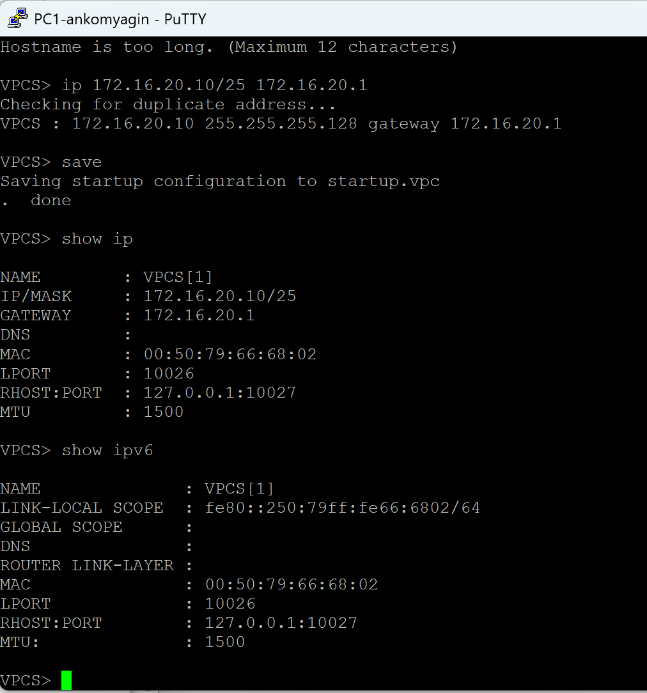{#fig:002}

**Настройка PC2:**

Команда: `ip 172.16.20.138/25 172.16.20.129`

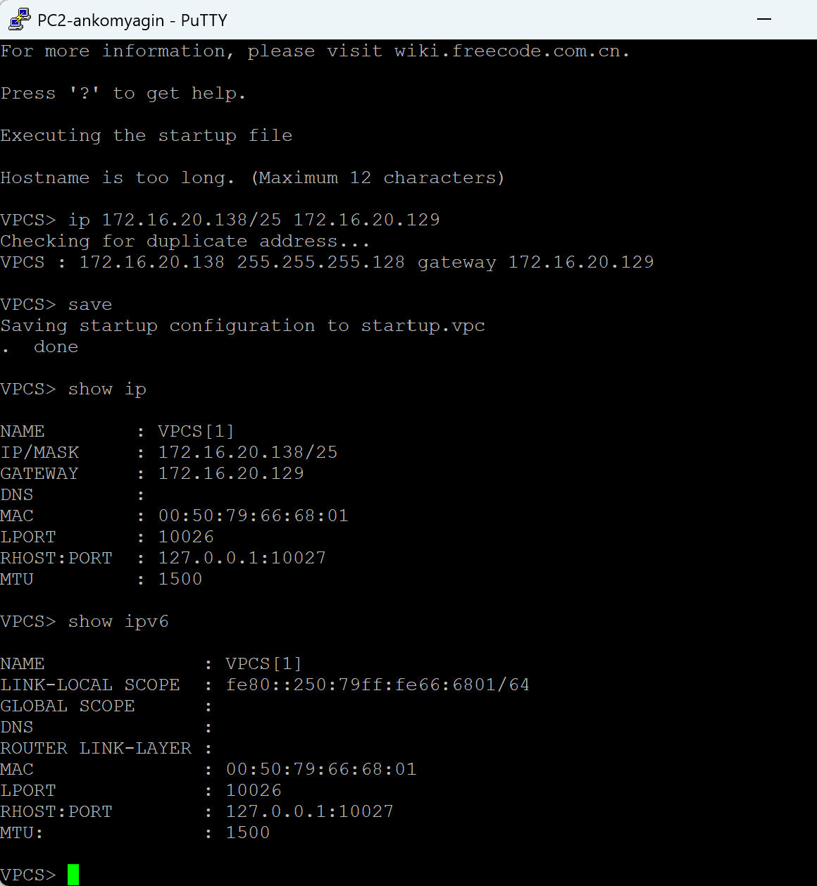{#fig:003}

**Настройка Server (IPv4 интерфейс):**

Команда: `ip 64.100.1.10/24 64.100.1.1`

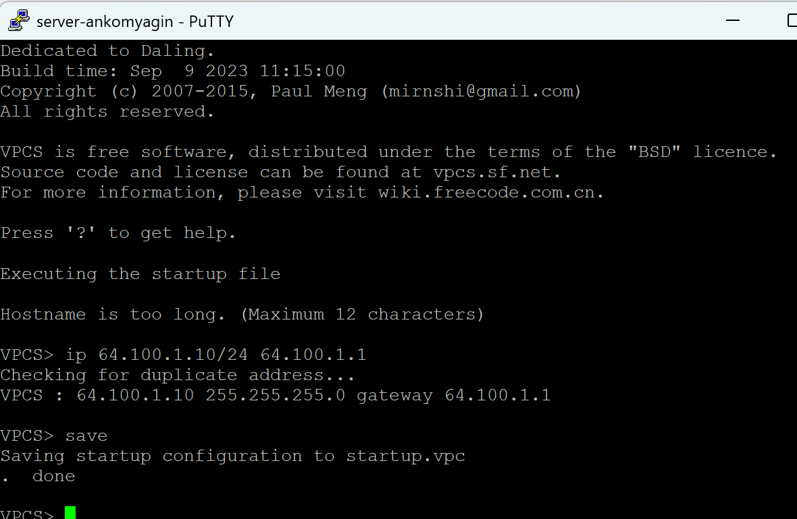{#fig:004}

**Настройка маршрутизатора FRR (msk-ankomyagin-gw-01):**

На маршрутизаторе были настроены IP-адреса на интерфейсах `eth0`, `eth1` и `eth2`.


```bash
configure terminal
interface eth0
 ip address 172.16.20.1/25
 no shutdown
interface eth1
 ip address 172.16.20.129/25
 no shutdown
interface eth2
 ip address 64.100.1.1/24
 no shutdown
```

{#fig:005}

Проверка конфигурации интерфейсов на маршрутизаторе:

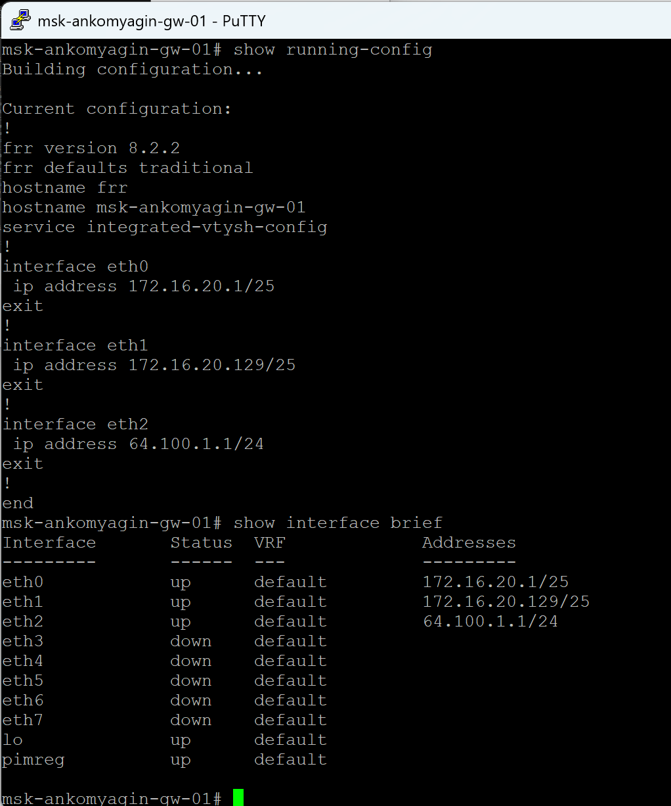{#fig:006}

**Проверка подключения IPv4:**

Выполнена проверка доступности узлов с помощью команды `ping`.

PC1 успешно пингует PC2 (`172.16.20.138`) и Сервер (`64.100.1.10`). PC2 также имеет доступ к сети.

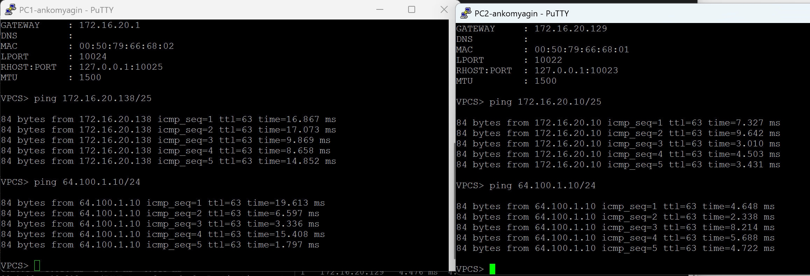{#fig:007}

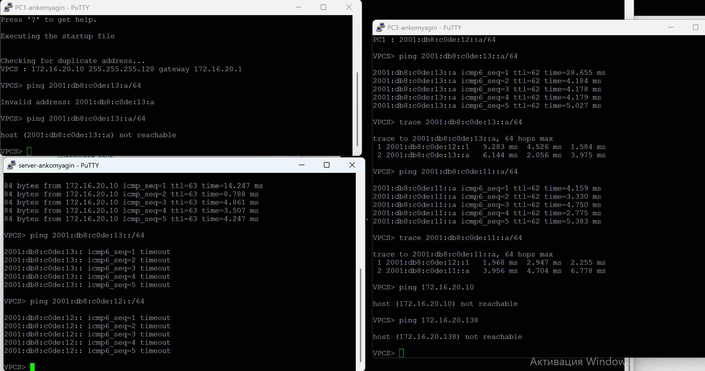{#fig:008}

### 2.3. Настройка IPv6-адресации

Для сегмента IPv6 использовался маршрутизатор VyOS.

**Установка и базовая настройка VyOS:**

Произведена установка образа системы на диск виртуальной машины и задано имя хоста.

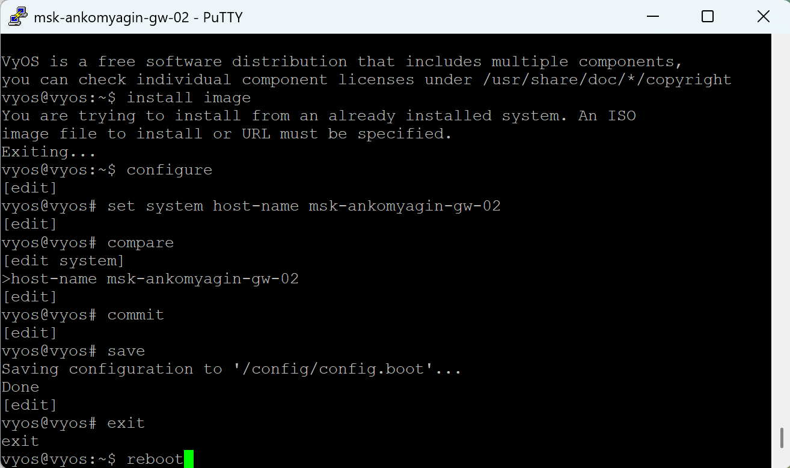{#fig:009}

**Настройка интерфейсов VyOS (msk-ankomyagin-gw-02):**
Настроены адреса IPv6 и объявления маршрутизатора (Router Advertisement) для автоконфигурации, хотя адреса на клиентах задавались статически согласно заданию.


```bash
set interfaces ethernet eth0 address 2001:db8:c0de:12::1/64
set interfaces ethernet eth1 address 2001:db8:c0de:13::1/64
set interfaces ethernet eth2 address 2001:db8:c0de:11::1/64
```

{#fig:010}

Проверка примененной конфигурации:

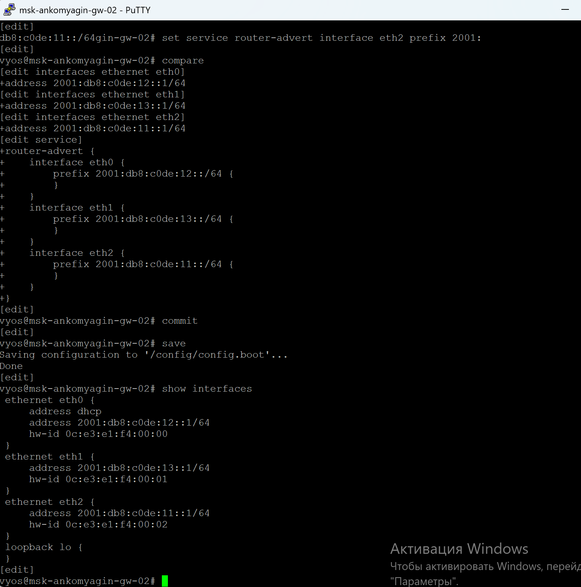{#fig:011}

**Настройка клиентов IPv6 (PC3, PC4, Server):**

*   **PC3:** `ip 2001:db8:c0de:12::a/64`

*   **PC4:** `ip 2001:db8:c0de:13::a/64`

{#fig:012}

*   **Server (IPv6):** `ip 2001:db8:c0de:11::a/64`

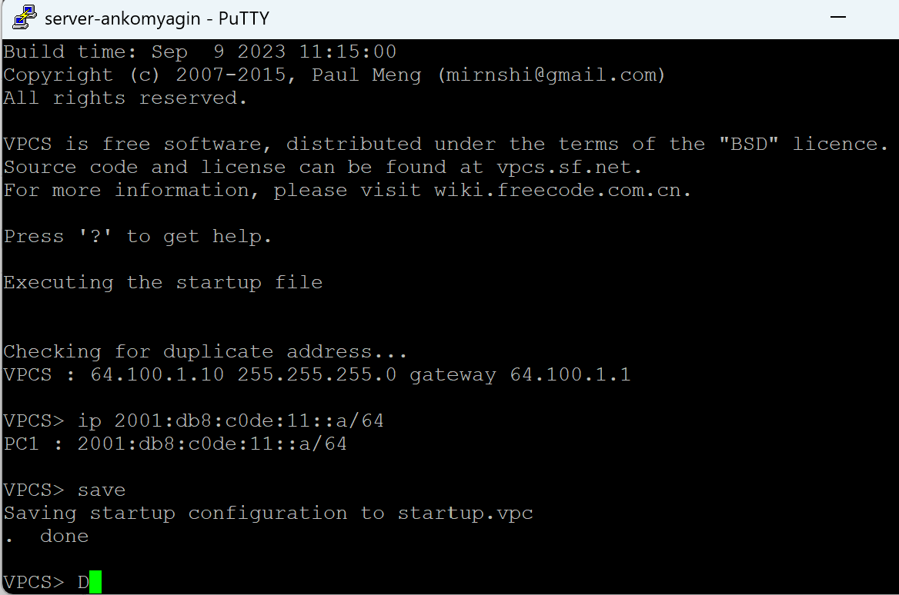{#fig:013}

Проверка текущих настроек на VPCS узлах (команда `show ipv6`):

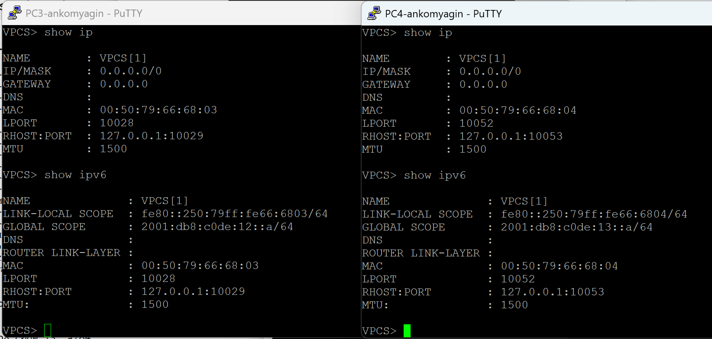{#fig:014}

**Проверка подключения IPv6:**
Выполнены `ping` и `trace` между узлами PC3, PC4 и сервером. Маршрутизация работает корректно, пакеты проходят через шлюз.

{#fig:015}

### 2.4. Анализ трафика

Был включен захват трафика (Wireshark) на линке между сервером и коммутатором.

В дампе наблюдаются пакеты протоколов:

1.  **ICMPv6:** Neighbor Solicitation и Neighbor Advertisement (аналог ARP в IPv4) для определения MAC-адресов соседей.

2.  **ICMPv6:** Echo (ping) request и reply — проверка связи.

3.  **ARP:** Запросы для IPv4 адресации (`Who has 64.100.1.1?`).

4.  **ICMP:** Echo request/reply для IPv4.

Это подтверждает работу двойного стека на сервере: он одновременно обрабатывает и ARP/ICMP для v4, и NDP/ICMPv6 для v6.

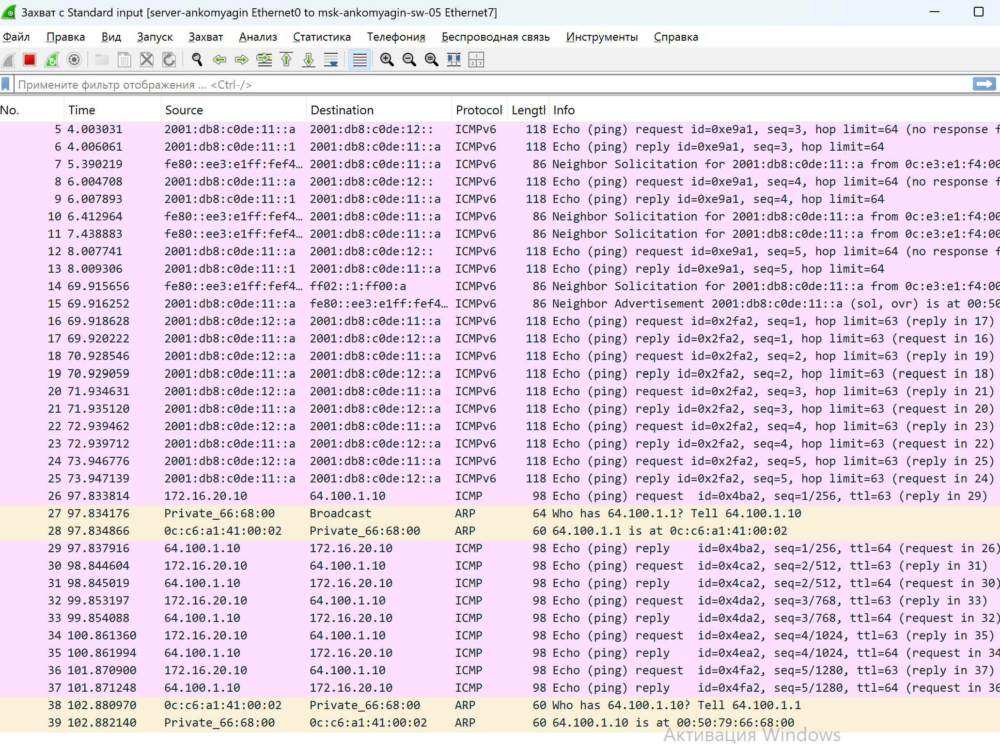{#fig:016}

---

## 3. Самостоятельная работа

### 3.1. Постановка задачи и расчет

Реализуется топология "галочка" (рис. 6.2 из методички) с одним маршрутизатором и двумя коммутаторами.

Заданные подсети:

1.  IPv4: `10.10.1.96/27`, IPv6: `2001:DB8:1:1::/64`

2.  IPv4: `10.10.1.16/28`, IPv6: `2001:DB8:1:4::/64`

**Расчет адресов шлюзов (наименьшие адреса):**

*   Подсеть 1 (левая):

    *   IPv4 сеть: `10.10.1.96`. Первый хост: `10.10.1.97` (шлюз).

    *   IPv6 сеть: `2001:DB8:1:1::/64`. Шлюз: `2001:DB8:1:1::1`.

*   Подсеть 2 (правая):

    *   IPv4 сеть: `10.10.1.16`. Первый хост: `10.10.1.17` (шлюз).

    *   IPv6 сеть: `2001:DB8:1:4::/64`. Шлюз: `2001:DB8:1:4::1`.

### 3.2. Реализация

Собрана топология в GNS3. В центре маршрутизатор VyOS (`msk-ankomyagin-gw-1`).

{#fig:017}

**Настройка маршрутизатора VyOS:**

Назначены адреса на интерфейсы `eth0` (левое плечо) и `eth1` (правое плечо).


```bash
set interfaces ethernet eth0 address 10.10.1.97/27
set interfaces ethernet eth0 address 2001:db8:1:1::1/64
set interfaces ethernet eth1 address 10.10.1.17/28
set interfaces ethernet eth1 address 2001:db8:1:4::1/64
```

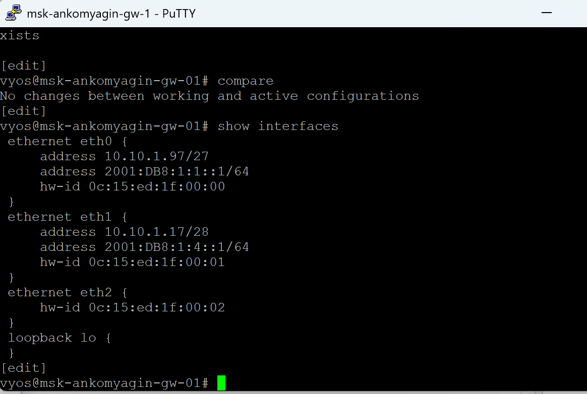{#fig:018}

**Настройка клиентов (PC1 и PC2):**

*   **PC1:**

    *   IP: `10.10.1.98/27`, GW: `10.10.1.97`

    *   IPv6: `2001:db8:1:1::a/64`

*   **PC2:**

    *   IP: `10.10.1.18/28`, GW: `10.10.1.17`

    *   IPv6: `2001:db8:1:4::a/64`

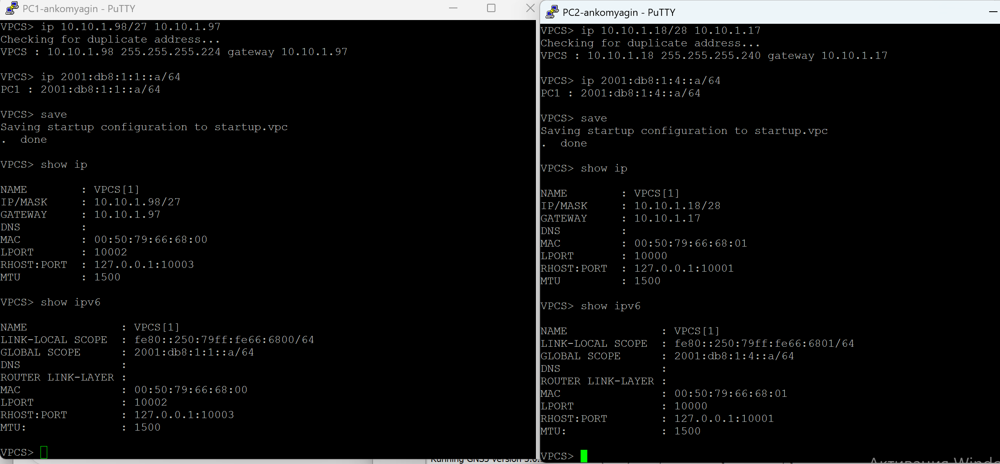{#fig:019}

### 3.3. Тестирование

Проведена проверка связности между PC1 и PC2 (прохождение через маршрутизатор).

Успешно проходят пинги как по IPv4 (`ping 10.10.1.98`), так и по IPv6 (`ping 2001:db8:1:1::a`).

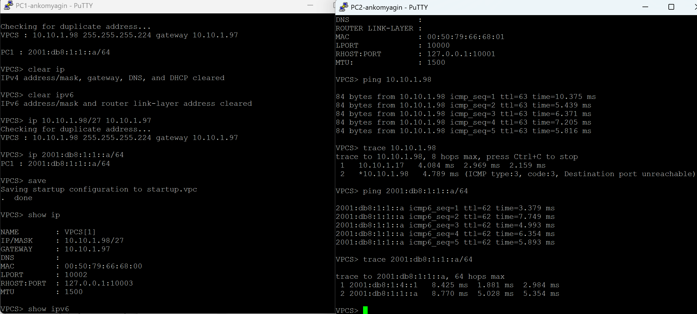{#fig:020}

# Выводы

В ходе выполнения лабораторной работы были изучены принципы IPv4 и IPv6 адресации, включая маски подсетей переменной длины (VLSM) и методы сегментации адресного пространства IPv6.

Были приобретены практические навыки:

1.  Расчета подсетей для заданного количества хостов.

2.  Настройки сетевого оборудования (маршрутизаторы FRR и VyOS) для работы в режимах Dual Stack.

3.  Конфигурирования конечных устройств (VPCS) для работы в смешанных сетях.

4.  Анализа сетевого трафика, где было наглядно продемонстрировано различие в служебных протоколах (ARP для IPv4 против NDP/ICMPv6 для IPv6).

