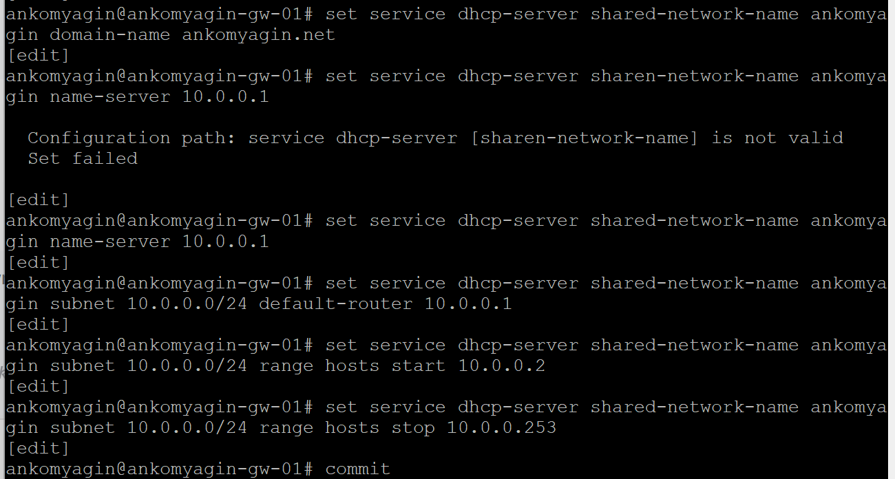
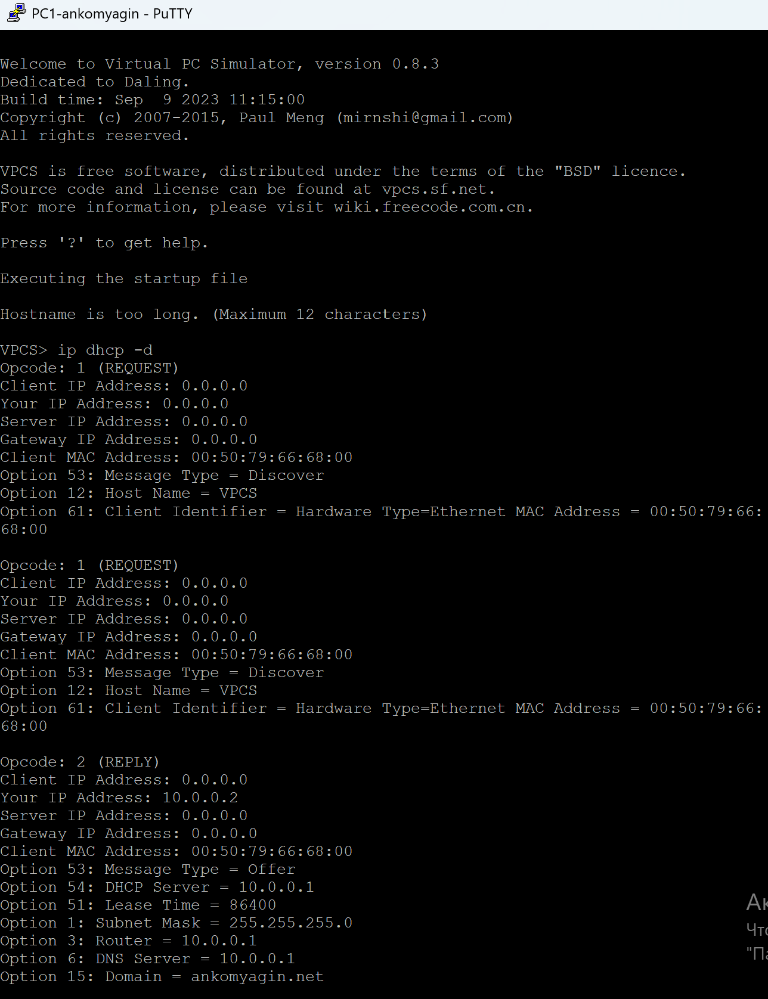
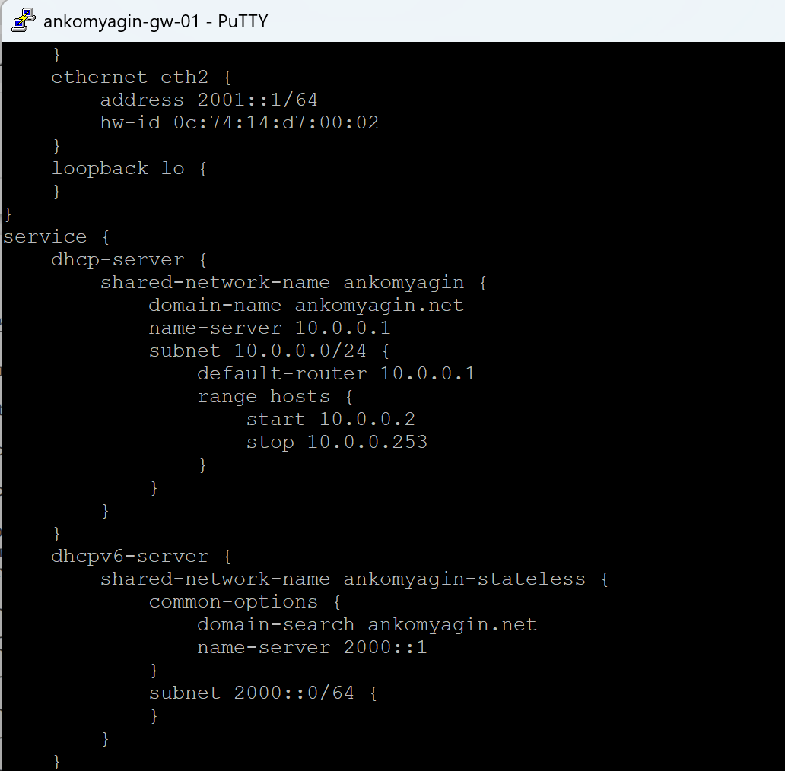
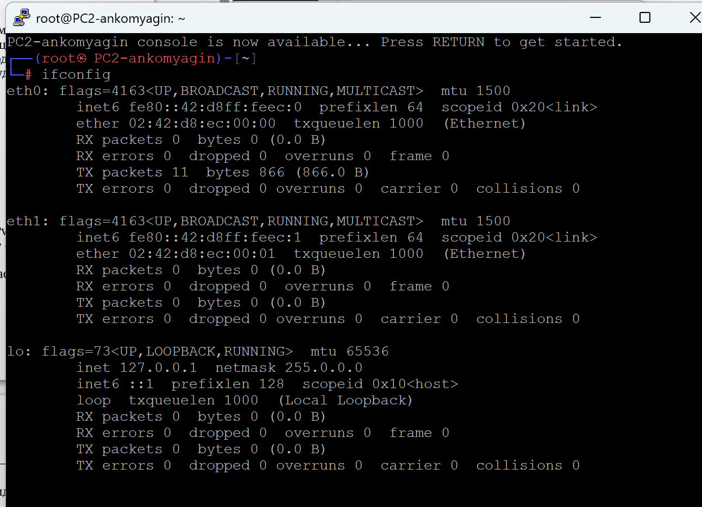
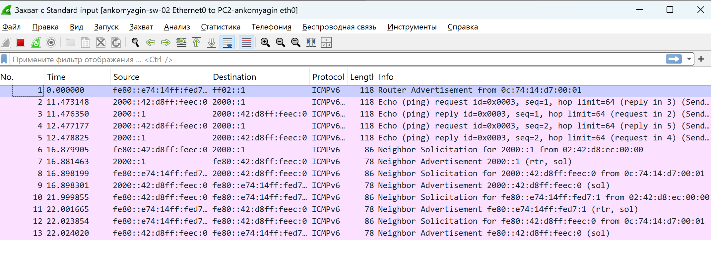
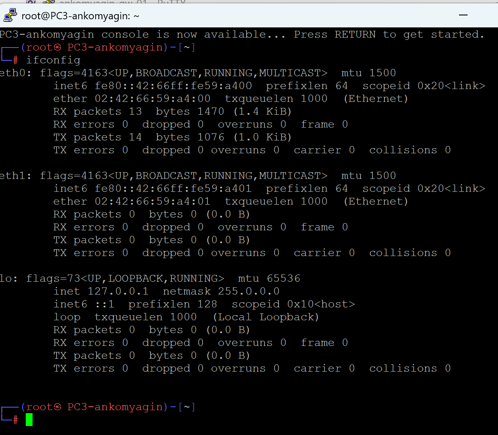
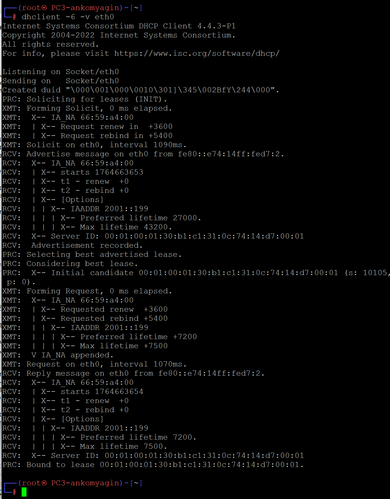
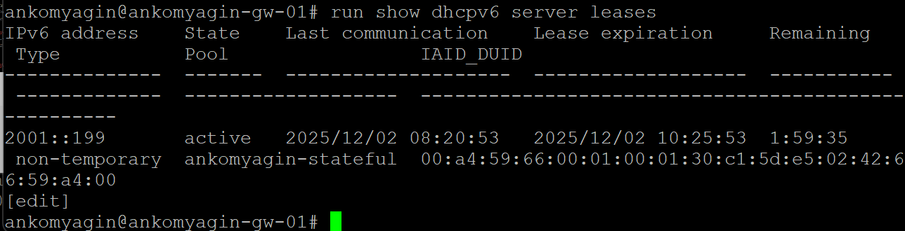
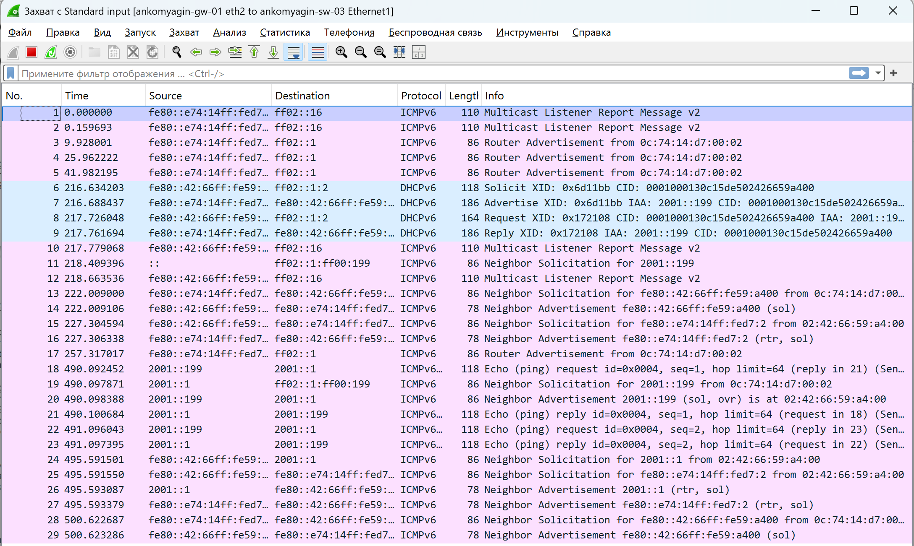

# Цель работы

## Цель

Изучение механизмов динамической конфигурации параметров IPv4- и IPv6-сетей с использованием DHCPv4 и DHCPv6, а также взаимодействия DHCP с SLAAC и ICMPv6 в среде моделирования GNS3.

# Задачи

## Основные задачи

1. Развертывание стенда в GNS3 с маршрутизатором VyOS.

2. Настройка DHCPv4-сервера для автоматической выдачи IPv4-адресов.

3. Проверка получения адреса клиентом VPCS.

4. Настройка stateless-DHCPv6 с SLAAC.

5. Настройка stateful-DHCPv6 с полной выдачей адреса.

6. Анализ трафика ICMPv6 и DHCPv6.

# Стенд

## Топология стенда

{width=70%}

## Компоненты стенда

- **Маршрутизатор VyOS** ankomyagin-gw-01;

- **Коммутаторы**: ankomyagin-sw-01, ankomyagin-sw-02, ankomyagin-sw-03;

- **Хосты**:
  - PC1 (VPCS) — DHCPv4 на eth0;
  - PC2 (Linux) — SLAAC + stateless-DHCPv6 на eth0;
  - PC3 (Linux) — stateful-DHCPv6 на eth0.

## Адресация

| Интерфейс | IPv4            | IPv6       |
|-----------|-----------------|------------|
| eth0      | 10.0.0.1/24     | —          |
| eth1      | —               | 2000::1/64 |
| eth2      | —               | 2001::1/64 |

# DHCPv4: Базовая настройка

## Конфигурация VyOS (шаг 1–2)

{width=60%}

## Конфигурация интерфейсов

{width=70%}

# DHCPv4: Конфигурация сервера

## Настройка DHCP-сервера

{width=70%}

## Статистика и пустой список арен

{width=70%}

# DHCPv4: Работа клиента

## Клиент PC1 получает адрес

{width=70%}

## Проверка на сервере

{width=70%}

# DHCPv6: Stateless (PC2)

## Конфигурация RA и DHCPv6 (stateless)

{width=70%}

## Полная конфигурация VyOS

{width=70%}

# DHCPv6: SLAAC и параметры

## Интерфейсы PC2 до DHCPv6

{width=70%}

## Маршрутизация и первый ping

{width=70%}

# DHCPv6: Получение параметров

## Запуск DHCPv6-клиента (stateless)

{width=70%}

## Захват трафика ICMPv6 и NDP

{width=70%}

# DHCPv6: Stateful (PC3)

## Конфигурация RA (managed-flag) и DHCPv6

{width=70%}

## Интерфейсы PC3 до DHCPv6

{width=70%}

# DHCPv6: Solicit–Advertise–Request–Reply

## Маршрутизация PC3 до DHCPv6

{width=70%}

## Работа dhclient (stateful)

{width=70%}

# DHCPv6: Итоги на PC3

## Полученная конфигурация

{width=70%}

## Маршрутизация и DNS

{width=70%}

# DHCPv6: Сервер и трафик

## Аренда на DHCPv6-сервере

{width=70%}

## Захват DHCPv6 и ICMPv6

{width=70%}

# Результаты

## Проведено

-  DHCPv4: автоматическая выдача адреса PC1;

-  Stateless-DHCPv6: SLAAC + параметры DNS для PC2;

-  Stateful-DHCPv6: полная выдача адреса 2001::199 для PC3;

-  Анализ трафика ICMPv6, NDP и DHCPv6.

## Выводы

- DHCPv4 обеспечивает централизованную выдачу параметров IPv4;

- SLAAC позволяет хостам независимо генерировать адреса в IPv6;

- DHCPv6 дополняет SLAAC, выступая в роли поставщика параметров или полного адреса;

- Протоколы NDP и DHCPv6 обеспечивают корректную работу IPv6-сетей.
