---
# Front matter
title: "Лабораторная работа №7"
subtitle: "Адресация IPv4 и IPv6. Настройка DHCP"
author: "Комягин Андрей Николаевич"

# Generic options
lang: ru-RU
toc-title: "Содержание"

# Pdf output format
toc: true # Table of contents
toc-depth: 2
lof: true # List of figures
lot: true # List of tables
fontsize: 12pt
linestretch: 1.5
papersize: a4
documentclass: scrreprt

# Fonts
mainfont: IBM Plex Serif
romanfont: IBM Plex Serif
sansfont: IBM Plex Sans
monofont: IBM Plex Mono
mathfont: STIX Two Math
mainfontoptions: Ligatures=Common,Ligatures=TeX,Scale=0.94
romanfontoptions: Ligatures=Common,Ligatures=TeX,Scale=0.94
sansfontoptions: Ligatures=Common,Ligatures=TeX,Scale=MatchLowercase,Scale=0.94
monofontoptions: Scale=MatchLowercase,Scale=0.94,FakeStretch=0.9
mathfontoptions: []

# Biblatex
biblatex: true
biblio-style: gost-numeric
biblatexoptions:
  - parentracker=true
  - backend=biber
  - hyperref=auto
  - language=auto
  - autolang=other*
  - citestyle=gost-numeric

# Pandoc-crossref LaTeX customization
figureTitle: "Рис."
tableTitle: "Таблица"
listingTitle: "Листинг"
lofTitle: "Список иллюстраций"
lotTitle: "Список таблиц"
lolTitle: "Листинги"

# Misc options
indent: true
header-includes:
  - \usepackage{indentfirst}
  - \usepackage{float} # keep figures where they are in the text
  - \floatplacement{figure}{H}
---

# Цель работы

Изучение механизмов динамической конфигурации параметров IPv4- и IPv6-сетей с использованием DHCPv4 и DHCPv6, а также взаимодействия DHCP с SLAAC и ICMPv6 в среде моделирования GNS3.

# Выполнение лабораторной работы

## Описание стенда и базовая настройка

### Топология стенда

В GNS3 была собрана простая топология с маршрутизатором VyOS ankomyagin-gw-01, коммутатором ankomyagin-sw-01 и хостом PC1-ankomyagin (VPCS), который использует DHCPv4 для получения адреса.

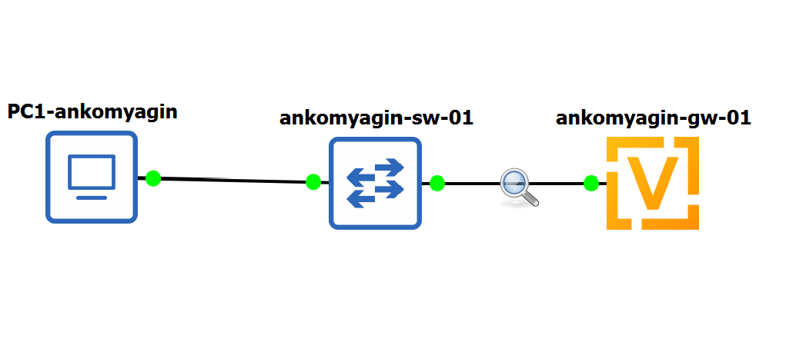{#fig:701}

На схеме также присутствуют дополнительные коммутаторы и хосты (PC2-ankomyagin и PC3-ankomyagin), подключенные к другим интерфейсам маршрутизатора для экспериментов с DHCPv6 и SLAAC.

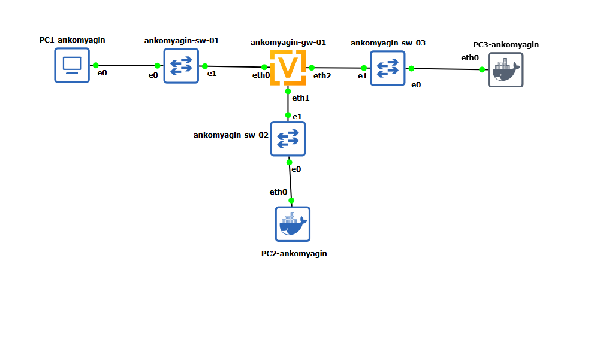{#fig:702}

### Первичная конфигурация VyOS

На маршрутизаторе VyOS была выполнена базовая настройка: задано имя хоста ankomyagin-gw-01, домен ankomyagin.net, создан пользователь ankomyagin и удален стандартный пользователь vyos. После внесения изменений конфигурация сохранена в файл /config/config.boot.

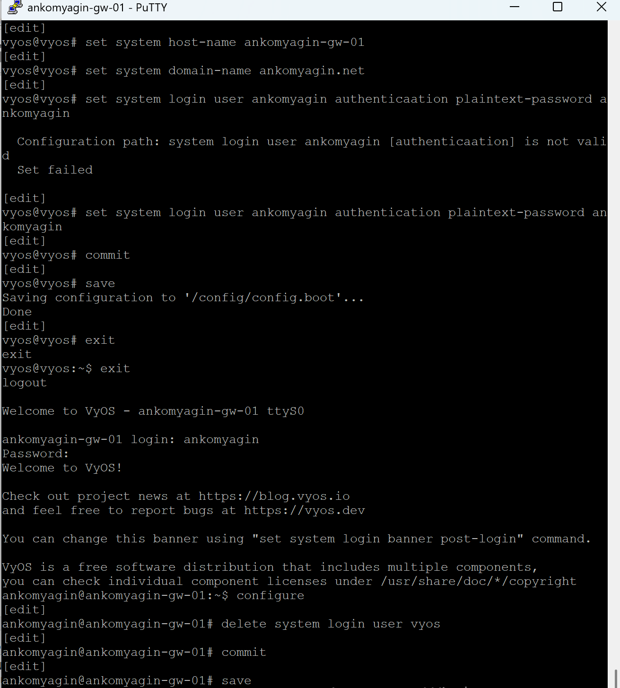{#fig:703}

Далее были настроены IP-адреса на интерфейсах маршрутизатора: 10.0.0.1/24 на eth0, 2000::1/64 на eth1 и 2001::1/64 на eth2. Вывод show interfaces показывает актуальную конфигурацию интерфейсов с привязкой MAC-адресов.

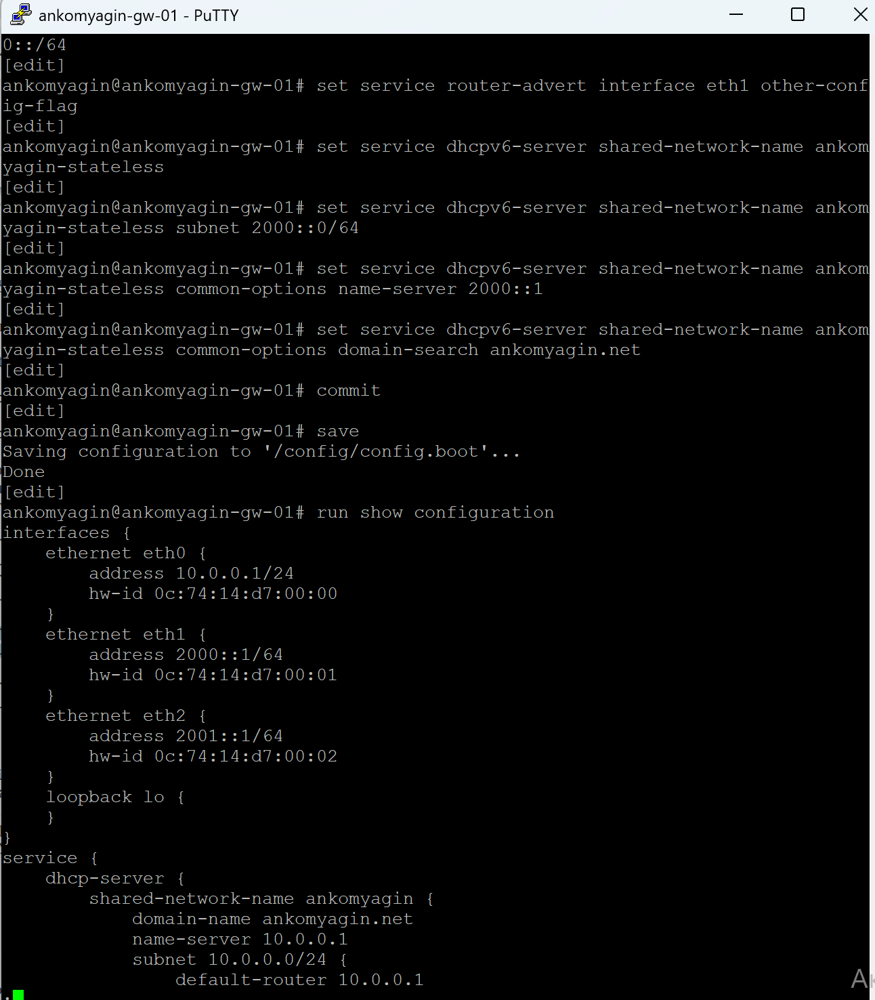{#fig:704}

## Настройка DHCPv4 и проверка на PC1

### Конфигурация DHCPv4 на VyOS

Для сети 10.0.0.0/24 была включена служба DHCPv4. Сначала был задан shared-network-name ankomyagin, доменное имя ankomyagin.net и DNS-сервер 10.0.0.1, затем настроен шлюз по умолчанию и диапазон выдаваемых адресов с 10.0.0.2 по 10.0.0.253.

{#fig:705}

После применения конфигурации (commit, save) были просмотрены статистика и список арен. На этом этапе пул содержит 252 доступных адреса и пока ни одной активной аренды для клиентов.

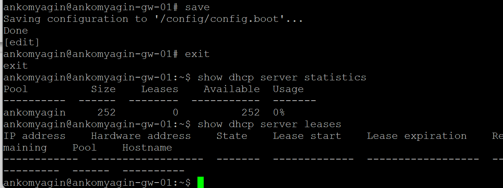{#fig:706}

### Получение IPv4-адреса по DHCP на PC1

Клиент PC1-ankomyagin (VPCS) был переведен в режим получения параметров по DHCP командой ip dhcp -d. В выводе детально показан процесс обмена: Discover, Offer, Request и Ack, а также назначение IP-адреса 10.0.0.2/24, шлюза 10.0.0.1, DNS-сервера 10.0.0.1 и домена ankomyagin.net.

{#fig:707}

После получения адреса на PC1 были сохранены настройки и выполнена проверка связности командой ping 10.0.0.1. На маршрутизаторе обновилась статистика DHCP-сервера: в пуле появился один активный клиент с IP 10.0.0.2 и соответствующим MAC-адресом, что видно в выводах show dhcp server statistics, show dhcp server leases и в журнале.

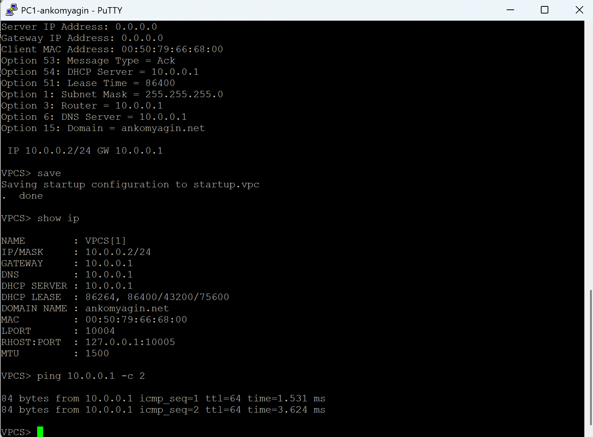{#fig:708}

## Настройка SLAAC и stateless-DHCPv6 для PC2

### Включение RA и stateless-DHCPv6 на VyOS

Для сети 2000::/64 на интерфейсе eth1 была включена рассылка Router Advertisement с other-config-flag, чтобы хосты использовали SLAAC для получения адреса, а DHCPv6 — для получения дополнительных параметров. Был создан пул ankomyagin-stateless с префиксом 2000::0/64, DNS-сервером 2000::1 и доменом ankomyagin.net.

{#fig:709}

Вывод полной конфигурации VyOS показывает одновременно настроенные службы: DHCPv4 для сети 10.0.0.0/24 и DHCPv6 (stateless) для сети 2000::/64, а также IPv6-адреса на интерфейсах eth1 и eth2.

{#fig:710}

### Состояние интерфейсов и маршрутизации на PC2

На PC2-ankomyagin (Linux) были просмотрены параметры интерфейсов с помощью ifconfig. Интерфейсы eth0 и eth1 имеют link-local адреса в диапазоне fe80::/64, а lo содержит локальные IPv4/IPv6-адреса. На данном этапе глобальный IPv6-адрес еще не показан.

{#fig:711}

Затем была изучена таблица маршрутизации IPv6 (route -n -A inet6). В ней присутствует маршрут по умолчанию через link-local адрес маршрутизатора fe80::e74:14ff:fed7:1, а также записи для префикса 2000::/64 и link-local сетей. Проверка связности ping 2000::1 показывает успешные ответы от маршрутизатора.

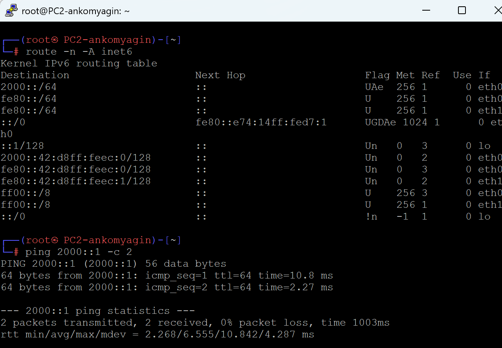{#fig:712}

### Работа DHCPv6 (stateless) и обновление DNS на PC2

Для получения дополнительных параметров по DHCPv6 на PC2 был запущен клиент dhclient -6 -S -v eth0. В выводе видно формирование и отправку Information-Request, а также получение Reply с параметрами. После этого ping 2000::1 показывает стабильные задержки, а в файле /etc/resolv.conf появился домен ankomyagin.net и DNS-сервер 2000::1.

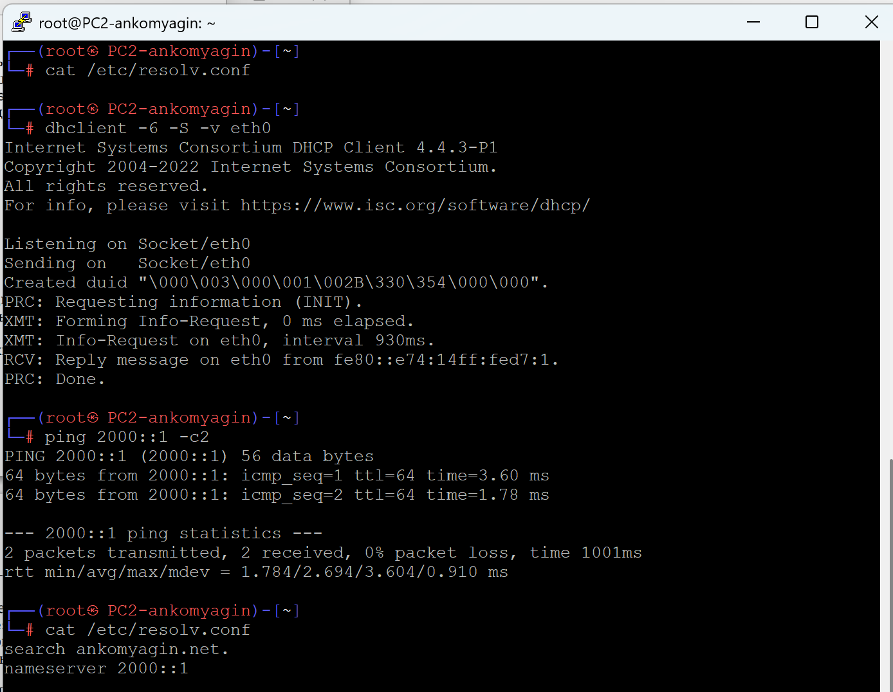{#fig:713}

Для более подробного анализа был выполнен захват трафика на порту коммутатора, к которому подключен PC2. В захваченных кадрах видно Router Advertisement от маршрутизатора, Echo Request/Echo Reply при ping, а также Neighbor Solicitation/Neighbor Advertisement при разрешении IPv6-адресов.

{#fig:714}

## Настройка stateful-DHCPv6 и проверка на PC3

### Конфигурация stateful-DHCPv6 на VyOS

Для сети 2001::/64 на интерфейсе eth2 был настроен Router Advertisement с флагом managed-flag, указывающим хостам использовать stateful-DHCPv6 для получения IPv6-адреса. Был создан пул ankomyagin-stateful с префиксом 2001::0/64, DNS-сервером 2001::1, доменом ankomyagin.net и диапазоном адресов 2001::100–2001::199.

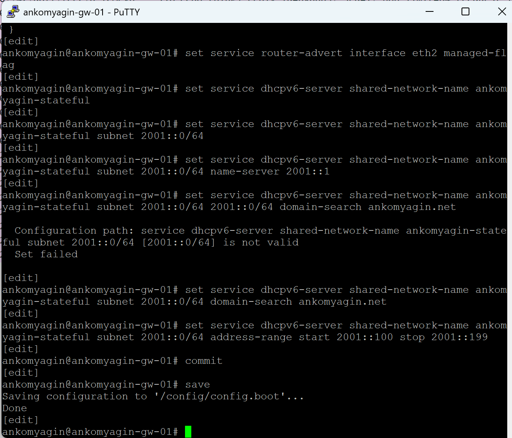{#fig:715}

### Состояние PC3 до запуска DHCPv6

На PC3-ankomyagin (Linux) просмотрены параметры интерфейсов ifconfig: интерфейсы eth0 и eth1 имеют только link-local IPv6-адреса, а lo содержит локальный IPv4/IPv6. Это состояние до получения глобального адреса по DHCPv6.

{#fig:716}

Таблица маршрутизации IPv6 (route -n -A inet6) показывает маршруты для link-local префиксов и маршрут по умолчанию через link-local адрес маршрутизатора fe80::e74:14ff:fed7:2. Это подготовленное состояние перед запросом адреса по DHCPv6.

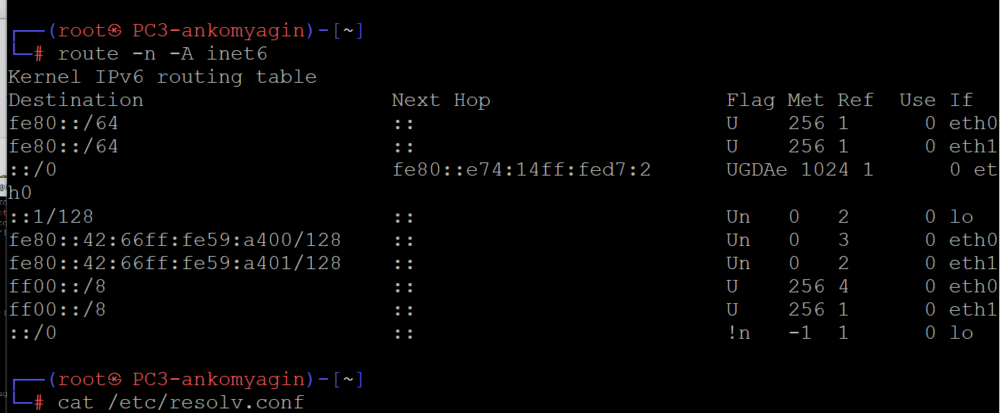{#fig:717}

### Получение адреса 2001::199 по DHCPv6

На PC3 был запущен DHCPv6-клиент dhclient -6 -v eth0. В детальном выводе показан обмен Solicit–Advertise–Request–Reply, в котором сервер предлагает адрес 2001::199 с заданными временами аренды, а клиент выбирает и подтверждает этот вариант.

{#fig:718}

После завершения работы клиента ifconfig показывает, что интерфейс eth0 получил глобальный адрес 2001::199/128, а также сохранил link-local адрес. Интерфейс eth1 и lo остались без изменений, что соответствует ожиданиям для данного сценария.

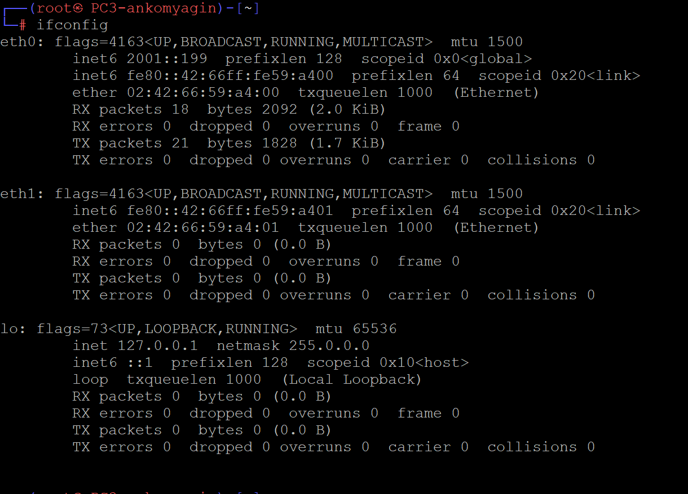{#fig:719}

Таблица маршрутизации IPv6 обновилась: появился маршрут к адресу 2001::199/128, маршрут по умолчанию по-прежнему указывает на link-local адрес маршрутизатора, а ping 2001::1 демонстрирует успешные ответы. В /etc/resolv.conf зафиксированы домен ankomyagin.net и DNS-сервер 2001::1.

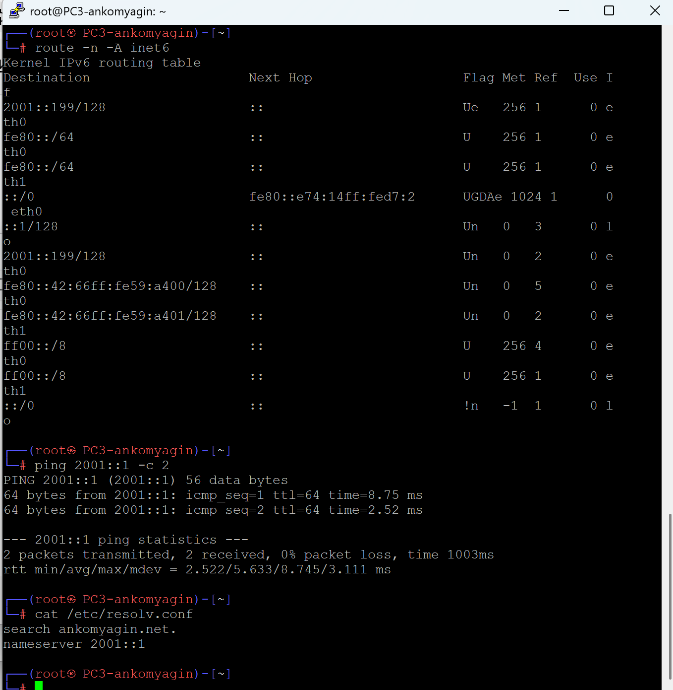{#fig:720}

### Аренда на DHCPv6-сервере и захват трафика

На стороне маршрутизатора команда show dhcpv6 server leases показывает активную аренду адреса 2001::199 для клиента PC3 с указанием времени окончания аренды, IAID и DUID клиента и названием пула ankomyagin-stateful.

{#fig:721}

Захват трафика на соединении между ankomyagin-gw-01 и коммутатором для PC3 демонстрирует последовательность сообщений DHCPv6 (Solicit, Advertise, Request, Reply), ICMPv6 Router Advertisement, Neighbor Solicitation/Advertisement, а также пакеты Echo Request/Echo Reply при ping 2001::1.

{#fig:722}

## xОбобщение результатов

В ходе лабораторной работы был настроен DHCPv4-сервер на маршрутизаторе VyOS, обеспечивший автоматическую выдачу IPv4-адреса 10.0.0.2 и параметров сети клиенту PC1 в подсети 10.0.0.0/24. Проверка связности и анализ таблицы арен подтвердили корректную работу службы DHCPv4.

В IPv6-сетях были реализованы два сценария: SLAAC + stateless-DHCPv6 для PC2 (адрес по SLAAC, параметры DNS и домена по DHCPv6) и stateful-DHCPv6 для PC3 (полная выдача адреса и параметров сервером). Захваты трафика ICMPv6, NDP и DHCPv6 позволили детально проследить обмен служебными сообщениями и сопоставить его с конфигурацией VyOS и поведением клиентов, что закрепило теоретические знания о работе DHCP в сетях IPv4 и IPv6.

