# Цель работы

## Цель

Изучение принципов маршрутизации в IPv4- и IPv6-сетях и принципов настройки сетевого оборудования.

# Задачи

## Основные задачи

1. Развертывание стенда в GNS3 с четырьмя маршрутизаторами FRR.

2. Документирование топологии (схемы L1, L3) и таблиц адресации.

3. Настройка двойного стека IPv4 и IPv6.

4. Конфигурация RIP/RIPng для динамической маршрутизации.

5. Конфигурация OSPF/OSPFv3 для динамической маршрутизации.

6. Проверка связности и анализ маршрутов.

# Стенд

## Топология сети

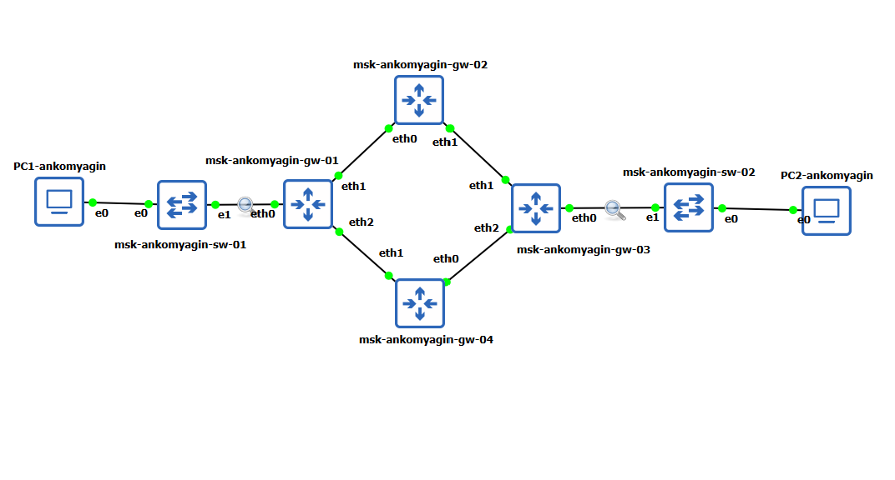{width=70%}

## Компоненты стенда

- **Маршрутизаторы FRR**: msk-ankomyagin-gw-01, msk-ankomyagin-gw-02, msk-ankomyagin-gw-03, msk-ankomyagin-gw-04;

- **Хосты VPCS**: PC1-ankomyagin, PC2-ankomyagin;

- **Коммутаторы**: msk-ankomyagin-sw-01, msk-ankomyagin-sw-02.

## Схема подключения (L1)

{width=70%}

# Адресация

## Таблица сетей (табл. 8.1)

| Сегмент | IPv4 | IPv6 |
|---------|------|------|
| PC1 – gw-01 | 10.0.10.0/24 | 2001:10::/64 |
| PC2 – gw-03 | 10.0.11.0/24 | 2001:11::/64 |
| gw-01 – gw-02 | 10.0.1.0/24 | 2001:1::/64 |
| gw-02 – gw-03 | 10.0.2.0/24 | 2001:2::/64 |
| gw-03 – gw-04 | 10.0.3.0/24 | 2001:3::/64 |
| gw-04 – gw-01 | 10.0.4.0/24 | 2001:4::/64 |

## Схема сетевой адресации (L3)

{width=70%}

# Построение стенда

## Создание проекта в GNS3

{width=70%}

## Переименование устройств

{width=70%}

## Включение захвата трафика

{width=70%}

# Конфигурация IPv4

## Настройка на VPCS (PC1, PC2)

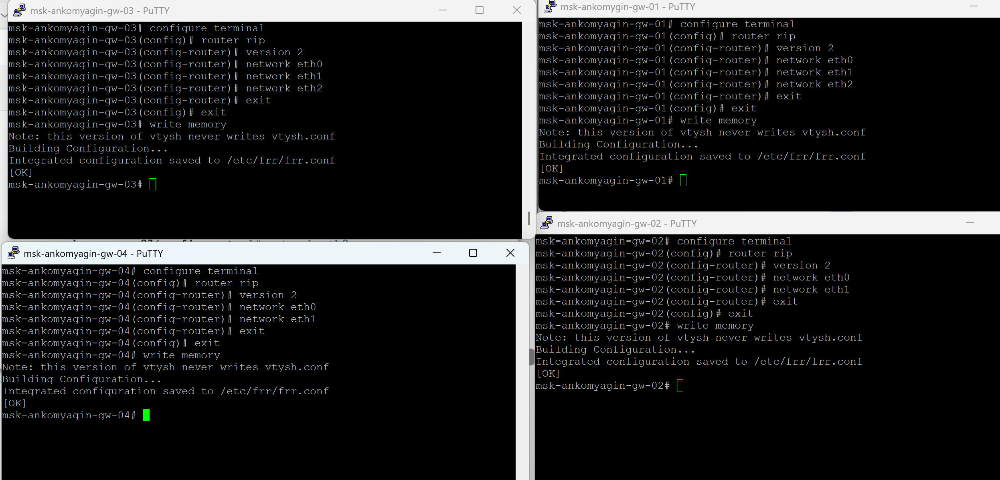{width=70%}

## Настройка на маршрутизаторах

{width=70%}

# Конфигурация IPv6

## Включение маршрутизации и RA

{width=70%}

## Назначение IPv6-адресов и префиксов

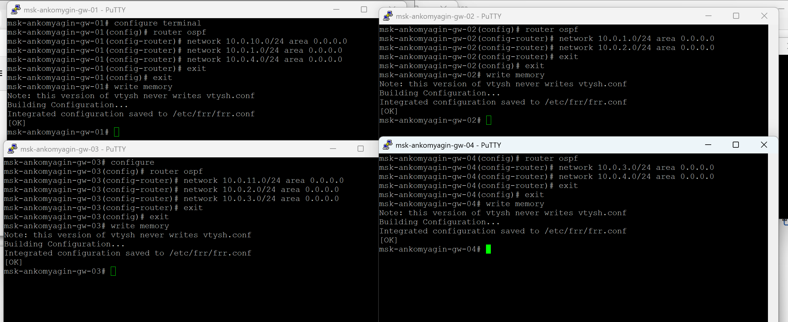{width=70%}

# RIP: Динамическая маршрутизация IPv4

## Конфигурация RIPv2

{width=70%}

## Проверка маршрутов RIP

{width=70%}

# RIP: Тестирование связности IPv4

## Ping и trace между PC1 и PC2

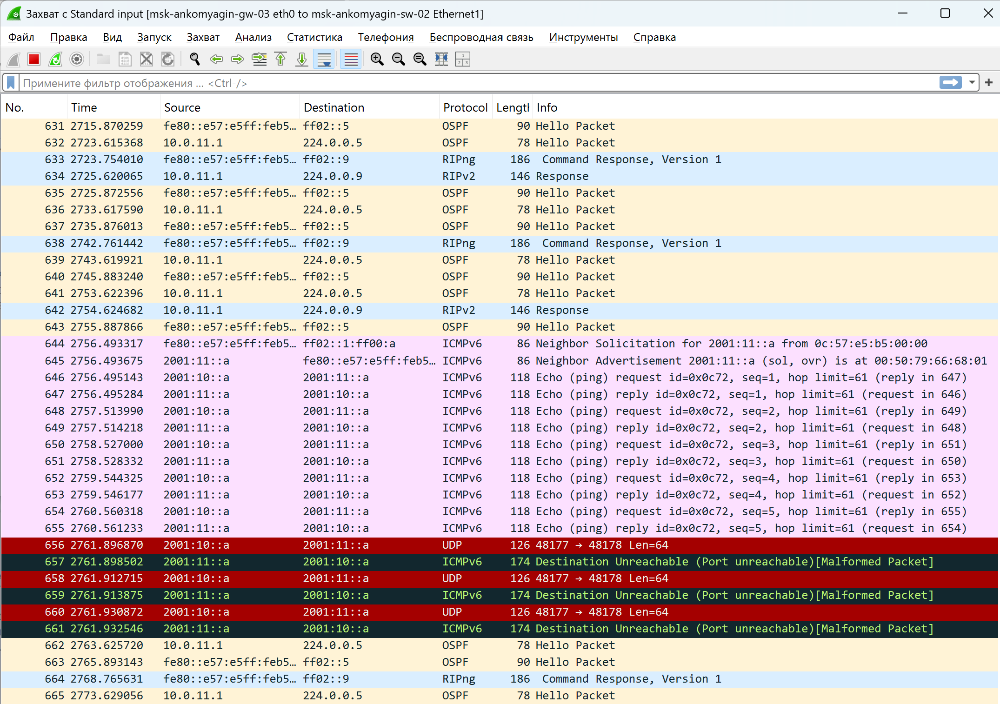{width=70%}

## Проверка отказоустойчивости

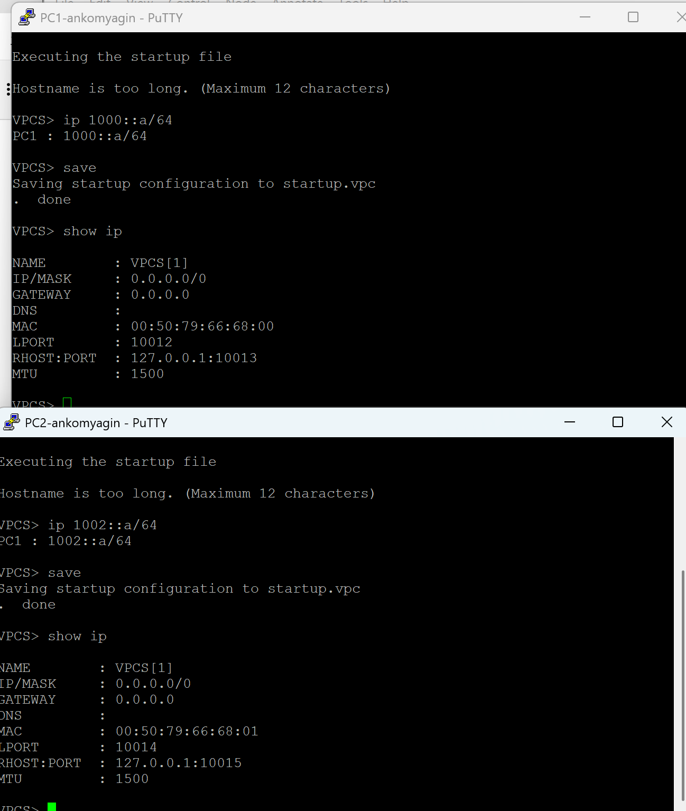{width=70%}

# RIP: Анализ трафика IPv4

## Захват RIPv2-обновлений

{width=70%}

## Наблюдение за сходимостью сети

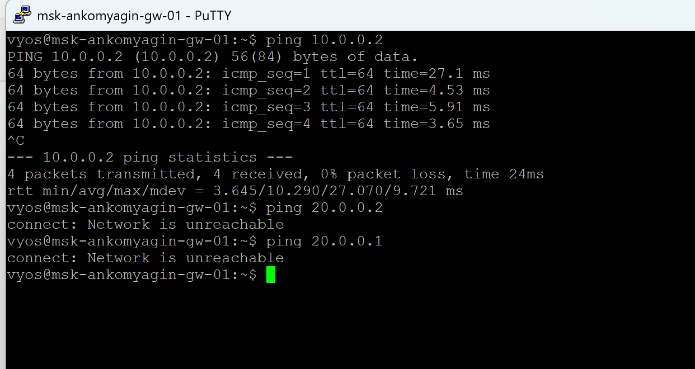{width=70%}

# RIPng: Динамическая маршрутизация IPv6

## Конфигурация RIPng

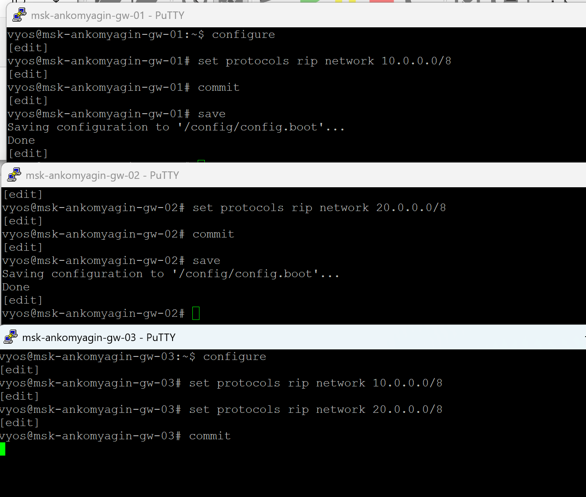{width=70%}

## Проверка маршрутов RIPng

{width=70%}

# RIPng: Тестирование связности IPv6

## Ping и trace между PC1 и PC2 (IPv6)

{width=70%}

## Проверка отказоустойчивости IPv6

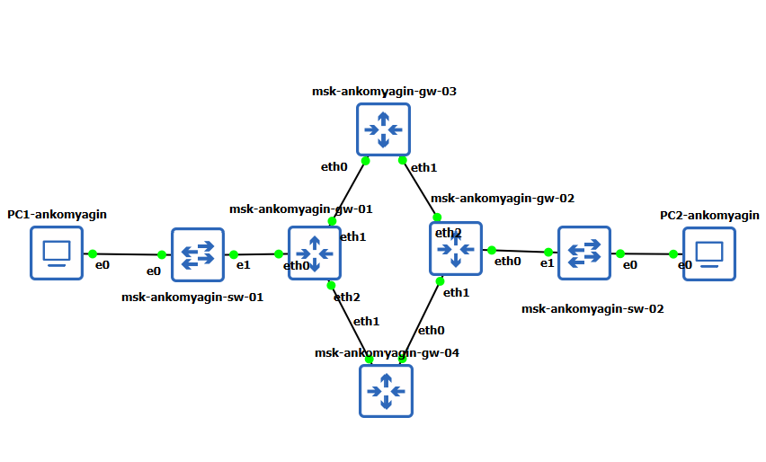{width=70%}

# RIPng: Анализ трафика IPv6

## Захват RIPng-обновлений

{width=70%}

## Служебный трафик при сходимости

{width=70%}

# OSPF: Динамическая маршрутизация IPv4

## Конфигурация OSPFv2

{width=70%}

## Проверка соседства и маршрутов OSPF

{width=70%}

# OSPF: Тестирование связности IPv4

## Ping и trace маршрутов OSPF

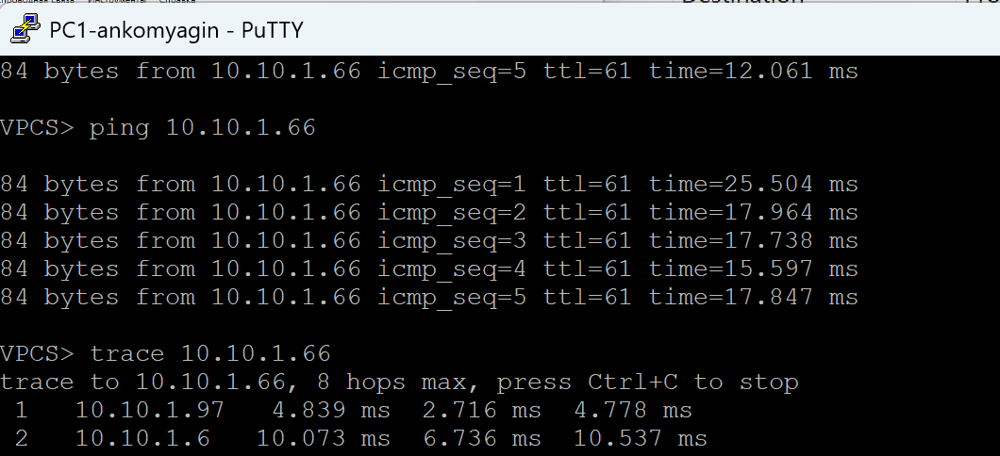{width=70%}

## Анализ служебных обменов OSPF

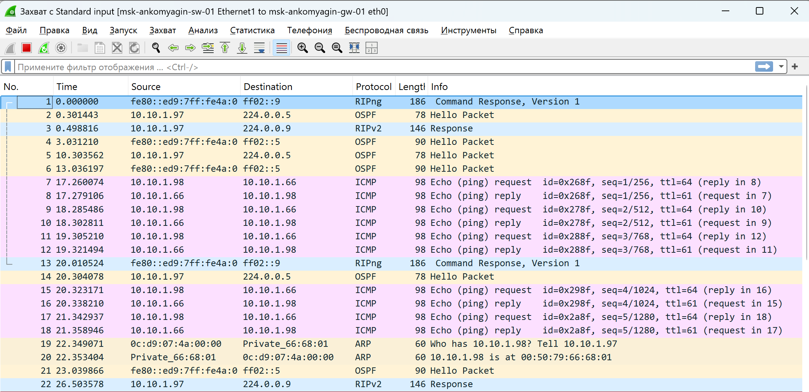{width=70%}

# OSPFv3: Динамическая маршрутизация IPv6

## Конфигурация OSPFv3

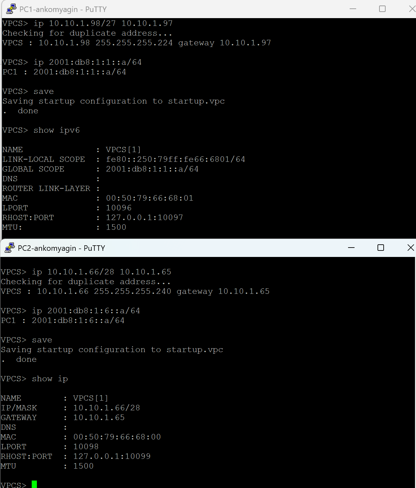{width=70%}

## Проверка соседства IPv6

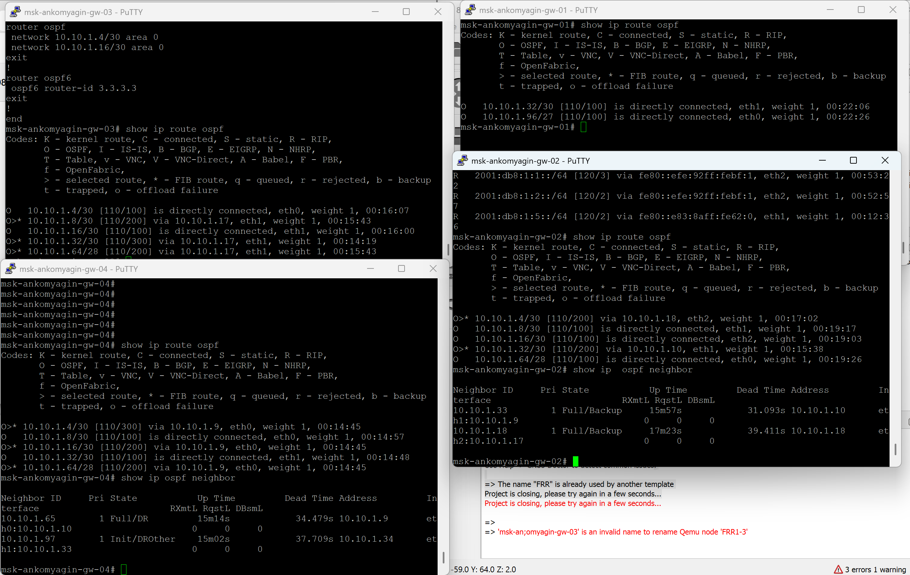{width=70%}

# Результаты

## Результаты

- Документирована топология: схемы L1, L3, таблицы адресации;

- Настроен двойной стек IPv4/IPv6 на четырёх маршрутизаторах;

- Реализована динамическая маршрутизация RIP/RIPng и OSPF/OSPFv3;

- Проверена связность между хостами с использованием ping/trace;

- Проведён анализ трафика и маршрутизации при отказах интерфейсов.

# Выводы

## Выводы

- **RIP/RIPv2** — простой дистанционно-векторный протокол (метрика = хопы), медленная сходимость (~180 сек);

- **RIPng** — расширение RIP для IPv6 (multicast FF02::9);

- **OSPF/OSPFv2** — протокол состояния канала с быстрой сходимостью, метрика = стоимость;

- **OSPFv3** — протокол состояния канала для IPv6 (multicast FF02::5/FF02::6);

- **Двойной стек IPv4/IPv6** — одновременная работа обоих протоколов в одной сети;

- **Анализ трафика** — служебные multicast-рассылки обеспечивают синхронизацию маршрутов и позволяют отследить сходимость после отказов.
