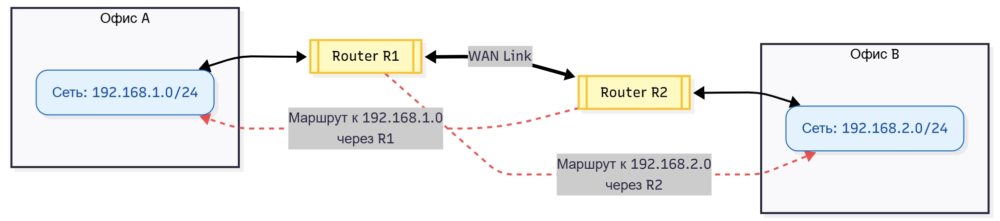

---
## Front matter
lang: ru-RU
title: Статическая и динамическая маршрутизация
subtitle: 
  - Комягин А.Н.
institute:
  - Российский университет дружбы народов, Москва, Россия


## i18n babel
babel-lang: russian
babel-otherlangs: english

## Formatting pdf
toc: false
toc-title: Содержание
slide_level: 2
aspectratio: 169
section-titles: true
theme: metropolis
header-includes:
 - \metroset{progressbar=frametitle,sectionpage=progressbar,numbering=fraction}
 

## Fonts
mainfont: IBM Plex Serif
romanfont: IBM Plex Serif
sansfont: IBM Plex Sans
monofont: IBM Plex Mono
mathfont: STIX Two Math
mainfontoptions: Ligatures=Common,Ligatures=TeX,Scale=0.94
romanfontoptions: Ligatures=Common,Ligatures=TeX,Scale=0.94
sansfontoptions: Ligatures=Common,Ligatures=TeX,Scale=MatchLowercase,Scale=0.94
monofontoptions: Scale=MatchLowercase,Scale=0.94,FakeStretch=0.9
 
---

# Информация

## Докладчик

::::::::::::::{.columns align=center}
:::{.column width="65%"}

* Комягин Андрей Николаевич

* Студент НПИбд-01-23

* Российский университет дружбы народов им. П. Лумумбы 

* Тема: Статическая и динамическая маршрутизация

:::
:::{.column width="35%"}

:::
::::::::::::::


# Цель

## Задачи

- Изучить принципы маршрутизации в компьютерных сетях

- Сравнить статический и динамический подходы

- Разобрать основные протоколы маршрутизации

- Определить области применения каждого метода

# Основные определения

## Что такое маршрутизация?

- Процесс выбора пути передачи данных

- Основан на IP-адресах назначения

- Использует таблицы маршрутизации

- Работает на сетевом уровне OSI

## Таблица маршрутизации

Пример упрощенной таблицы маршрутизации:

| Destination | Gateway | Metric |
|---|---|---|
| 192.168.1.0 | 0.0.0.0 | 0 |
| 10.0.0.0 | 192.168.1.1 | 10 |
| 0.0.0.0 | 192.168.1.254 | 100 |

# Статическая маршрутизация

## Определение

- Ручная настройка маршрутов администратором

- Маршруты не изменяются автоматически

- Полный контроль над передачей данных

- "Бумажная карта" сети

## Свойства

- Предсказуемость работы

- Минимальные накладные расходы

- Отсутствие служебного трафика

- Детерминированное поведение

## Преимущества

- Безопасность (нет уязвимостей протоколов)

- Простота в малых сетях

- Низкие требования к оборудованию

- Полный контроль над трафиком

## Недостатки

- Не адаптируется к изменениям

- Высокие трудозатраты в больших сетях

- Отсутствие автоматического резервирования

- Человеческий фактор при настройке

# Пример сети со статической маршрутизацией

## Топология

**Схема:**


**Настройка на R1:**

```bash
ip route 192.168.2.0 255.255.255.0 192.168.1.2
```

**Настройка на R2:**

```bash
ip route 192.168.1.0 255.255.255.0 192.168.1.1
```


# Динамическая маршрутизация

## Определение

- Автоматический обмен информацией о маршрутах

- Адаптация к изменениям топологии сети

- Использование специальных протоколов

- "Живой навигатор" сети

## Преимущества

- Автоматическое обновление маршрутов

- Масштабируемость

- Отказоустойчивость

- Балансировка нагрузки

## Недостатки

- Сложность настройки

- Накладные расходы на служебный трафик

- Требования к ресурсам оборудования

- Уязвимости протоколов

# Протоколы динамической маршрутизации

## RIP (Routing Information Protocol)

- **Тип:** Дистанционно-векторный алгоритм

- **Метрика:** Количество хопов (макс. 15)

- **Особенности:**

  - Обновления каждые 30 секунд

  - Простота настройки

  - Медленная сходимость

## OSPF (Open Shortest Path First)


- **Тип:** Алгоритм состояния каналов (Link-State)

- **Метрика:** Стоимость каналов (Bandwidth)

- **Особенности:**

  - Быстрая сходимость

  - Иерархическая структура

  - Сложная настройка, высокая масштабируемость

## BGP (Border Gateway Protocol)


- **Тип:** Path-Vector алгоритм

- **Назначение:** Для междоменной маршрутизации

- **Особенности:**

  - Основа маршрутизации в Интернете

  - Политическое управление трафиком

# Сравнение маршрутизаций

## Сравнительная таблица

| Параметр | Статическая | Динамическая |
|---|---|---|
| **Масштабируемость** | Низкая | Высокая |
| **Адаптивность** | Нет | Высокая |
| **Сложность** | Низкая | Высокая |
| **Безопасность** | Высокая | Средняя |
| **Накладные расходы** | Минимальные | Значительные |

# Выводы

## Ключевые моменты

- **Статическая маршрутизация** подходит для малых стабильных сетей

- **Динамическая маршрутизация** необходима в крупных сложных сетях

- Выбор подхода зависит от требований и масштаба сети

- Современные сети часто используют гибридные подходы

## Рекомендации по выбору

- **Статическая:** малые сети, тупиковые сегменты, жесткие требования безопасности

- **Динамическая:** крупные сети, частое изменение топологии, необходимость отказоустойчивости
